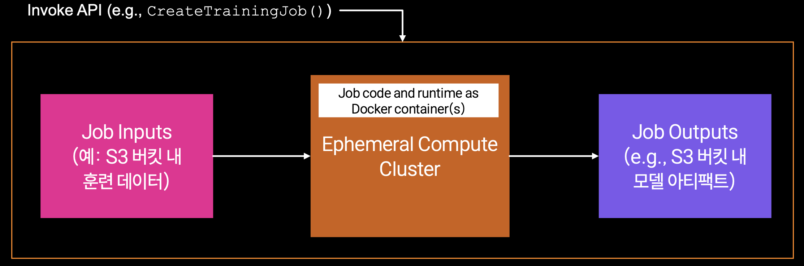
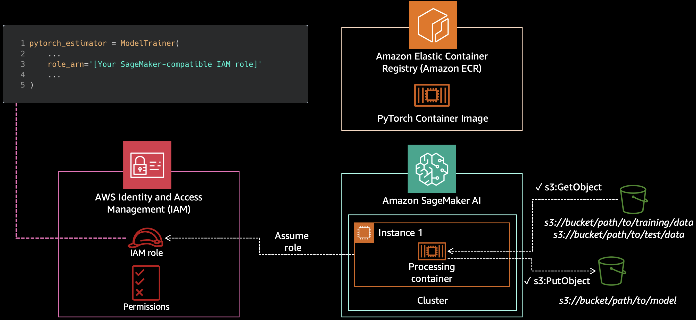
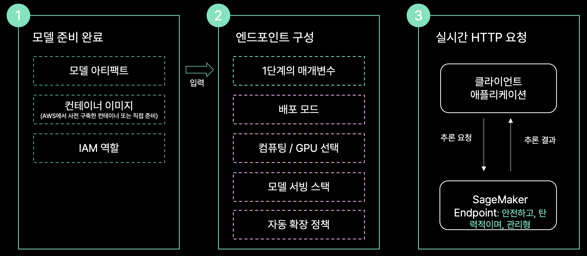

# 01. SageMaker AI 기초: Training Job과 Endpoint

!!! info "Scope"
    SageMaker AI를 처음 사용하는 ML 엔지니어를 위한 문서입니다. Training Job과 Endpoint의 실행 방식, 실행 역할, 컨테이너 경로, 수명과 과금 차이를 설명합니다.

    파인튜닝 구현은 [파인튜닝](03_finetuning.md), 배포와 호출은 [SageMaker AI 추론](04_sagemaker_inference.md), 전체 실행 순서는 [E2E 실행 가이드](RUN_E2E.md)에서 다룹니다.

## 핵심 개념

SageMaker AI에서 먼저 구분할 것은 Training Job과 Endpoint입니다.

| 구분 | Training Job | Endpoint |
|---|---|---|
| 목적 | 학습 스크립트를 한 번 실행 | 추론 요청을 계속 처리 |
| 컴퓨팅 리소스 | 작업을 시작할 때 생성하고 종료 후 해제 | 배포 후 계속 유지 |
| 입력과 출력 | S3 입력을 읽고 모델 아티팩트를 S3에 저장 | S3 모델 아티팩트를 내려받아 HTTP 요청 처리 |
| 과금 | 작업 실행 시간 기준 | 프로비저닝된 인스턴스 시간 기준 |
| 정리 | 컴퓨팅 리소스는 자동 해제 | 이 프로젝트에서는 `99_cleanup.ipynb`로 삭제 |

학습은 끝나는 작업이고, Endpoint는 계속 실행되는 서버입니다. 이 차이를 이해하면 나머지 노트북의 역할도 명확해집니다.

## Training Job: 실행이 끝나면 컴퓨팅 리소스가 해제됩니다 { #training-job-끝나면-컴퓨팅-리소스까지-사라집니다 }

!!! abstract "Training Job의 수명"
    SageMaker AI는 Training Job을 시작할 때 컴퓨팅 리소스를 준비하고 작업이 끝나면 해제합니다. 컨테이너 안에 저장한 파일 중 지정된 출력만 S3에 남습니다.

[](images/sm_job_anatomy.png)

이 프로젝트에서 `ModelTrainer.train()`을 호출하면 SageMaker AI가 [`CreateTrainingJob`](https://docs.aws.amazon.com/sagemaker/latest/APIReference/API_CreateTrainingJob.html) 요청을 받아 학습 환경을 만듭니다. 학습 코드는 노트북 커널이 아니라 별도의 학습 컨테이너에서 실행됩니다.

### Training Job에 전달하는 값

| 항목 | 역할 | 이 프로젝트의 값 |
|---|---|---|
| 컨테이너 이미지 | Python, CUDA와 학습 프레임워크 제공 | PyTorch DLC |
| 소스 코드 | 컨테이너에서 실행할 진입 스크립트 | `scripts/train.py`와 `requirements.txt` |
| 입력 데이터 | 학습 데이터가 있는 S3 위치 | 이름이 `train`인 입력 채널 |
| 컴퓨팅 설정 | 인스턴스 유형과 수량 | `Compute(...)` |
| 시간 제한 | 작업의 최대 실행 시간 | `StoppingCondition(...)` |
| 실행 역할 | S3, ECR과 CloudWatch 접근 권한 | `SAGEMAKER_ROLE_ARN` 또는 자동 탐색한 역할 |

Training Job은 다음 순서로 실행됩니다.

1. 요청한 인스턴스를 준비합니다.
2. 학습 이미지를 가져오고 입력 데이터를 S3에서 복사합니다.
3. 소스 코드를 컨테이너에 배치하고 진입 스크립트를 실행합니다.
4. `/opt/ml/model`의 내용을 압축해 S3에 업로드합니다.
5. 컴퓨팅 리소스를 해제하고 작업을 종료합니다.

학습 로그는 CloudWatch에서 확인할 수 있습니다. 학습 코드가 로컬 파일을 직접 읽을 수는 없으므로 필요한 파일은 `source_dir`에 포함하거나 S3 입력 채널로 전달해야 합니다.

### 실행 역할: S3와 ECR 접근 { #실행-role로-무엇을-하는가-s3와-ecr-접근 }

[실행 역할](https://docs.aws.amazon.com/sagemaker/latest/dg/sagemaker-roles.html)은 사용자의 로그인 자격증명과 다릅니다. 사용자는 Training Job을 생성하고 역할을 전달하며, SageMaker AI는 해당 역할을 맡아 S3, ECR과 CloudWatch에 접근합니다.

[](images/sm_security.png)

역할이 존재한다고 필요한 권한까지 보장되는 것은 아닙니다. S3 읽기와 쓰기, ECR 이미지 가져오기 또는 CloudWatch 로그 기록 권한이 부족하면 Job 제출 후 실제 리소스에 접근하는 단계에서 실패할 수 있습니다.

이 프로젝트의 `resolve_sagemaker_role()`은 다음 순서로 실행 역할을 찾습니다.

1. `SAGEMAKER_ROLE_ARN`
2. Studio 또는 Notebook 인스턴스에 연결된 실행 역할
3. 계정에 있는 기존 SageMaker AI 실행 역할
4. `SAGEMAKER_CREATE_DEFAULT_ROLE=1`일 때만 생성하는 기본 역할

마지막 방식은 넓은 관리형 정책을 연결할 수 있어 기본적으로 비활성화되어 있습니다. 운영 환경에서는 필요한 권한만 가진 역할을 `SAGEMAKER_ROLE_ARN`으로 지정하는 편이 명확합니다.

### 경로 규약: 컨테이너 입력과 출력 { #경로-규약-컨테이너-안의-정해진-경로 }

SageMaker AI는 [컨테이너의 정해진 경로](https://docs.aws.amazon.com/sagemaker/latest/dg/model-train-storage.html)를 통해 입력과 출력을 전달합니다. 학습 스크립트는 하드코딩된 로컬 경로 대신 SageMaker AI가 설정한 환경변수를 사용해야 합니다.

| 컨테이너 경로 | 환경변수 | 용도 | 작업 종료 후 |
|---|---|---|---|
| `/opt/ml/input/data/<채널명>` | `SM_CHANNEL_<채널명>` | S3에서 받은 입력 데이터 | 컴퓨팅 리소스와 함께 삭제 |
| `/opt/ml/model` | `SM_MODEL_DIR` | 최종 모델 아티팩트 | 압축 후 S3에 업로드 |
| `/opt/ml/output/data` | `SM_OUTPUT_DATA_DIR` | 모델 외 부가 결과 | 별도 아카이브로 S3에 업로드 |
| `/opt/ml/checkpoints` | 없음 | 재시작용 체크포인트 | `CheckpointConfig`를 지정한 경우에만 S3와 동기화 |
| `/tmp` | 없음 | 임시 파일 | 컴퓨팅 리소스와 함께 삭제 |

이 프로젝트의 학습 스크립트는 입력 파일이 지정되지 않으면 `SM_CHANNEL_TRAIN`에서 JSONL 파일을 찾고, 출력 경로의 기본값으로 `SM_MODEL_DIR`을 사용합니다.

```python
train_dir = os.environ.get("SM_CHANNEL_TRAIN", "/opt/ml/input/data/train")
output_dir = os.environ.get("SM_MODEL_DIR", "./out")
```

환경변수가 없을 때 로컬 기본값을 사용하므로 같은 `train.py`를 로컬 검증과 SageMaker AI 학습에 함께 사용할 수 있습니다.

!!! warning "최종 모델은 SM_MODEL_DIR에 저장"
    `/opt/ml/model` 밖에 저장한 모델은 작업이 끝날 때 사라집니다. 반대로 중간 체크포인트를 이 경로에 많이 남기면 압축과 업로드 시간이 늘어납니다.

서빙 컨테이너는 S3의 모델 아티팩트를 다시 `/opt/ml/model`에 풉니다. 따라서 이 프로젝트는 병합된 Hugging Face 모델의 `config.json`과 가중치를 아티팩트 루트에 저장합니다.

### MaxRuntimeInSeconds의 범위 { #maxruntimeinseconds는-어디까지-세는가 }

[`StoppingCondition`](https://docs.aws.amazon.com/sagemaker/latest/APIReference/API_StoppingCondition.html)의 `max_runtime_in_seconds`는 Training Job의 최대 실행 시간입니다. 학습 루프만이 아니라 데이터 준비, 모델 병합과 저장 같은 후처리 시간을 포함해 설정해야 합니다.

GPU 용량을 기다리는 `Pending` 시간은 `MaxPendingTimeInSeconds`로 별도 관리합니다. 두 값을 같은 제한으로 보면 안 됩니다.

이 프로젝트는 SFT에 4시간, GRPO에 6시간을 명시합니다. 학습 스텝이 모두 끝나도 모델 병합 중 제한에 도달하면 배포할 수 없는 아티팩트가 남을 수 있기 때문입니다.

제한 시간을 길게 잡는 것만으로 전체 시간이 과금되지는 않습니다. 작업이 정상 종료되면 그 시점에 컴퓨팅 리소스와 과금이 중단됩니다. 단, warm pool을 사용하면 설정한 유지 시간 동안 리소스가 남습니다.

작업 상태가 `Stopped`이고 최대 실행 시간 근처에서 종료되었다면 CloudWatch 로그와 S3 아티팩트를 함께 확인하세요. 실제 사례와 대응은 [MaxRuntimeExceeded 문제](03_finetuning.md#maxruntimeexceeded-학습-뒤-머지에서-잘리는-함정)에 정리되어 있습니다.

## Endpoint: 삭제할 때까지 실행됩니다 { #endpoint-삭제할-때까지-켜져-있는-서버 }

!!! abstract "Endpoint의 수명"
    이 프로젝트의 Real-time Endpoint는 배포 후 인스턴스를 계속 유지합니다. 요청이 없어도 삭제 전까지 인스턴스 비용이 발생합니다.

Endpoint 배포에는 세 가지 SageMaker AI 리소스가 사용됩니다.

| 리소스 | 역할 |
|---|---|
| `Model` | 모델 아티팩트, 서빙 이미지와 실행 역할 연결 |
| `EndpointConfig` | 인스턴스 유형, 수량과 production variant 정의 |
| `Endpoint` | 실제 인스턴스를 실행하고 추론 요청 수신 |

### 배포 리소스와 순서 { #배포-3단계-무엇을-어떤-순서로-넘기는가 }

[](images/sm_endpoint_01.png)

이 프로젝트의 `03_deploy_endpoint.ipynb`는 다음 값을 사용합니다.

| 단계 | 입력 | 결과 |
|---|---|---|
| 모델 준비 | Training Job의 `model_data`, 서빙 DLC, 실행 역할 | SageMaker AI `Model` |
| 배포 설정 | 인스턴스 유형, 인스턴스 수와 환경변수 | `EndpointConfig` |
| 배포 | Endpoint 이름과 설정 | 실행 중인 Real-time Endpoint |
| 확인 | 테스트 요청 | 응답과 CloudWatch 로그 |

`ModelBuilder`가 리소스 생성을 처리하지만 실제로 만들어지는 `Model`, `EndpointConfig`와 `Endpoint`의 역할은 동일합니다. 이 프로젝트는 인스턴스 한 대를 사용하며 자동 확장 정책은 구성하지 않습니다.

### 컨테이너 규약: 모델 아티팩트와 상태 확인 { #컨테이너-규약-모델-artifact와-ping-health-check }

SageMaker AI가 서빙 컨테이너를 실행하려면 [추론 컨테이너 규약](https://docs.aws.amazon.com/sagemaker/latest/dg/your-algorithms-inference-code.html)을 지켜야 합니다.

- S3의 `model.tar.gz`는 컨테이너 시작 전에 `/opt/ml/model`에 풀립니다.
- 컨테이너는 8080 포트에서 `/ping`과 `/invocations`를 제공해야 합니다.
- `/ping`은 컨테이너 상태 확인, `/invocations`는 추론 요청 처리에 사용됩니다.
- 모델 다운로드와 로딩 시간이 길면 시작 상태 확인 제한 시간을 늘려야 합니다.
- 배포 실패의 실제 원인은 Endpoint의 CloudWatch 로그에서 확인해야 합니다.

이 프로젝트에서 사용하는 vLLM, SGLang과 DJL LMI DLC는 해당 규약을 이미 구현합니다. `SERVING_ENGINE`으로 엔진을 선택하고, 컨테이너에는 `/opt/ml/model`을 불러오도록 설정합니다.

`did not pass the ping health check`는 최종 증상일 뿐입니다. CUDA OOM, 모델 설정 오류 또는 가중치 누락 같은 원인은 CloudWatch 로그에 기록됩니다.

### Training Job과 Endpoint의 수명 비교

| 항목 | Training Job | Endpoint |
|---|---|---|
| 시작 | 학습 요청 제출 | 모델 배포 |
| 종료 | 성공, 실패 또는 제한 시간 도달 | 명시적으로 삭제 |
| 컴퓨팅 리소스 | 종료 시 자동 해제 | 삭제 전까지 유지 |
| 남는 리소스 | S3 아티팩트와 CloudWatch 로그 | `Model`, `EndpointConfig`, Endpoint |
| 이 프로젝트의 정리 | 별도 컴퓨팅 정리 불필요 | `99_cleanup.ipynb` 실행 |

노트북 커널을 종료해도 AWS의 Endpoint는 계속 실행됩니다. 실습이 끝나면 `99_cleanup.ipynb`로 Endpoint, EndpointConfig와 Model을 삭제하세요.

## SageMaker AI의 추론 방식

SageMaker AI는 요청 방식과 실행 시간에 따라 여러 추론 옵션을 제공합니다.

| 방식 | 실행 형태 | 적합한 경우 |
|---|---|---|
| Real-time Endpoint | 인스턴스를 계속 유지하며 동기 요청 처리 | 낮은 지연 시간과 지속적인 온라인 요청 |
| Serverless Inference | 요청량에 따라 관리형으로 확장 | 트래픽이 간헐적이고 시작 지연을 허용할 수 있는 경우 |
| Asynchronous Inference | 요청을 대기열에 넣고 비동기로 처리 | 처리 시간이 길거나 입력이 큰 경우 |
| Batch Transform | Endpoint 없이 일괄 데이터 처리 | 온라인 응답이 필요 없는 대량 추론 |

이 프로젝트는 모델 서버를 계속 실행하고 평가와 에이전트 요청을 동기로 처리하기 위해 Real-time Endpoint를 사용합니다. 상세 비교는 [SageMaker AI 추론](04_sagemaker_inference.md#왜-real-time인가-추론-4옵션-비교)에서 확인할 수 있습니다.

## SageMaker AI vs HyperPod vs EC2 vs 온프레미스 { #sagemaker-ai-vs-hyperpod-vs-ec2-vs-on-prem }

같은 GPU 워크로드라도 컴퓨팅 리소스의 수명과 운영 책임이 다릅니다. SageMaker AI는 작업과 Endpoint 단위의 관리형 리소스를 제공하고, HyperPod는 여러 작업이 공유하는 장기 실행 클러스터를 제공합니다. EC2와 온프레미스는 더 많은 제어권과 운영 책임을 사용자에게 넘깁니다.

### 운영 관점 비교

| 선택지 | 실행 단위 | 장기 실행 인프라 | 사용자가 관리할 범위 | 적합한 경우 |
|---|---|---|---|---|
| SageMaker AI | Training Job 또는 Endpoint | Training Job은 없음, Endpoint는 있음 | 코드, 컨테이너 설정과 AWS 리소스 구성 | 개별 학습과 관리형 Endpoint 운영 |
| SageMaker HyperPod | Slurm 또는 EKS 클러스터의 작업 | 있음 | 스케줄러, 클러스터 구성과 워크로드 | 여러 팀이 다수 GPU를 장기간 공유 |
| EC2 자체 구성 | 인스턴스 또는 직접 만든 클러스터의 작업 | 선택 | 운영체제, 드라이버, 네트워크, 스케줄러와 복구 | 인프라 제어가 필요하거나 기존 운영 체계가 있음 |
| 온프레미스 | 자체 클러스터의 작업 | 있음 | 하드웨어부터 전체 소프트웨어 스택 | 높은 지속 사용률 또는 데이터 반출 제한 |

시간당 인스턴스 가격만으로는 전체 비용을 비교하기 어렵습니다. 운영 인력과 규정 준수 비용을 포함한 기준은 [인프라 비용은 TCO의 한 칸일 뿐입니다](00_overview.md#인프라-비용은-tco의-한-칸일-뿐입니다)에서 설명합니다.

### 서비스 구분에서 자주 생기는 오해 { #티어를-헷갈리게-만드는-오해 }

- HyperPod가 SageMaker AI Training Job의 상위 버전인 것은 아닙니다. Training Job은 개별 작업용이고 HyperPod는 장기 실행 클러스터용입니다.
- HyperPod의 Slurm 구성과 EKS 구성은 제출 방식과 운영 도구가 다릅니다. 팀이 사용하는 스케줄러에 맞춰 선택해야 합니다.
- DLC는 워크로드를 실행하는 컨테이너 이미지이고, DLAMI는 EC2 호스트 이미지입니다. 서로 대체 관계가 아닙니다.
- Blue/green, canary와 rolling 배포 가드레일은 SageMaker AI Endpoint 기능입니다. HyperPod나 EC2에서는 사용하는 오케스트레이터에 맞게 배포 방식을 구성해야 합니다.

기능과 지원 범위는 변경될 수 있습니다. HyperPod를 설계할 때는 [현재 공식 문서](https://docs.aws.amazon.com/sagemaker/latest/dg/sagemaker-hyperpod.html)를 확인하세요.

## 언제 무엇을 쓰나

| 선택지 | 선택 기준 |
|---|---|
| SageMaker AI Training Job과 Endpoint | 개별 학습과 온라인 서빙을 빠르게 실행하고 인프라 운영을 줄이려는 경우 |
| SageMaker HyperPod | 많은 GPU를 장기간 공유하고 작업 큐와 장애 복구가 필요한 경우 |
| EC2 자체 구성 | 운영체제, 드라이버, 네트워크와 스케줄러를 직접 제어해야 하는 경우 |
| 온프레미스 | 높은 사용률이 지속되거나 데이터 반출이 제한되는 경우 |
| 혼합 구성 | 워크로드마다 규모, 보안 요구와 운영 방식이 다른 경우 |

처음부터 장기 실행 클러스터를 선택할 필요는 없습니다. Training Job의 실행 빈도, 대기 시간과 비용을 측정한 뒤 HyperPod나 자체 클러스터가 필요한지 판단하는 편이 안전합니다.

## 이 프로젝트에서는

플래그십 코스인 `tracks/01_extraction_to_json/`을 기준으로 각 노트북이 만드는 리소스는 다음과 같습니다.

| 노트북 | AWS 리소스 | 역할 |
|---|---|---|
| `00_setup.ipynb` | 없음 | 자격증명, 실행 역할과 S3 버킷 확인 |
| `01_data_and_synthetic.ipynb` | 선택적으로 Bedrock 호출 | 학습 데이터 준비 |
| `02_train_sft_sagemaker.ipynb` | Training Job | SFT 실행과 `model_data` 생성 |
| `02a_train_grpo_sagemaker.ipynb` | Training Job | 추출과 분류 코스의 선택적 GRPO 추가 학습 |
| `02b_local_serve.ipynb` | 없음 | 로컬 vLLM 검증 |
| `03_deploy_endpoint.ipynb` | Model, EndpointConfig와 Endpoint | 모델 배포와 응답 확인 |
| `04_evaluate.ipynb` | 기존 Endpoint 호출 | held-out 데이터 평가 |
| `05_agentic_strands.ipynb` | 기존 Endpoint와 Bedrock 호출 | 에이전트 흐름 실행 |
| `06_agentcore_deploy.ipynb` | AgentCore Runtime | 에이전트 애플리케이션 배포 |
| `99_cleanup.ipynb` | Endpoint 관련 리소스 삭제 | Endpoint 비용 중단 |

멀티모달 코스는 `02_train_mm_sagemaker.ipynb`와 `03_deploy_mm_endpoint.ipynb`를 사용하지만 Training Job과 Endpoint의 수명은 동일합니다.

학습이 끝나면 Training Job의 컴퓨팅 리소스는 자동으로 해제됩니다. Endpoint를 배포했다면 평가가 끝난 뒤 `99_cleanup.ipynb`를 실행해야 합니다.

## 관련 파일

| 파일 | 역할 |
|---|---|
| `tracks/01_extraction_to_json/scripts/train.py` | `SM_CHANNEL_TRAIN`에서 입력을 읽고 `SM_MODEL_DIR`에 모델 저장 |
| `tracks/01_extraction_to_json/02_train_sft_sagemaker.ipynb` | Training Job 설정과 제출 |
| `tracks/01_extraction_to_json/03_deploy_endpoint.ipynb` | Real-time Endpoint 배포와 호출 확인 |
| `tracks/01_extraction_to_json/99_cleanup.ipynb` | Endpoint, EndpointConfig와 Model 삭제 |
| `common/config.py` | 실행 역할과 공통 설정 해석 |
| `common/dlc.py` | 학습 및 서빙 DLC 이미지 선택 |
| `common/aws_utils.py` | S3 업로드, Endpoint 호출과 CloudWatch 링크 생성 |

다음 단계는 [E2E 실행 가이드](RUN_E2E.md)입니다.
