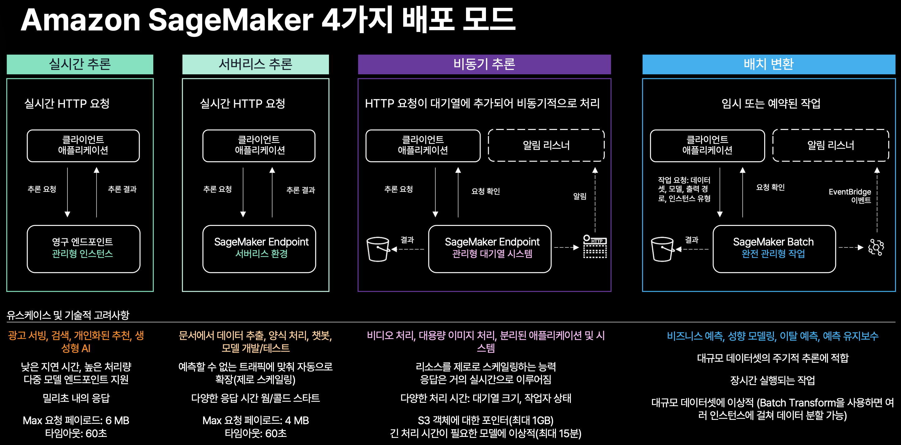
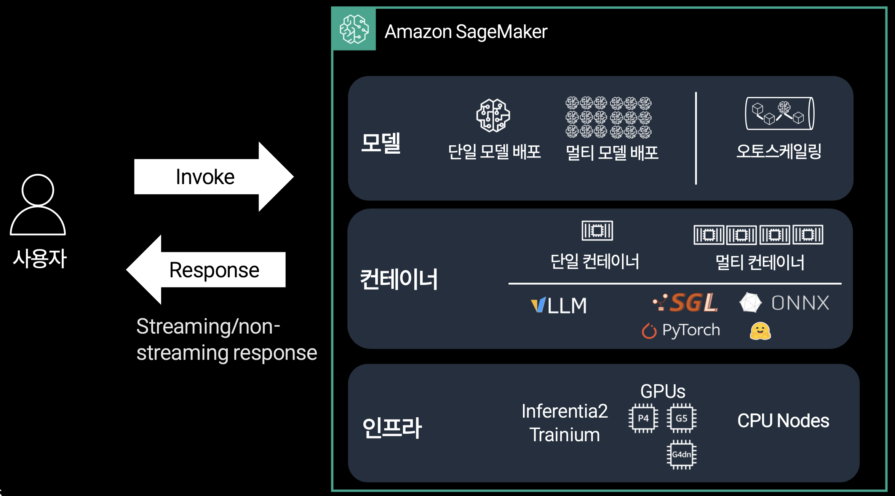

# 04 · SageMaker AI 추론 완전 가이드 — 이 kit의 앵커 문서

!!! info "Scope"
    파인튜닝한 SLM(Gemma 4)을 "어떻게 서빙하나"가 궁금한 초심자~중급자를 위한 문서입니다.
    HyperPod/EC2 지식은 필요 없습니다.

    - **선행 조건**: `02_train_sft_sagemaker`까지 실행해 `model_data`(S3 아티팩트)가 있는 상태.
      Training Job·Endpoint의 수명과 과금 차이가 낯설면
      [SageMaker AI 기초](01_sagemaker_basics.md)부터
    - **여기서 다루는 것**: 추론 4옵션 선택 · endpoint 구조와 호출 ·
      서빙 컨테이너/DLC 이미지 · 비용과 정리
    - **여기서 다루지 않는 것**: 학습 하이퍼파라미터 · 평가 지표 · agentic 설계

이 문서는 이 kit의 **추론 앵커 문서**입니다. 다른 가이드(학습·agentic·평가)는 "endpoint가 무엇인지"를 설명할 때 이 문서로 링크를 겁니다.

본문에 인용한 실측값은 이 kit의 **코스** 5개에서 나왔습니다(코스가 무엇인지는 [전체 지도](00_overview.md)에 있습니다).

리포지토리 디렉터리 이름은 초기 이름을 그대로 둬서 `tracks/`이고, `track_data`·`--track` 같은 코드 식별자도 바뀌지 않았습니다. 본문의 "코스"와 코드의 `track`은 같은 것을 가리킵니다.

!!! warning "빠르게 바뀌는 값"
    모델 ID·DLC 이미지 태그·SDK 버전·리전·서비스 한도(payload/timeout/cold start)·GA 상태는 분기마다 바뀝니다.
    이 문서의 구체 수치와 태그는 전부 **실행 직전 재확인** 대상입니다. 각 주장 옆에 붙은 공식 문서 링크가 최종 확인처입니다.
    계정 ID·시크릿·절대경로는 하드코딩하지 마세요. 전부 env로 주입합니다.

---

## TL;DR

**Amazon SageMaker AI 추론에는 4가지 옵션(Real-time / Serverless / Asynchronous / Batch Transform)이 있고, LLM/SLM 서빙에는 GPU가 붙는 Real-time이 사실상 유일한 선택입니다. 이 kit은 Real-time endpoint에 vLLM DLC(기본) · SGLang DLC · DJL LMI 중 하나를 실어 배포하며, 호출은 `sagemaker-runtime`(Bedrock과 별개 서비스), 정리는 반드시 `99_cleanup`입니다.**

정리하면 다음과 같습니다.

1. **Serverless Inference에는 GPU가 없습니다.** 따라서 LLM/SLM에는 부적합하며, 이것이 이 kit이 Real-time을 선택한 근본 이유입니다([왜 Real-time인가](#왜-real-time인가--추론-4옵션-비교)).
2. **endpoint 호출은 Bedrock 호출과 다릅니다.** endpoint는 `sagemaker-runtime.invoke_endpoint()`, Bedrock Claude는 `bedrock-runtime.converse()`로 부르는 **별개 서비스·별개 클라이언트**입니다([서비스 경계](#서비스-경계--endpoint--bedrock)).
3. **서빙 컨테이너는 하나로 모든 상황을 해결할 수 없습니다.** 이 kit은 vLLM(기본) / SGLang / DJL LMI 세 경로를 env로 전환합니다([서빙 컨테이너와 DLC 이미지](#서빙-컨테이너와-dlc-이미지)).
4. **24GB GPU에서는 엔진 기본값 그대로 배포하면 CUDA OOM으로 endpoint가 `Failed`합니다.** `max_num_seqs`를 낮춰야 합니다([24GB GPU CUDA OOM](#24gb-gpu-cuda-oom--max_num_seqs-기본값)).
5. **Real-time은 삭제하기 전까지 시간당(GPU) 요금이 계속 부과됩니다.** 실습이 끝나면 반드시 `99_cleanup`을 실행하세요([비용과 cleanup](#비용과-cleanup)).

---

## 기존 Pain Point

파인튜닝까지 끝낸 초심자가 배포 단계에서 실제로 자주 막히는 지점은 다음과 같습니다.

- "endpoint 종류가 4개나 되는데 **무엇을 골라야 할까요?**": 문서마다 이름만 나열할 뿐, *언제 무엇을* 써야 하는지는 알려주지 않습니다.
- "Bedrock은 그냥 API로 부르던데, **내 endpoint도 Bedrock으로 부르는 걸까요?**": 아닙니다. 완전히 다른 서비스입니다.
- "**Serverless가 제일 싸 보이는데** 왜 쓰지 않을까요?": GPU가 없어서 LLM이 돌아가지 않기 때문입니다. 이 사실을 모르고 골랐다가 배포에 실패하는 경우가 많습니다.
- "서빙 컨테이너가 vLLM, SGLang, LMI로 여러 개인데, **어느 것에 model_data를 물려야 할까요?**"
- "설정을 건드리지 않았는데 **endpoint가 `Failed`로 끝났어요.**": 24GB GPU에서 엔진 기본값이 메모리를 넘겼기 때문입니다.
- "테스트만 했을 뿐인데 **다음 날 청구서가 날아왔어요.**": Real-time endpoint를 지우지 않았기 때문입니다.

이 문서는 위 여섯 가지 고민을 순서대로 해소해 드립니다.

---

## 왜 Real-time인가 — 추론 4옵션 비교

!!! abstract "쉽게 말하면"
    추론 옵션 4개는 결국 **손님이 어떤 방식으로 찾아오는가**에 대한 답입니다.
    실시간 채팅처럼 찾아오면 항상 켜 둔 창구(**Real-time**), 가끔 뜸하게 오면 부를 때만 여는 창구(**Serverless**).
    큰 서류뭉치를 맡기고 나중에 찾아가면 접수 후 처리(**Asynchronous**), 하룻밤에 수만 건이면 야간 일괄처리(**Batch Transform**).
    그런데 **GPU 조리기구가 있는 창구는 Real-time · Async · Batch뿐**입니다.

AWS는 이 네 가지를 [모델 배포 옵션 개요](https://docs.aws.amazon.com/sagemaker/latest/dg/deploy-model.html)에서 함께 문서화합니다. LLM/SLM은 GPU가 반드시 필요하고, 목적이 **대화형 실시간 응답**이라면 남는 답은 Real-time입니다.

[](images/sm_inference_option.png)

*네 옵션의 차이는 "무엇을 지원하는가"가 아니라 응답이 어느 경로로 돌아오는가입니다: 왼쪽 둘은 HTTP 왕복, 오른쪽 둘은 S3 + 알림. 패널 안의 작은 글씨는 그림을 클릭해 원본 크기로 보세요.*

!!! warning "그림의 “최대 15분”은 과거 한도입니다"
    비동기 추론 패널에 적힌 `긴 처리 시간이 필요한 모델에 이상적(최대 15분)`은 촬영 시점의 값이고, **현행 한도는 1시간**입니다([Async 문서](https://docs.aws.amazon.com/sagemaker/latest/dg/async-inference.html)). 그림과 아래 표가 어긋나면 표와 링크를 믿으세요. 나머지 수치(`Max 요청 페이로드: 6 MB` / `4 MB`, `타임아웃: 60초`, S3 객체 포인터 `최대 1GB`)는 현행과 일치합니다.

이 그림에서 표가 담지 못하는 부분은 **화살표의 개수**이고, 이 토폴로지 차이가 곧 호출 코드의 차이입니다.

- 실시간·서버리스 패널은 `추론 요청` → `추론 결과` 왕복 화살표 하나로 끝납니다.
- 비동기·배치 패널은 화살표가 세 갈래로 갈라집니다: 즉시 돌아오는 **요청 확인**(접수증), S3로 떨어지는 **결과**, 알림 리스너로 가는 **완료 통보**.

- **Asynchronous**는 payload를 먼저 S3에 올리고 `invoke_endpoint_async(InputLocation=...)`로 **포인터만** 넘깁니다. 응답으로는 결과가 아니라 `OutputLocation`이 돌아오고, 완료 통보는 SNS로 받습니다(`AsyncInferenceConfig.OutputConfig.NotificationConfig`의 `SuccessTopic`/`ErrorTopic`: [결과 확인 방법](https://docs.aws.amazon.com/sagemaker/latest/dg/async-inference-check-predictions.html)).
- **Batch Transform**은 호출 API 자체가 없습니다. `CreateTransformJob`으로 Job을 띄우고 결과를 S3에서 회수합니다. 상태 변화는 EventBridge `SageMaker Transform Job State Change` 이벤트로 받습니다([SageMaker EventBridge 이벤트](https://docs.aws.amazon.com/sagemaker/latest/dg/automating-sagemaker-with-eventbridge.html)).
- 즉 **응답을 그 자리에서 되받는 것은 Real-time(과 Serverless)뿐**입니다. 이 kit의 04·05 노트북이 SNS 토픽도 EventBridge 규칙도 없이 `invoke_endpoint()` 한 줄로 끝나는 이유가 여기 있습니다.

### 추론 4옵션 비교

각 옵션 이름에 공식 문서를 걸어 두었습니다. 수치를 인용하기 전에 해당 문서에서 현행 한도를 확인하세요.

| 축 | [Real-time](https://docs.aws.amazon.com/sagemaker/latest/dg/realtime-endpoints.html) | [Serverless](https://docs.aws.amazon.com/sagemaker/latest/dg/serverless-endpoints.html) | [Asynchronous](https://docs.aws.amazon.com/sagemaker/latest/dg/async-inference.html) | [Batch Transform](https://docs.aws.amazon.com/sagemaker/latest/dg/batch-transform.html) |
|---|---|---|---|---|
| **용도** | 상시 실시간 응답(챗·API) | 간헐적/예측불가 트래픽 | 대용량 payload·긴 처리 | 데이터셋 일괄 추론 |
| **상주 리소스** | 있음(항상 켜짐) | 없음(요청 시 기동) | 있음(오토스케일→0 가능) | Job 단위(끝나면 종료) |
| **레이턴시** | 최저(ms~수초) | cold start 지연 있음 | 비동기(큐→S3 결과) | 배치 완료까지 |
| **Cold start** | 없음(웜) | 있음 | 스케일업 시 있음 | 해당 없음(Job) |
| **GPU 지원** | ✅ 있음 | ❌ 없음(CPU 전용) | ✅ 있음 | ✅ 있음 |
| **비용 모델** | 인스턴스 시간당(삭제 전까지) | 요청+실행시간(유휴 0) | 인스턴스 시간(0까지 축소 가능) | Job 실행 시간만 |
| **최대 요청 payload** | 6 MB(`Body` 6,291,456바이트) | 4 MB(요청·응답 공통) | S3 객체 포인터, 객체 1 GB까지 | 미니배치 `MaxPayloadInMB` ≤ 100 MB |
| **요청 timeout** | 60초(컨테이너 응답 한도) | 60초(`/invocations`) | 최대 1시간 처리 | Job 단위(요청 timeout 개념 없음) |
| **다중 모델 엔드포인트** | ✅ 지원 | ❌ 미지원(기능 제외 목록) | — | — |
| **LLM/SLM 적합** | ✅ 적합(이 kit) | ❌ 부적합(GPU 없음) | 조건부(긴 생성·오프라인) | 조건부(대량 오프라인 채점) |

??? info "더 읽을 거리 — 표의 수치가 나온 곳"
    - **Real-time**: `InvokeEndpoint`의 `Body` 길이 제한이 6,291,456바이트(= 6 MB)이고, "모델 컨테이너는 60초 안에 응답해야 한다"가 API 규약입니다([InvokeEndpoint API](https://docs.aws.amazon.com/sagemaker/latest/APIReference/API_runtime_InvokeEndpoint.html)).
    - **Serverless**: 요청·응답 payload가 각각 4 MB, `/invocations` timeout이 1분, `/ping` 응답은 3분 안입니다. **GPU·Multi-Model Endpoint·VPC·Model Monitor는 기능 제외 목록**에 있습니다([Serverless 호출](https://docs.aws.amazon.com/sagemaker/latest/dg/serverless-endpoints-invoke.html)).
    - **Async**: payload 1 GB·처리 시간 최대 1시간이며, 요청이 없을 때 **인스턴스를 0으로 축소**합니다([Async 문서](https://docs.aws.amazon.com/sagemaker/latest/dg/async-inference.html)). 위 그림의 "최대 15분"이 과거 한도인 이유는 그림 아래 주의를 보세요.
    - **Batch**: S3 객체를 키 단위로 인스턴스에 매핑해 나눠 처리합니다(입력 파일이 1개면 인스턴스를 늘려도 1대만 일합니다). `SplitType=Line`으로 미니배치를 쪼개며, `MaxConcurrentTransforms × MaxPayloadInMB ≤ 100 MB` 제약을 받습니다([Batch Transform 문서](https://docs.aws.amazon.com/sagemaker/latest/dg/batch-transform.html)).

**이 60초·6 MB가 이 kit에 주는 실질적 제약**은 두 가지입니다.

- **60초**: Real-time 호출은 컨테이너가 60초 안에 응답을 끝내야 하므로, 긴 생성(`max_tokens`를 크게 Job은 요약)은 timeout에 걸릴 수 있습니다. 앞서 실측한 요약 코스 완성 대기가 **16.16초**였으니 아직 여유가 있습니다.
- **6 MB**: 프롬프트 기준으로는 충분히 큽니다(요약 코스 입력이 5,996자). 다만 이미지·오디오를 base64로 묶어 보내는 멀티모달 호출에서는 실제로 닿을 수 있는 벽입니다.

**60초를 넘길 수 있는 워크로드는 스트리밍이 아니라 [Asynchronous](https://docs.aws.amazon.com/sagemaker/latest/dg/async-inference.html)로 옮기는 것이 정답입니다.** [응답 스트리밍](#응답-스트리밍--invoke_endpoint_with_response_stream)은 이 벽을 옮겨 주지 않습니다.

스트리밍은 첫 토큰 체감만 줄이고 전체 생성 시간은 그대로입니다. 응답을 끝내지 못하면 `ModelInvocationTimeExceeded`(스트림 도중이면 `ModelStreamError`)로 끊깁니다([InvokeEndpointWithResponseStream API](https://docs.aws.amazon.com/sagemaker/latest/APIReference/API_runtime_InvokeEndpointWithResponseStream.html)).

cold-start 시간, 오토스케일 축소 최솟값, 리전별 동시성 한도 같은 값은 위에 인용한 한도와 달리 **더 자주 바뀝니다**. 이 표는 각 옵션의 "성격"을 잡기 위한 것이므로, 실제 값은 **실행 전에 위 표의 옵션별 공식 문서에서 재확인**하세요.

### 기술적 차이 3가지

1. **인스턴스 상주 여부**: Real-time과 Async는 프로비저닝된 인스턴스가 붙어 있지만, Serverless는 요청이 들어오는 순간에 용량을 할당합니다. 그래서 cold start가 생기고, **가속기(GPU)를 상주 형태로 붙일 수 없어** GPU를 지원하지 못합니다.
2. **요청-응답 채널**: Real-time은 동기 응답(HTTP), Async는 **S3 입력 → 큐 → S3 출력 + SNS 알림**, Batch는 S3 데이터셋을 Job 단위로 훑습니다. 채널이 다르면 payload/timeout 한도도 달라집니다. HTTP 왕복에 묶인 Real-time·Serverless는 6 MB/4 MB·60초, S3를 거치는 Async는 1 GB·1시간입니다.
3. **스케일 바닥값**: Async는 인스턴스를 0까지 축소할 수 있어 유휴 비용을 줄일 수 있지만, Real-time은 (오토스케일을 걸더라도) 통상 1대 이상을 유지합니다. 이것이 바로 **상시 과금**이 발생하는 원인입니다.

??? question "오해 — “Serverless가 제일 싸니까 LLM도 Serverless로 하면 되지 않나요?”"
    **아닙니다.** SageMaker Serverless Inference에는 **GPU가 없습니다**(CPU 전용). Gemma 같은 SLM/LLM은 GPU 없이는 사실상 돌아가지 않거나, 돌아가더라도 실용 불가 수준으로 느립니다.
    "간헐적인 트래픽이니 Serverless가 저렴하겠다"는 판단은 CPU 모델(작은 임베딩, 전통 ML)에나 맞는 이야기입니다. LLM/SLM에는 Real-time(또는 GPU가 붙는 Async/Batch)을 쓰세요.
    GPU는 단독 항목이 아니라 **기능 제외 목록의 첫 줄**입니다. GPU·Multi-Model Endpoint·VPC 구성·network isolation·data capture·다중 production variant·Model Monitor·inference pipeline이 함께 빠집니다. RAM도 최대 6,144 MB(6 GB)까지만 고를 수 있어서, bf16 E4B 가중치 14.23 GiB는 **애초에 올라가지 않습니다**.
    다만 GPU 미지원은 정책성 항목이라 언젠가 바뀔 수 있으니 [Serverless Inference 문서](https://docs.aws.amazon.com/sagemaker/latest/dg/serverless-endpoints.html)에서 **실행 전 재확인**하시기 바랍니다.

### 언제 무엇을 고르는가

- 대화형·실시간 API가 목표이고 트래픽이 꾸준하다면 → **Real-time**을 선택하세요 (이 kit의 선택입니다).
- CPU로 충분한 작은 모델이면서 트래픽이 뜸하고 cold start를 감수할 수 있다면 → **Serverless**가 적합합니다.
- 입력이 Real-time의 6 MB를 넘거나(S3 객체 1 GB까지) 응답이 60초를 넘겨도 되며(최대 1시간) 비동기로 받아도 된다면 → **Asynchronous**를 쓰세요.
- 상시 endpoint 없이 대량 데이터셋을 한 번에 채점하거나 생성하려면 → **Batch Transform**을 고르세요 (예: 평가셋 오프라인 추론). 입력을 **여러 파일로 나눠 두어야** 인스턴스를 늘린 만큼 병렬로 처리됩니다.

---

## Endpoint 3층 구조와 호출

!!! abstract "쉽게 말하면"
    endpoint 하나가 뜨기까지 **3층짜리 레고**가 차곡차곡 쌓입니다.
    **Model** = "어떤 가중치(model_data, S3)를 + 어떤 컨테이너(이미지)로 로드할 것인가".
    **EndpointConfig** = "그 Model을 + 어떤 인스턴스로 + 몇 대(variant)로 + 트래픽 비율은 어떻게" 담은 설계도.
    **Endpoint** = 그 설계도로 실제로 떠 있는 **상시 서버**이며, 곧 과금이 시작되는 지점.

```
[S3: model_data tar.gz]      [ECR: 서빙 DLC 이미지]
   (파인튜닝 merged 가중치)        (763104351884.dkr.ecr...)
            \                       /
             v                     v
        ┌──────────── Model ────────────┐   ← "무엇을 어떤 컨테이너로"
        └───────────────┬───────────────┘
                        v
        ┌──────── EndpointConfig ────────┐   ← "어떤 인스턴스 · 몇 대 · variant 트래픽"
        └───────────────┬───────────────┘
                        v
        ┌────────────  Endpoint  ────────┐   ← 상시 서버 = 과금 시작
        └───────────────┬───────────────┘
                        v
   client.invoke_endpoint(EndpointName=..., Body=...)   ← sagemaker-runtime
```

**왜 3층으로 나뉘어 있을까요?** 이렇게 분리되어 있는 덕분에 **무중단 배포**(새 EndpointConfig로 교체), **A/B 테스트(production variant)**, **오토스케일**이 가능해집니다.

다만 이런 배포 가드레일(blue/green·canary·rolling)은 SageMaker AI endpoint의 기능이지 HyperPod의 기능이 아닙니다([티어를 헷갈리게 만드는 오해](01_sagemaker_basics.md#티어를-헷갈리게-만드는-오해)).

[SageMaker Python SDK](https://github.com/aws/sagemaker-python-sdk) v3에서는 이 3층을 `ModelBuilder`가 한 번에 만듭니다. v2의 `Model`/`HuggingFaceModel` 클래스는 제거되었습니다. 그래서 이 kit의 `03_deploy_endpoint`는 `ModelBuilder(image_uri=..., s3_model_data_url=..., env_vars=...)` → `.build()` → `.deploy()` 경로를 씁니다.

만들 때는 한 번에 묶이지만 **삭제할 때는 이 3개 리소스를 각각 지워야 합니다**([cleanup이 실제로 지우는 것](#cleanup이-실제로-지우는-것)).

### 세 가지 선택 축 — 모델 · 컨테이너 · 인프라

위의 Model/EndpointConfig/Endpoint가 **리소스**를 세 층으로 나눈 것이라면, 그 위에서 실제로 우리가 고르는 **선택**도 세 축으로 나뉩니다.

"모델을 몇 개 얹을까(모델)", "어떤 서빙 컨테이너로 돌릴까(컨테이너)", "어떤 가속기에 태울까(인프라)"는 서로 **다른 레이어의 결정**이라 하나를 바꿔도 나머지는 건드릴 필요가 없습니다.

이 분리의 실질적인 효과는 이 kit이 `SERVING_ENGINE` env 하나로 vLLM ↔ SGLang ↔ LMI를 갈아 끼우면서도 호출 코드는 그대로 둔다는 점입니다.

[](images/sm_inference_stack.png)

*선택은 레이어별로 나뉘지만 인프라와 컨테이너는 서로 맞물립니다(CUDA 빌드 ↔ Neuron 빌드). 이 kit의 조합은 "단일 모델 배포 + 단일 컨테이너(vLLM DLC) + GPU 인스턴스"입니다.*

| 레이어 | 고르는 것 | 이 kit의 선택 |
|---|---|---|
| **모델** | 단일 모델 배포 / [멀티 모델 배포(MME)](https://docs.aws.amazon.com/sagemaker/latest/dg/multi-model-endpoints.html) / [오토스케일링](#오토스케일과-cloudwatch-관측) | 단일 모델 배포(코스별 endpoint 1개) |
| **컨테이너** | 단일 컨테이너 / [멀티 컨테이너](https://docs.aws.amazon.com/sagemaker/latest/dg/multi-container-endpoints.html) · 안에 들어가는 것은 vLLM·SGLang·ONNX·PyTorch·HuggingFace 등 | 단일 컨테이너 + vLLM DLC(기본) |
| **인프라** | GPU(G4dn·G5·P4 등) / [Inferentia2·Trainium](https://awsdocs-neuron.readthedocs-hosted.com/en/latest/) / CPU 노드 | `ml.g6.2xlarge`(L4 24GB) |

- **멀티 모델 배포(MME)는 LLM 서빙에 잘 맞지 않습니다.** GPU 기반 MME는 [Triton Inference Server 컨테이너를 통해서만 지원](https://docs.aws.amazon.com/sagemaker/latest/dg/multi-model-support.html)되고, 지원 GPU 인스턴스도 **p2·p3·g5·g4dn**으로 한정됩니다. vLLM/SGLang DLC는 MME 컨테이너가 아니므로 이 kit은 코스마다 **단일 모델 endpoint를 따로** 띄웁니다.
- **멀티 컨테이너는 단일 SLM 하나를 서빙하는 이 kit에 필요 없습니다.** 한 endpoint에 최대 15개 컨테이너까지 얹을 수 있고, `InferenceExecutionConfig.Mode`가 `Serial`(기본값, inference pipeline으로 순차 실행)인지 `Direct`(`TargetContainerHostname`으로 개별 호출)인지에 따라 호출 방식이 달라집니다([create 문서](https://docs.aws.amazon.com/sagemaker/latest/dg/multi-container-create.html)).
- **인프라를 바꾸면 컨테이너도 함께 바꿔야 합니다.** 축이 독립적이라는 말은 "아무 조합이나 된다"가 아닙니다. `.env`의 서빙 이미지는 전부 CUDA 빌드(vLLM/SGLang/LMI 모두 `cu130`)라 GPU 전용이므로, Inferentia2/Trainium으로 옮기려면 Neuron 전용 DLC(`*-neuronx` 계열)로 교체해야 합니다.
- 위 그림의 GPU 예시(P4·G5·G4dn)는 스냅샷입니다. 이 kit은 g5 용량 대기 때문에 **G6(L4)** 세대를 씁니다.
- **응답 채널(스트리밍 / 비스트리밍)은 호출 시점에 고르지만, 스트리밍은 컨테이너가 지원해야 합니다.** 같은 endpoint를 두 방식으로 부를 수 있는 것은 **연속 배칭 엔진(vLLM·SGLang·LMI)** 을 얹었을 때의 이야기입니다. AWS도 `InvokeEndpointWithResponseStream`에 "해당 모델의 컨테이너가 추론 스트리밍을 지원해야 한다"는 조건을 달아 둡니다.
- **그림의 PyTorch·HuggingFace 칸(transformers 단건 서빙)에서는 스트리밍이 나오지 않습니다.** 응답을 완성본으로 버퍼링하기 때문입니다([응답 스트리밍](#응답-스트리밍--invoke_endpoint_with_response_stream)).

컨테이너 레이어 안에서 다시 "엔진(vLLM) ≠ 컨테이너(vLLM DLC / LMI)"로 한 겹 더 나뉘는 이야기는 [왜 레이어가 다른가 — 엔진 ≠ 서빙 컨테이너](05_serving_containers.md#왜-레이어가-다른가--엔진--서빙-컨테이너)에 있습니다.

### invoke_endpoint 호출 스키마

호출은 **별도의 런타임 서비스**(`sagemaker-runtime`)로 전달됩니다. 파라미터 목록과 한도는 [InvokeEndpoint API 문서](https://docs.aws.amazon.com/sagemaker/latest/APIReference/API_runtime_InvokeEndpoint.html)에 있습니다.

이 kit의 `common/aws_utils.py`는 스키마별로 얇은 래퍼 두 개를 제공합니다.

```python
# common/aws_utils.invoke_sagemaker_chat() — OpenAI 호환 chat 스키마 (이 kit의 기본 경로)
client = boto3.client("sagemaker-runtime", region_name=region)
resp = client.invoke_endpoint(
    EndpointName=endpoint_name,
    ContentType="application/json",
    Accept="application/json",
    Body=json.dumps({"messages": messages, "max_tokens": 512, "temperature": 0.2}),
)

# common/aws_utils.invoke_sagemaker_endpoint() — generation 스키마 (TGI/LMI rolling-batch 계열)
Body=json.dumps({"inputs": prompt, "parameters": {"max_new_tokens": 512, ...}})
```

- vLLM · SGLang · DJL LMI(vLLM 백엔드) **셋 다 OpenAI 호환 `messages` 스키마**를 받습니다. 그래서 엔진을 바꿔도 04·05 노트북의 호출 코드가 그대로 동작합니다.
- `messages`로 보내면 **chat template을 서버가 적용**합니다. 로컬에서 토크나이저로 렌더한 raw 문자열을 `{"inputs": ...}`로 보내면 OpenAI 호환 서버는 `Could not find a handler for the request. Expected one of: ['ChatCompletionRequest', 'CompletionRequest']`로 거부합니다.
- template이 빠진 raw 텍스트는 (거부되지 않더라도) 반복·저품질 출력을 냅니다.
- 응답 파싱도 방어적으로 해야 합니다. 컨테이너마다 구조가 달라서, OpenAI 호환은 `{"choices":[{"message":{"content"}}]}`, TGI는 `[{"generated_text": ...}]`, DJL generation 스키마는 `{"generated_text": ...}` 형태입니다. `_parse_endpoint_response()`가 양쪽을 모두 처리합니다.
- 통합 인터페이스가 필요하면 `common/llm_gateway.endpoint_chat()`을 쓰세요([LiteLLM](https://github.com/BerriAI/litellm)의 `sagemaker_chat/<ep>` 또는 `sagemaker/<ep>`+`hf_model_name` 형태).

### 응답 스트리밍 — invoke_endpoint_with_response_stream

토큰을 한 번에 받지 않고 흘려받고 싶다면(챗 UX에 유용합니다) 동일한 `sagemaker-runtime`의 [`invoke_endpoint_with_response_stream()`](https://docs.aws.amazon.com/sagemaker/latest/APIReference/API_runtime_InvokeEndpointWithResponseStream.html)을 쓰고, payload에 `"stream": true`를 넣습니다.

이 kit은 이 호출을 `aws_utils.stream_sagemaker_chat()`으로 감쌌습니다.

요약 코스 endpoint 실측(vLLM 0.26.0, 입력 5,996자): **첫 응답 0.42초 vs 완성 대기 16.16초 → 체감 38배**. 단 **완료 시각은 15.9초 vs 16.2초로 사실상 같습니다**. 스트리밍은 첫 토큰 체감만 줄이고, 전체 생성 시간이나 동시 처리량은 그대로입니다.

**SSE 청크 경계는 줄 경계와 일치하지 않습니다.** 실측에서 `PayloadPart` 하나가 JSON 중간에서 끊겨 `..."system_finger` / `print":"vllm..."`로 나뉘어 도착했습니다.

청크를 받는 즉시 파싱하면 `JSONDecodeError`가 나므로, 버퍼에 모아 `\n\n`(SSE 이벤트 구분자) 단위로만 잘라 파싱해야 합니다(`stream_sagemaker_chat()`이 그렇게 합니다).

스트리밍 payload 필드와 이벤트 파싱 방식은 컨테이너·SDK 버전에 따라 달라지므로 **실행 전 재확인**이 필요합니다.

---

## 서비스 경계 — endpoint ≠ Bedrock

| | SageMaker AI Endpoint (내 파인튜닝 SLM) | Bedrock (Claude 등 관리형 LLM) |
|---|---|---|
| boto3 클라이언트 | `sagemaker-runtime` | `bedrock-runtime` |
| 호출 API | [`invoke_endpoint`](https://docs.aws.amazon.com/sagemaker/latest/APIReference/API_runtime_InvokeEndpoint.html) / `invoke_endpoint_with_response_stream` | [`converse`](https://docs.aws.amazon.com/bedrock/latest/userguide/conversation-inference.html) / `converse_stream` |
| 리소스 | 내가 띄운 상시 endpoint | 관리형(상주 리소스 없음) |
| 가중치 | 내 model_data(S3) | AWS가 호스팅 |
| 모델 지정 | `EndpointName` | `modelId`(inference-profile prefix 필요) |
| 과금 | 인스턴스 시간당(삭제 전까지) | 호출 토큰량 |
| 이 kit의 위치 | 파인튜닝 Gemma 서빙 | agentic reasoning·합성 데이터 생성 |

??? question "오해 — “내 endpoint도 Bedrock API로 부르면 되지 않나요?”"
    **아닙니다.** endpoint는 `sagemaker-runtime.invoke_endpoint()`로, Bedrock은 `bedrock-runtime.converse()`로 호출하는 **완전히 다른 서비스**입니다.
    이 kit은 `common/llm_gateway.py`(LiteLLM)로 두 백엔드를 하나의 인터페이스처럼 쓰지만, 내부적으로 각각 올바른 서비스로 라우팅하는 것일 뿐 같은 API를 쓰는 것이 아닙니다.
    Bedrock Claude는 inference-profile prefix(`us.` / `eu.` / `apac.` / `global.`)가 필요합니다. 모델 ID는 **하드코딩 금지, env로 주입**입니다. `common/config.BEDROCK_CLAUDE_MODEL_ID`(기본 `global.anthropic.claude-sonnet-5`)를 참고하세요.

---

## 서빙 컨테이너와 DLC 이미지

!!! abstract "쉽게 말하면"
    endpoint는 "빈 GPU 서버"라서, **서빙 컨테이너(요리사)**를 넣어야 비로소 모델이 돕니다.
    **vLLM DLC**(이 kit 기본) = AWS가 vLLM을 그대로 담은 컨테이너. 최신 엔진 기능을 바로 씁니다.
    **SGLang DLC** = vLLM 대안(RadixAttention — 프리픽스 캐시 재사용에 강함).
    **DJL LMI** = AWS 관리형 추상화. 내부 백엔드로 **vLLM을 감싸며** `OPTION_*` env로 설정합니다.

"LMI를 쓰면 vLLM을 못 쓴다"가 흔한 오해입니다. LMI는 내부에서 vLLM 엔진을 감싸는 AWS 관리형 컨테이너이므로(`OPTION_ROLLING_BATCH=vllm`), vLLM DLC와 LMI는 **같은 엔진을 다른 포장으로** 쓰는 선택입니다.

엔진과 컨테이너가 서로 다른 레이어라는 배경은 [왜 레이어가 다른가 — 엔진 ≠ 서빙 컨테이너](05_serving_containers.md#왜-레이어가-다른가--엔진--서빙-컨테이너)에서 더 자세히 다룹니다.

### 서빙 엔진 3종 비교

| | [vLLM](https://github.com/vllm-project/vllm) DLC (기본) | [SGLang](https://github.com/sgl-project/sglang) DLC | [DJL LMI](https://github.com/deepjavalibrary/djl-serving) (AWS 관리형) |
|---|---|---|---|
| `SERVING_ENGINE` 값 | `vllm` | `sglang` | `lmi` |
| 제공 주체 | AWS(엔진은 vLLM 커뮤니티) | AWS(엔진은 SGLang) | AWS |
| 내부 백엔드 | vLLM | SGLang | vLLM / TensorRT-LLM 선택(`OPTION_ROLLING_BATCH`) |
| 설정 방식 | `SM_VLLM_*` env → CLI 플래그 | `SM_SGLANG_*` env → CLI 플래그 | `OPTION_*` env |
| 버전 최신성 | ✅ 최신(0.25.1 / 0.26.0) | ✅ 최신(0.5.15) | 번들 vLLM 버전에 종속 |
| 페이로드 스키마 | OpenAI 호환(`messages`) | OpenAI 호환(`messages`) | OpenAI 호환(`messages`) |
| 연속 배칭·스트리밍 | ✅ 지원 | ✅ 지원 | ✅ 지원 |
| 언제 | 최신 모델·최신 엔진 기능(기본값) | 프리픽스 캐시 재사용이 중요할 때 | 관리형 추상화·기존 LMI 자산 재사용 |

세 엔진 모두 연속 배칭 + OpenAI 호환이라 **호출 코드가 동일**합니다.

[HF TGI](https://github.com/huggingface/text-generation-inference)와 HF PyTorch Inference DLC는 이 kit의 서빙 선택지에서 제외했습니다. 후자는 transformers 단건 서빙용이라 연속 배칭·스트리밍이 없습니다(`dlc.resolve_hf_inference_image()`로 남겨 두긴 했습니다).

**gemma-4 서빙에는 vLLM ≥ 0.19가 필요합니다.** vLLM DLC(0.25.1 / 0.26.0)는 이 조건을 충족합니다.

LMI를 쓸 때는 번들 vLLM이 이 조건을 넘는 최신 태그여야 합니다. 최신 태그는 `0.36.0-lmi27.0.0-cu130-v1.1`(LMI 27.0.0 = vLLM 0.23.1, ECR 실조회로 확인)이고, 그보다 오래된 LMI 태그는 gemma-4를 로드하지 못합니다.

### model_data 로드 경로

- 학습(`tracks/*/scripts/train.py`, TRL `SFTTrainer` + PEFT LoRA)이 끝나면 **merged 가중치**를 S3에 올립니다. 이것이 **`model_data`**입니다.
- 배포할 때 Model이 이 S3 아티팩트를 컨테이너의 `/opt/ml/model`에 풀어 놓고, 서빙 엔진이 그 경로를 로드합니다(`SM_VLLM_MODEL=/opt/ml/model`). `train.py`가 머지 모델을 아티팩트 루트에 저장하므로 하위 경로 지정은 필요 없습니다.
- `03_deploy_endpoint`는 앞 단계에서 `%store`로 저장해 둔 `model_data`를 받아 `ModelBuilder(s3_model_data_url=...)`에 물립니다. SDK v3의 `model_path`는 **로컬 경로**이므로 S3 URI에 쓰면 안 됩니다.

Gemma를 서빙할 때 주의할 점은 다음과 같습니다(모두 **실행 전 재확인** 항목이고, 상세는 `tracks/*/scripts/train.py`에 있습니다).

- **chat template**은 서버(vLLM/SGLang/LMI) 또는 `apply_chat_template`에 위임합니다(이 kit의 `common/gemma_format.py`).
- **system role**: Gemma 템플릿에는 전용 system 슬롯이 없는 경우가 많습니다(정확한 동작은 모델별 `tokenizer_config`가 결정합니다). 그래도 이 kit의 코스는 `build_inference_messages(..., system_content=...)`로 만든 system role을 그대로 endpoint에 보내고, 서버의 chat template이 처리합니다. 이 문서에 인용한 실측값도 그 경로에서 나왔습니다.
- **system role 거부 시**: 템플릿이 system role을 거부하는 모델을 만났을 때만 `fold_system_into_user()`로 첫 user 턴에 병합하세요(자동 폴백은 없습니다).
- **형식 일치**: 학습과 추론의 프롬프트 형식이 어긋나면 점수가 떨어집니다. **학습에 쓴 형식과 같은 쪽**을 유지하는 것이 원칙입니다.
- **dtype는 bf16 필수**: **fp16은 금지**입니다. Gemma에서 오버플로/NaN을 유발합니다.
- **LoRA 타깃(텍스트)**: all-linear에 `modules_to_save=["lm_head","embed_tokens"]`를 함께 지정합니다.
- **LoRA 타깃(멀티모달)**: vision/audio proj가 매칭돼 크래시하므로, language_model 한정 `target_modules`에 `modules_to_save=None`을 씁니다.

**gemma-4 E2B/E4B는 저장 시 KV-shared 텐서가 소실되므로 vLLM 로드가 깨집니다. 이 kit은 복원해서 서빙합니다.**

두 모델은 KV-sharing 레이어를 갖는데, transformers가 그 레이어의 `k_norm`/`k_proj`/`v_proj` 모듈을 아예 만들지 않습니다. 그래서 `save_pretrained` 시 원본 텐서가 사라집니다(E4B 실측 54개).

vLLM은 전 레이어에 `k_norm`을 등록하므로, 그 상태의 아티팩트는 `weights not initialized` ValueError로 엔진 초기화가 실패합니다([vLLM 이슈 #44788](https://github.com/vllm-project/vllm/issues/44788)).

이 kit의 `train.py`는 저장 직전 base에서 그 텐서를 복원합니다(연산에 쓰이지 않는 dead weight라 정확도에 무해). 실측 복원 전 665키(vLLM 실패) → 복원 후 719키(원본과 동일, vLLM 로드 OK). 상세는 [E계열 KV-shared dead weight 복원](05_serving_containers.md#e계열-kv-shared-dead-weight-복원)에 있습니다.

### DLC 이미지 URI 패턴

SageMaker AI 서빙/학습 컨테이너(DLC) 이미지는 AWS ECR에 올라가 있으며, **URI 패턴이 고정**되어 있습니다.

```
763104351884.dkr.ecr.<region>.amazonaws.com/<repository>:<tag>
└── ECR 계정(대부분 리전 공용)                    └── 태그는 자주 바뀜
```

`common/dlc.py`가 이 패턴으로 URI를 조립합니다. 해석 우선순위는 (1) 엔진별 완전 URI env → (2) 버전/접미사 env로 조립 → (3) `image_uris.retrieve()` 자동 해석입니다.

덕분에 available_images 페이지가 갱신되어도 **코드를 고칠 필요 없이 env만** 바꾸면 됩니다.

| 엔진 | 해석 함수 | 완전 URI env(최우선) | 버전 env | 이 kit `.env` 실측값(us-west-2) |
|---|---|---|---|---|
| `vllm` | `resolve_vllm_image` | `VLLM_IMAGE_URI` | `VLLM_DLC_VERSION` | `vllm:0.26.0-gpu-py312-cu130-ubuntu22.04-sagemaker-v1.1` |
| `sglang` | `resolve_sglang_image` | `SGLANG_IMAGE_URI` | `SGLANG_DLC_VERSION` | `sglang:0.5.15-gpu-py312-cu130-ubuntu24.04-sagemaker` |
| `lmi` | `resolve_lmi_image` | `LMI_IMAGE_URI` | `LMI_VERSION` | `djl-inference:0.36.0-lmi27.0.0-cu130-v1.1` |
| (참고) HF Inference | `resolve_hf_inference_image` | `HF_INFER_IMAGE_URI` | `HF_INFER_TRANSFORMERS_VERSION` | `huggingface-pytorch-inference:2.6.0-transformers5.5.3-gpu-py312-cu124-ubuntu22.04` |

- `dlc.resolve_serving_image(region, engine)`이 `config.SERVING_ENGINE`과 1:1로 대응합니다.
- `dlc.serving_image_table(region)`이 세 엔진의 현재 해석 결과를 한 번에 보여 줍니다.
- 학습 이미지는 별도로 `resolve_training_image()`가 `DLC_IMAGE_URI` / `DLC_REPOSITORY`+`DLC_TAG`를 봅니다.
- 태그를 손으로 조립할 때는 우분투 버전이 엔진마다 다르다는 점에 주의하세요(vLLM 22.04, SGLang 24.04).

!!! warning "이미지 태그는 실행 전 재확인"
    repository와 tag는 배포 직전 [available_images](https://aws.github.io/deep-learning-containers/reference/available_images/)에서 재확인하세요.
    `common/dlc.py`의 `_DEFAULT_TAG` 같은 기본 문자열은 `# TODO verify` 예시일 뿐 현행 값이 아닐 수 있습니다.
    현행 태그 직접 조회: `aws ecr describe-images --registry-id 763104351884 --repository-name vllm --region <region> --query 'reverse(sort_by(imageDetails,&imagePushedAt))[:5].imageTags'`
    학습 이미지는 **리전별 private ECR만** 허용됩니다. `public.ecr.aws/...`를 주면 `TrainingImageConfig ... VPC` 에러가 납니다.

컨테이너를 하나로 통일하고 싶은 마음이 들 수 있는데, 실제로는 그렇게 되지 않습니다.

??? question "오해 — “서빙 컨테이너 하나면 다 되는 것 아닌가요?”"
    **아닙니다.** 컨테이너마다 지원 모델, payload 스키마, 스트리밍 방식, 내부 백엔드가 다릅니다. 같은 Gemma라도 OpenAI 호환 서버와 TGI generation 스키마는 payload가 서로 다릅니다(`_parse_endpoint_response()`가 응답을 방어적으로 파싱하는 이유입니다).
    "한 컨테이너로 모든 것을 해결한다"가 아니라, **모델·처리량·기능 요구에 맞춰 선택**해야 합니다.
    참고로 **DLAMI와 DLC는 다릅니다.** DLAMI는 노드(호스트) 머신 이미지, DLC는 그 위에서 도는 워크로드 컨테이너이며, DLC는 관리형 Job 전용이 아니라 EC2/ECS/EKS(HyperPod-EKS 포함) 어디서나 실행됩니다.

---

## 이 kit의 배포 경로 (03_deploy_endpoint)

`03_deploy_endpoint` 노트북은 **S3의 학습 결과 → 상시 endpoint → 바로 호출 테스트**까지를 한 번에 처리합니다.

```
02_train_sft_sagemaker (%store model_data)
        │
        v
03_deploy_endpoint:
   ENGINE = config.SERVING_ENGINE                     # vllm(기본) | sglang | lmi
   serve_image = dlc.resolve_serving_image(region, ENGINE)
   serve_env   = dlc.serving_env(ENGINE, max_model_len=4096,
                                 max_num_seqs=32, gpu_memory_utilization='0.90')
        │
        v
   ModelBuilder(image_uri=serve_image, s3_model_data_url=model_data,
                env_vars=serve_env, role_arn=role,
                instance_type=config.INFER_INSTANCE_TYPE,
                mode=Mode.SAGEMAKER_ENDPOINT).build()
        .deploy(endpoint_name=..., initial_instance_count=1, wait=False)
        │
        v
   Endpoint.get(name).refresh()                       # Creating → InService → (Failed)
   aws_utils.invoke_sagemaker_chat(EP, messages, ...)  # 즉시 호출 스모크
   aws_utils.cw_links(region, endpoint_name=EP)        # CloudWatch 링크 출력
```

- **엔진 선택**: `.env`의 `SERVING_ENGINE`으로 고릅니다(기본 `vllm`). 세 엔진 모두 OpenAI 호환이라 04·05 노트북은 손댈 필요가 없습니다.
- **리전 이동**: **엔진별 이미지는 `.env`에 완전 URI로 하드코딩**되어 있으므로, `AWS_REGION`과 URI의 리전을 함께 바꿔야 합니다.
- **인스턴스**: `config.INFER_INSTANCE_TYPE`을 씁니다. 프리셋 기본값은 E4B → `ml.g5.2xlarge`, 12B / 26B-A4B → `ml.g5.12xlarge`입니다. 이 kit의 `.env`는 g5 용량 대기가 길어 **`ml.g6.2xlarge`(L4 24GB + RAM 32GB)로 오버라이드**해 두었습니다.
- **비동기 배포**: `deploy(wait=False)`로 즉시 반환합니다. endpoint 생성은 GPU 프로비저닝 + 이미지 pull + 모델 로드로 수 분~십수 분 걸리지만 **커널이 끊겨도 서버에서 계속 진행**됩니다. 재접속은 `Endpoint.get(endpoint_name).refresh()`입니다.
- **관측**: `aws_utils.cw_links()`가 SageMaker AI 콘솔과 CloudWatch Logs(`/aws/sagemaker/Endpoints`)로 가는 바로가기 HTML을 출력합니다.
- **`%store` 주의**: 전역 `endpoint_name` 키는 다른 코스가 덮어씁니다. 그래서 각 코스는 `ep_extraction` 같은 **코스 전용 키를 함께 저장**하고 복구 시 그쪽을 우선합니다.

`serving_env()`가 "의미 → 엔진별 키"를 한곳에서 매핑하므로, 노트북은 의미만 넘깁니다. 같은 설정을 세 엔진의 서로 다른 키로 세 번 쓰면 값을 하나 바꿀 때 빼먹기 쉽습니다. 이 kit도 `max_num_seqs`를 vLLM 분기에만 넣고 LMI 분기를 놓쳐 OOM이 재발한 적이 있습니다.

| 의미 | vLLM | SGLang | DJL LMI |
|---|---|---|---|
| 모델 경로 | `SM_VLLM_MODEL` | `SM_SGLANG_MODEL_PATH` | `HF_MODEL_ID` |
| 텐서 병렬 | `SM_VLLM_TENSOR_PARALLEL_SIZE` | `SM_SGLANG_TP_SIZE` | `OPTION_TENSOR_PARALLEL_DEGREE` |
| 최대 컨텍스트 | `SM_VLLM_MAX_MODEL_LEN` | `SM_SGLANG_CONTEXT_LENGTH` | `OPTION_MAX_MODEL_LEN` |
| 동시 시퀀스 | `SM_VLLM_MAX_NUM_SEQS` | `SM_SGLANG_MAX_RUNNING_REQUESTS` | `OPTION_MAX_ROLLING_BATCH_SIZE` |
| GPU 메모리 비율 | `SM_VLLM_GPU_MEMORY_UTILIZATION` | `SM_SGLANG_MEM_FRACTION_STATIC` | `OPTION_GPU_MEMORY_UTILIZATION` |
| 멀티모달 입력 제한 | `SM_VLLM_LIMIT_MM_PER_PROMPT` | (해당 키 없음) | `OPTION_LIMIT_MM_PER_PROMPT` |

vLLM/SGLang DLC의 entrypoint는 `SM_<ENGINE>_` 접두사를 떼고 소문자화 + `_`→`-` 변환해 CLI 플래그로 넘깁니다. 예를 들어 `SM_VLLM_MAX_MODEL_LEN=2048`은 `--max-model-len 2048`이 됩니다.

별도 화이트리스트가 없으므로 엔진이 아는 플래그면 무엇이든 이 규칙으로 넘길 수 있습니다([`aws/deep-learning-containers`](https://github.com/aws/deep-learning-containers)의 `sagemaker_entrypoint.sh` 소스 확인).

LMI는 `OPTION_*`를 vLLM `EngineArguments`로 pass-through 합니다. 현행 키 이름은 [LMI 문서](https://docs.djl.ai/master/docs/serving/serving/docs/lmi/index.html)에서 확인하세요.

**텍스트 vs 멀티모달 서빙**: gemma-4 전 사이즈는 멀티모달 base입니다(apache-2.0, ungated).

- 학습에서 **텍스트 전용으로 re-export**했다면(config `model_type=*_text`) 그냥 텍스트로 서빙됩니다.
- re-export하지 않은 멀티모달 아티팩트를 텍스트로만 쓰려면, `SM_VLLM_LIMIT_MM_PER_PROMPT`(LMI는 `OPTION_LIMIT_MM_PER_PROMPT`)로 이미지/오디오를 0으로 두세요.

### 24GB GPU CUDA OOM — max_num_seqs 기본값

이 kit endpoint 실측값입니다(vLLM 0.26.0, gemma-4 E4B bf16 14.23 GiB, `ml.g6.2xlarge` = L4 22.9GB 가용). KV 캐시를 배정한 뒤 남은 여유가 **0.47 GiB**뿐이었습니다.

멀티모달 코스(05)는 vision tower 때문에 가중치가 **1 GiB 더 커서, 같은 설정으로 CUDA OOM이 나 배포가 `Failed`**했습니다.

- `max_num_seqs`(vLLM 기본 **256**)는 샘플러 logits 버퍼를 `256 × vocab 262,144 × 4B = 256 MiB`로 잡습니다. 실습은 동시 요청이 1~2건이므로 **32**로 낮춰도 손실이 없고, 버퍼는 32 MiB로 줄어듭니다.
- 그래서 `serving_env()`의 기본값이 `max_num_seqs=32`, `gpu_memory_utilization=0.90`입니다.
- **증상이 원인을 가립니다.** 배포 실패가 `did not pass the ping health check`로만 보이고, 실제 `torch.OutOfMemoryError`는 **CloudWatch endpoint 로그에만** 남습니다. `Endpoint.get(name)`의 `failure_reason`부터 확인하고, 로그로 내려가세요.
- 동시 처리량이 정말 필요하면 `max_num_seqs`를 올리되, 그때는 `ml.g6e.2xlarge`(L40S 45GB)처럼 큰 GPU를 쓰세요.
- 엔진별 플래그명은 [대응 — 엔진별 키는 serving_env가 관리](05_serving_containers.md#대응--엔진별-키는-serving_env가-관리)에, 메모리 예산 상세는 [메모리 예산 — L4 22.9GB 실측](05_serving_containers.md#메모리-예산--l4-229gb-실측)에 있습니다.

---

## 오토스케일과 CloudWatch 관측

- **오토스케일을 걸어도 "쓰지 않으면 삭제한다"가 비용 관리의 핵심입니다.** Real-time은 **application auto scaling**으로 인스턴스 수를 트래픽에 맞춰 조절할 수 있지만(예: `InvocationsPerInstance`를 타깃으로 지정), 통상 **최소 1대 이상**을 유지하므로 완전히 0으로 축소되지는 않습니다.
- 오토스케일 정책·메트릭·축소 최솟값은 분기마다 바뀌므로 [endpoint 오토스케일 문서](https://docs.aws.amazon.com/sagemaker/latest/dg/endpoint-auto-scaling.html)에서 **실행 전 재확인**하세요.
- endpoint 로그는 **CloudWatch Logs `/aws/sagemaker/Endpoints`**에 쌓입니다. [지표(Invocations, ModelLatency, 4XX/5XX 등)](https://docs.aws.amazon.com/sagemaker/latest/dg/monitoring-cloudwatch.html)는 SageMaker 네임스페이스에서 확인합니다.
- `aws_utils.cw_links()`가 노트북에서 클릭할 수 있는 콘솔/로그 링크를 출력합니다(콘솔 URL 형식은 AWS가 바꾸면 갱신이 필요합니다).

---

## 자주 나오는 오해

앞 절에서 다루지 않은, 배포 단계에서 자주 나오는 착각들입니다. 티어 귀속 오류("blue/green을 HyperPod에서도 쓸 수 있겠지")는 이 문서가 아니라 [티어를 헷갈리게 만드는 오해](01_sagemaker_basics.md#티어를-헷갈리게-만드는-오해)에서 제외 목록까지 포함해 다룹니다.

가장 자주 나오는 것은 스트리밍에 대한 기대치입니다.

??? question "오해 — “스트리밍을 켜면 처리량도 올라가지 않나요?”"
    **아닙니다.** 스트리밍이 줄이는 것은 **첫 토큰까지의 체감 대기**뿐입니다. 실측에서 첫 응답은 0.42초로 빨라졌지만 완료 시각은 15.9초 vs 16.2초로 사실상 같았습니다.
    동시 처리량(throughput)을 결정하는 것은 연속 배칭과 [max_num_seqs 기본값](#24gb-gpu-cuda-oom--max_num_seqs-기본값)이지 스트리밍 여부가 아닙니다.
    응답이 JSON/라벨처럼 **완성돼야 쓸 수 있는** 태스크라면 스트리밍을 켤 이유가 거의 없습니다.

마지막은 삭제와 과금에 관한 것입니다.

??? question "오해 — “호출하지 않으면 endpoint 요금도 안 나오죠?”"
    **아닙니다.** Real-time endpoint는 호출이 0건이어도 **켜져 있는 동안 인스턴스 시간당** 과금됩니다.
    `endpoint_name`으로 삭제해도 **model은 조용히 남습니다**. `ModelBuilder`가 `model-42c30d1e` 같은 임의 이름을 생성하기 때문입니다.
    시간당 과금은 endpoint에서만 발생하지만, config/model이 남으면 계정당 개수 제한에 걸립니다. 정리 순서는 [비용과 cleanup](#비용과-cleanup)을 보세요.

---

## 비용과 cleanup

!!! danger "비용과 cleanup"
    **Real-time endpoint는 삭제하기 전까지 시간당(GPU 인스턴스) 요금이 계속 부과됩니다.** 호출이 전혀 없어도 켜져 있는 한 비용이 발생합니다.
    실습이 끝나면 **반드시 `99_cleanup.ipynb`를 실행**하거나 endpoint를 직접 삭제하세요.
    여러 번 배포했다면 `%store`의 `endpoint_name`은 마지막 것만 가리킵니다. 코스 prefix(`gemma-extraction` 등)로 잔여 리소스를 훑어 정리하세요.
    다른 리전에도 띄운 적이 있다면 그 리전의 endpoint 목록도 확인해야 합니다.

`common/aws_utils.COST_WARNING`이 노트북에서 출력하는 내용과 같습니다.

| 소스 | 과금 방식 | 정리 방법 |
|---|---|---|
| SageMaker AI Real-time endpoint | 인스턴스 시간당, 삭제 전까지 계속 | `99_cleanup` → `delete_endpoint` → `delete_endpoint_config` → `delete_model` |
| SageMaker AI Training Job | Job 실행 시간만(종료 시 과금 중단) | 자동 종료. Managed Spot 미사용 시 on-demand 요금 |
| Bedrock Converse | 호출 토큰량 기준, 상주 리소스 없음 | teardown 불필요. 대량 합성 시 비용 누적 주의 |
| AgentCore Runtime | Runtime 리소스 과금(배포한 경우) | `bash agentcore/cleanup_agent.sh --aws`(Runtime + ECR) |
| 로컬 `local_model/`·vLLM 프로세스 | 과금 없음(디스크·GPU 점유) | `bash scripts/cleanup_local.sh --yes` |

### cleanup이 실제로 지우는 것

```python
# 1) endpoint-config에서 실제 ModelName을 먼저 조회 (삭제하면 조회 불가 → 순서가 중요)
cfg = sm.describe_endpoint_config(EndpointConfigName=endpoint_name)
model_names = [v["ModelName"] for v in cfg.get("ProductionVariants", []) if v.get("ModelName")]

# 2) endpoint → endpoint-config → model 순서로 삭제 (사용 중이면 삭제가 거부됨)
sm.delete_endpoint(EndpointName=endpoint_name)                 # 상시 서버(과금원) 제거
sm.delete_endpoint_config(EndpointConfigName=endpoint_name)    # 설계도 제거
for m in model_names:
    sm.delete_model(ModelName=m)                               # 임의 생성된 model 이름

# 3) 확인 — 이 코스 것과 다른 코스 것을 구분해서 본다
sm.list_endpoints()   # 이 코스 prefix가 비어 있으면 그 코스 과금은 멈춤
```

**순서에 주의하세요.** Endpoint를 먼저 지워야 EndpointConfig를, 그다음에 Model을 지울 수 있습니다.

확인할 때는 prefix로 나눠서 보는 편이 낫습니다. 계정 전체 목록만 보면 다른 코스의 endpoint를 보고 "이 코스가 안 지워졌다"고 오해하게 됩니다.

로컬 vLLM을 종료할 때는 `kill <pid>`로 정밀하게 하세요. `pkill -f vllm`은 실행 중인 셸이나 노트북까지 죽일 수 있습니다.

---

## 관련 리포지토리 파일

호출과 관측:

- `common/aws_utils.py`: endpoint 호출(`invoke_sagemaker_chat`), 스트리밍(`stream_sagemaker_chat`), CloudWatch 링크(`cw_links`), 비용 경고 문구(`COST_WARNING`)
- `common/llm_gateway.py`: LiteLLM 통합 게이트웨이(`endpoint_chat`), endpoint와 Bedrock을 한 인터페이스로
- `common/gemma_format.py`: Gemma chat 포맷 어댑터(`build_inference_messages`, `fold_system_into_user`)

배포 설정:

- `common/dlc.py`: 서빙 DLC 이미지 URI 해석(`resolve_serving_image`)과 엔진별 env 매핑(`serving_env`)
- `common/config.py`: 엔진 선택(`SERVING_ENGINE`)·인스턴스 타입(`INFER_INSTANCE_TYPE`)·Bedrock 모델 ID(`BEDROCK_CLAUDE_MODEL_ID`) 등 프리셋과 환경변수
- `.env`: 엔진별 완전 이미지 URI와 리전 오버라이드

노트북 순서: `02_train_sft_sagemaker`(`model_data` 생성) → `03_deploy_endpoint`(배포·스모크 호출) → `99_cleanup`(과금 중단)
