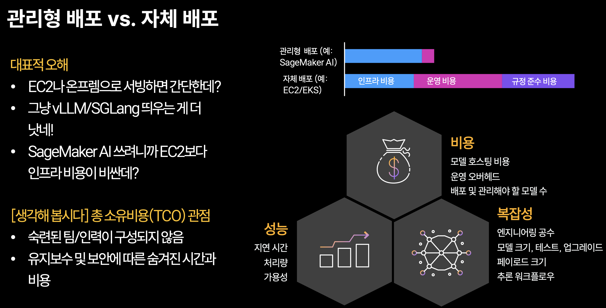

# 00. 전체 지도: 프로젝트 구조와 실행 순서

!!! info "Scope"
    저장소 구조, 5가지 유스케이스, 노트북 실행 순서, 공통 코드와 문서 위치를 설명합니다.

    설치는 [시작하기](../getting_started.md), 실제 실행은 [노트북 실행법](../execution/run_notebook.md) 또는 [Python 스크립트 실행법](../execution/run_pipeline.md), SageMaker AI 기본 개념은 [SageMaker AI 기초](01_sagemaker_basics.md)에서 확인하세요.

## 프로젝트 구성

이 저장소는 5개의 독립적인 실습 코스와 공통 코드로 구성됩니다. 각 코스는 데이터 준비, 학습, 배포와 정리 과정을 자체적으로 포함합니다.

| 경로 | 역할 |
|---|---|
| `tracks/` | 유스케이스별 노트북, 데이터 어댑터와 학습 스크립트 |
| `common/` | 설정, AWS 호출, 데이터 합성, 평가와 MLflow 공통 코드 |
| `pipelines/` | 노트북 과정을 Python으로 자동 실행하는 파이프라인 |
| `agentcore/` | Strands 에이전트와 AgentCore Runtime 배포 코드 |
| `iam/` | 실행 역할에 필요한 IAM 정책 예시 |
| `docs/` | 개념, 실행 방법과 유스케이스별 설명 |
| `tools/` | 노트북 생성과 저장소 유지보수 도구 |
| `tests/` | 설정과 주요 실행 경로의 스모크 테스트 |
| `config.yaml` | 파이프라인에서 사용하는 비밀값이 아닌 실행 설정 |
| `.env` | 리전, 인스턴스와 기능 스위치 등 환경 설정 |

`tracks/<코스>/track_data.py`는 원본 데이터셋을 공통 `messages` 형식으로 바꿉니다. `tracks/<코스>/scripts/`에는 SageMaker AI와 로컬 검증에서 함께 사용하는 학습 및 서빙 코드가 있습니다.

## 텍스트 코스 실행 흐름

텍스트 코스 4개는 같은 노트북 순서를 사용합니다.

| 단계 | 필수 여부 | 결과 |
|---|---|---|
| `00_setup.ipynb` | 필수 | AWS 자격증명, 실행 역할, 리전과 버킷 확인 |
| `01_data_and_synthetic.ipynb` | 필수 | 시드 데이터 변환, held-out 분리와 합성 데이터 생성 |
| `02_train_sft_sagemaker.ipynb` | 필수 | SFT Training Job과 모델 아티팩트 |
| `02a_train_grpo_sagemaker.ipynb` | 추출과 분류 코스에서 선택 | SFT 모델의 GRPO 추가 학습 |
| `02b_local_serve.ipynb` | 선택 | SageMaker AI 배포 전 로컬 vLLM 확인 |
| `03_deploy_endpoint.ipynb` | 필수 | Real-time Endpoint |
| `04_evaluate.ipynb` | 필수 | held-out 데이터 평가 결과 |
| `05_agentic_strands.ipynb` | 선택 | Endpoint와 Bedrock을 연결한 에이전트 |
| `06_agentcore_deploy.ipynb` | 선택 | AgentCore Runtime 배포 |
| `99_cleanup.ipynb` | Endpoint를 만들었다면 필수 | Endpoint, EndpointConfig와 Model 삭제 |

모델 학습과 평가만 수행하려면 `00`, `01`, `02`, `03`, `04`, `99` 순서로 실행하면 됩니다. 에이전트 단계와 GRPO 추가 학습은 필요한 코스에서만 선택합니다.

### 멀티모달 코스 05의 별도 파이프라인

`tracks/05_multimodal_extraction/`은 영수증 이미지에서 구조화 JSON을 추출합니다. 이미지 합성, GRPO, 로컬 vLLM, 별도 평가와 에이전트 단계는 포함하지 않습니다.

| 단계 | 결과 |
|---|---|
| `00_setup.ipynb` | 환경과 AWS 리소스 확인 |
| `01_data_explore.ipynb` | CORD v2 이미지와 정답 JSON 확인 |
| `02_train_mm_sagemaker.ipynb` | 멀티모달 Training Job과 모델 아티팩트 |
| `03_deploy_mm_endpoint.ipynb` | 이미지 입력을 받는 Endpoint |
| `99_cleanup.ipynb` | Endpoint 관련 리소스 삭제 |

멀티모달 모델은 vision tower를 유지하므로 텍스트 코스의 모델 재내보내기 경로를 사용하지 않습니다.

## 5개 독립 코스와 공통 레이어

각 코스는 다른 코스의 결과에 의존하지 않습니다. 관심 있는 유스케이스 하나만 선택해 처음부터 끝까지 실행할 수 있습니다.

| 유스케이스 | 디렉터리 | 시드 데이터셋 | 입력과 출력 | 주요 평가 |
|---|---|---|---|---|
| [텍스트 구조화 추출](../courses/extraction.md) | `01_extraction_to_json` | `glaiveai/glaive-function-calling-v2` | 사용자 요청, 도구 호출 JSON | 인자 단위 F1 |
| [의도 분류](../courses/classification.md) | `02_classification` | `mteb/banking77` | 고객 문의, 의도 라벨 | 정확도와 macro F1 |
| [문서 요약](../courses/summarization.md) | `03_summarization` | `FiscalNote/billsum` | 문서, 요약문 | ROUGE와 LLM 평가 |
| [도메인 질의응답](../courses/domain_qa.md) | `04_domain_qa` | `databricks/databricks-dolly-15k` | 질문과 지시문, 답변 | token F1과 LLM 평가 |
| [이미지 구조화 추출](../courses/multimodal.md) | `05_multimodal_extraction` | `naver-clova-ix/cord-v2` | 영수증 이미지, JSON | 배포 확인과 결과 검토 |

코스 간에 공유되는 것은 코드입니다. 데이터와 모델 아티팩트는 각 코스 디렉터리와 AWS 리소스 이름으로 분리됩니다.

### 공통 코드

| 파일 | 역할 |
|---|---|
| `common/config.py` | 모델 프리셋, 리전, 실행 역할과 코스 설정 |
| `common/gemma_format.py` | Gemma chat template과 `messages` 변환 |
| `common/aws_utils.py` | S3 업로드, Endpoint 호출과 CloudWatch 링크 |
| `common/dlc.py` | 학습 및 서빙 DLC 이미지와 환경변수 구성 |
| `common/synth/bedrock_synth.py` | Bedrock Converse 기반 합성 데이터 생성 |
| `common/eval_utils.py` | 코스별 평가 지표와 LLM 평가 |
| `common/model_inspect.py` | 모델 아티팩트와 서빙 호환성 확인 |
| `common/mlflow_utils.py` | 로컬 SQLite 또는 SageMaker Managed MLflow 기록 |
| `common/llm_gateway.py` | Bedrock과 SageMaker AI Endpoint 호출 인터페이스 |

### 학습 길이와 서빙 길이는 다른 값입니다

학습과 서빙은 토큰 길이를 다르게 계산합니다.

| 설정 | 적용 시점 | 포함하는 토큰 | 주요 영향 |
|---|---|---|---|
| `max_seq_length` | 학습 | 학습 예시 전체 | 학습 메모리, 속도와 입력 절단 |
| `serve_max_model_len` | 서빙 | 프롬프트와 생성 결과 | KV cache 메모리와 최대 컨텍스트 |
| `gen_max_tokens` | 추론 | 새로 생성할 결과 | 응답 길이와 처리 시간 |

서빙 컨텍스트는 프롬프트와 생성 결과를 모두 포함하므로 학습 길이와 같다고 가정하면 긴 입력이 잘릴 수 있습니다. 코스에서 `serve_max_model_len`을 지정하지 않으면 공통 코드가 `max_seq_length`의 두 배를 사용합니다.

각 코스의 실제 값과 선택 이유는 유스케이스별 문서에 정리되어 있습니다.

## 설정과 실행

### 설정 위치

| 위치 | 용도 |
|---|---|
| 셸과 `.env` | 리전, 인스턴스, 이미지 URI와 기능 스위치 |
| `config.yaml` | 모델, 학습, 서빙, 데이터와 평가 설정 |
| `common/config.py` | 노트북과 공통 코드의 기본값 |
| `pipelines/_config.py` | `config.yaml`을 파이프라인 실행 설정으로 변환 |

환경변수가 `config.yaml`보다 우선하고, `config.yaml`이 코드 기본값보다 우선합니다. 한 번만 값을 바꿀 때는 명령을 실행하는 셸에서 환경변수로 지정합니다.

시크릿과 계정별 값은 커밋하지 않습니다. Hugging Face 토큰은 `hf auth login`, SageMaker AI 실행 역할은 `SAGEMAKER_ROLE_ARN` 또는 자동 탐색을 사용합니다.

현재 저장소 기본값은 Gemma 4 E4B, vLLM 서빙과 MLflow 비활성화입니다. 실제 값과 설명은 `config.yaml`과 `.env`를 기준으로 확인하세요.

### 실행 방법

| 방법 | 적합한 경우 | 확인할 문서 |
|---|---|---|
| 노트북 | 처음 실행하거나 중간 결과를 확인할 때 | [노트북 실행법](../execution/run_notebook.md) |
| Python 파이프라인 | 검증된 코스를 반복 실행하거나 CI에서 사용할 때 | [Python 스크립트 실행법](../execution/run_pipeline.md) |
| 파이프라인 `--dry-run` | AWS 리소스를 만들지 않고 실행 계획을 확인할 때 | [Python 스크립트 실행법](../execution/run_pipeline.md) |

노트북의 `DRY_RUN=1`은 데이터와 학습 규모를 줄이는 설정입니다. 학습이나 배포 셀을 실행하면 AWS 리소스와 비용이 발생할 수 있습니다. 비용 없이 실행 계획만 확인하려면 Python 파이프라인의 `--dry-run`을 사용하세요.

## 설계 원칙

### 주요 선택

| 영역 | 이 저장소의 선택 | 이유 |
|---|---|---|
| 데이터 | 시드 데이터 기반 합성과 held-out 분리 | 학습 데이터와 평가 데이터의 혼합 방지 |
| 학습 | PyTorch DLC, TRL과 PEFT | 학습 코드, LoRA 설정과 라이브러리 버전을 직접 제어 |
| 서빙 | Real-time Endpoint와 vLLM 기본값 | 평가와 에이전트가 동기 요청 사용 |
| 대체 서빙 엔진 | SGLang과 DJL LMI | 동일한 모델을 다른 엔진에서 비교 |
| 에이전트 | Strands와 Bedrock, 선택적으로 AgentCore Runtime | 파인튜닝 모델을 도구로 연결 |
| 실험 추적 | 선택적 SageMaker Managed MLflow | 설정, 학습 지표와 평가 결과 비교 |

엔진별 차이와 호환성 문제는 [서빙 컨테이너](../guides/04_serving_containers.md), 학습 설계는 [파인튜닝](../guides/02_finetuning.md)에서 다룹니다.

### TCO 관점의 플랫폼 선택 { #인프라-비용은-tco의-한-칸일-뿐입니다 }

관리형 서비스와 자체 운영 환경을 비교할 때는 인스턴스 가격 외의 비용도 포함해야 합니다.

| 비용 | 자체 운영 환경 | SageMaker AI |
|---|---|---|
| 인프라 | 인스턴스, 스토리지와 네트워크 직접 구성 | Training Job과 Endpoint 단위로 사용 |
| 운영 | 드라이버, 스케줄러, 상태 확인, 배포와 복구 직접 관리 | 관리형 컨트롤 플레인 사용 |
| 규정 준수 | 운영 체제 패치, 격리와 감사 체계 직접 구성 | 관리형 서비스 범위는 AWS가 담당하고 애플리케이션과 데이터는 사용자가 관리 |

자체 운영 체계와 전문 인력이 이미 있다면 자체 배포의 추가 비용이 낮을 수 있습니다. 반대로 개별 학습과 Endpoint를 빠르게 운영하려면 관리형 경로가 단순합니다. 플랫폼 선택 기준은 [언제 무엇을 쓰나](01_sagemaker_basics.md#언제-무엇을-쓰나)에서 비교합니다.

## 문서와 노트북 매핑

### 상세 문서 지도

| 문서 | 다루는 내용 | 관련 단계 | 주요 코드 |
|---|---|---|---|
| [01 SageMaker AI 기초](01_sagemaker_basics.md) | Training Job, Endpoint, 실행 역할과 경로 규약 | 전 단계 | `common/config.py`, `common/aws_utils.py` |
| [02 SageMaker AI와 Studio 이해하기](02_sagemaker_ai_vs_studio.md) | 서비스, 개발환경과 관리형 리소스의 경계 | 전 단계 | boto3, SageMaker SDK |
| [03 [Advanced] SageMaker AI 보안과 네트워크](03_sagemaker_security_network.md) | control plane, VPC, 데이터 경로와 network isolation | 전 단계 | IAM, VPC, S3와 CloudWatch |
| [01 합성 데이터](../guides/01_synthetic_data.md) | 시드 변환, 합성 데이터와 held-out 분리 | `01_data_and_synthetic` | `common/synth/`, `track_data.py` |
| [02 파인튜닝](../guides/02_finetuning.md) | SFT, GRPO, LoRA, QLoRA와 모델 저장 | `02`, `02a` | `scripts/train.py`, `scripts/train_grpo.py` |
| [03 SageMaker AI 추론](../guides/03_sagemaker_inference.md) | Endpoint 배포, 호출, 평가와 정리 | `03`, `04`, `99` | `common/aws_utils.py` |
| [04 서빙 컨테이너](../guides/04_serving_containers.md) | vLLM, SGLang, DJL LMI와 호환성 문제 | `02b`, `03` | `common/dlc.py`, `common/model_inspect.py` |
| [05 Agentic loop](../guides/05_agentic.md) | Strands, Bedrock과 AgentCore Runtime | `05`, `06` | `agentcore/app.py`, `common/llm_gateway.py` |
| [노트북 실행법](../execution/run_notebook.md) | 노트북 순서와 단계별 결과 전달 | 전 단계 | 코스별 노트북 |
| [Python 스크립트 실행법](../execution/run_pipeline.md) | 코스 자동 실행, 재개와 정리 | 전 단계 | `pipelines/` |
| [SageMaker Managed MLflow](../experiments/mlflow.md) | 실험 설정, 학습 지표와 평가 결과 추적 | 학습과 평가 | `common/mlflow_utils.py` |
| [속도 측정](../experiments/benchmark.md) | TTFT, TPOT, ITL과 E2EL 측정 | 배포 이후 | `pipelines/run_benchmark.py` |
| [SageMaker SDK V3](../sdk_v3/index.md) | V2와 V3 차이, 학습과 배포 API | 전 단계 | `sagemaker` 패키지 |

유스케이스별 데이터 변환, 지표와 설정값은 각 코스 문서에서 확인할 수 있습니다.

## 라이선스 요약

모델과 데이터셋의 라이선스는 서로 독립적입니다. 파인튜닝한 모델을 재배포할 때는 기본 모델과 학습 데이터 양쪽의 조건을 확인해야 합니다.

| 항목 | 확인할 내용 |
|---|---|
| 기본 모델 | [`google/gemma-4-E4B-it`](https://huggingface.co/google/gemma-4-E4B-it)의 모델 카드와 Apache 2.0 조건 |
| 도메인 질의응답 | [`databricks/databricks-dolly-15k`](https://huggingface.co/datasets/databricks/databricks-dolly-15k)의 CC BY-SA 3.0과 동일조건변경허락 |
| 멀티모달 추출 | [`naver-clova-ix/cord-v2`](https://huggingface.co/datasets/naver-clova-ix/cord-v2)의 CC BY 4.0과 저작자 표시 |
| 나머지 시드 데이터셋 | 각 코스 문서에 연결된 데이터셋 카드와 원본 저장소의 라이선스 |

데이터셋 미러에는 라이선스 메타데이터가 빠질 수 있습니다. 실제 재배포 전에 모델 카드, 데이터셋 카드와 원본 저장소를 다시 확인하세요.

다음 단계는 [시작하기](../getting_started.md), [노트북 실행법](../execution/run_notebook.md) 또는 [Python 스크립트 실행법](../execution/run_pipeline.md)입니다.
