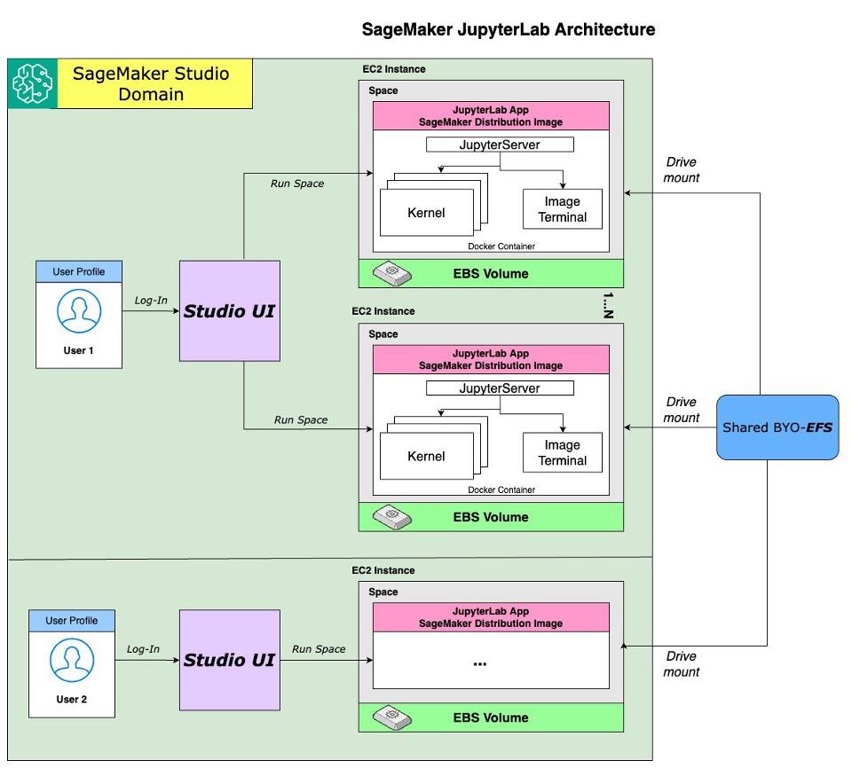

# 02. SageMaker AI와 SageMaker Studio 이해하기

!!! info "Scope"
    SageMaker AI, 현재 SageMaker Studio, Studio Classic과 SageMaker Unified Studio의 역할을 구분하고 Studio에서 실행한 코드가 실제로 어디에서 동작하는지 설명합니다.

## 30초 요약

**SageMaker AI는 모델을 학습하고 배포하는 관리형 서비스이고, SageMaker Studio는 SageMaker AI를 사용하는 웹 개발환경입니다.**

Studio 안에서 노트북을 열더라도 학습과 배포가 Studio EC2 안에서 실행되는 것은 아닙니다. 노트북은 SageMaker AI API를 호출하고, 실제 학습과 추론은 별도의 Training Job과 Endpoint에서 실행됩니다.


Studio는 선택 사항입니다. 랩탑, EC2, 사내 서버나 CI에서도 같은 API를 호출할 수 있습니다.

!!! warning "Studio의 EC2는 일반 EC2가 아닙니다"
    Studio Space는 EC2 기반이지만 SageMaker AI가 관리하는 App 인스턴스입니다. 사용자는 인스턴스 유형과 App 시작·중지를 선택할 수 있지만 EC2 콘솔, SSH, AMI나 ENI 수준으로 직접 관리하지는 않습니다.

## 이름부터 정리

SageMaker 관련 제품은 이름이 비슷해 먼저 구분해야 합니다.

| 이름 | 의미 | 현재 위치 |
|---|---|---|
| **Amazon SageMaker AI** | Training Job, Processing Job, Model과 Endpoint를 제공하는 ML 서비스 | 이 저장소가 사용하는 핵심 서비스 |
| **Amazon SageMaker Studio** | SageMaker AI용 웹 포털과 IDE 모음 | 현재 사용해야 하는 Studio |
| **SageMaker Studio Classic** | 2023년 11월 30일 이전 Studio 환경 | 레거시 |
| **SageMaker Notebook Instance** | Domain 없이 단독으로 만드는 관리형 Jupyter 서버 | 선택 가능한 별도 개발환경 |
| **Amazon SageMaker Unified Studio** | 데이터, 분석, ML과 생성형 AI 작업을 한곳에 모은 통합 개발환경 | SageMaker Studio의 새 버전이 아닌 별도 제품 |

## SageMaker AI와 Studio의 역할

Studio는 SageMaker AI 위에서 동작하는 개발환경입니다. 둘은 같은 제품 화면에서 함께 보이지만 담당하는 역할이 다릅니다.

| 구분 | SageMaker Studio | SageMaker AI |
|---|---|---|
| 목적 | 코드를 작성하고 실행하며 리소스를 확인 | 모델 학습, 처리와 배포 실행 |
| 주요 리소스 | Domain, User Profile, Space와 App | Training Job, Processing Job, Model과 Endpoint |
| 컴퓨팅 | 노트북과 터미널용 개발 인스턴스 | 작업별 학습 인스턴스와 상시 추론 인스턴스 |
| 저장소 | Space별 EBS, 선택적으로 EFS | S3 입력, 체크포인트와 모델 아티팩트 |
| 수명 | App을 시작하고 중지 | Job은 완료되면 종료, Endpoint는 삭제할 때까지 실행 |
| 필수 여부 | 선택 | 이 저장소에서 필수 |

Studio의 인스턴스 유형과 Training Job의 인스턴스 유형은 서로 독립적입니다. 작은 Studio 인스턴스에서 노트북을 실행하면서 큰 GPU Training Job을 생성할 수 있습니다.

## 현재 SageMaker Studio 구조

현재 Studio는 **Space를 중심으로 개발환경을 관리**합니다.



그림은 왼쪽에서 오른쪽 순서로 읽으면 됩니다.

1. 사용자는 User Profile로 Studio UI에 로그인합니다.
2. 사용자가 Space를 실행하면 해당 Space용 EC2 인스턴스와 EBS 볼륨이 준비됩니다.
3. JupyterLab App, Jupyter Server, 커널과 터미널은 같은 EC2 인스턴스에서 실행됩니다.
4. 각 Space의 EBS는 서로 분리되며, 여러 Space가 같은 파일을 사용해야 한다면 별도의 EFS를 연결할 수 있습니다.

!!! note "현재 Studio에는 별도의 KernelGateway App이 없습니다"
    Python Kernel은 여전히 노트북 셀을 실행하지만 JupyterLab Server와 같은 Space의 EC2 인스턴스에서 동작합니다. Studio Classic처럼 JupyterServer App이 원격 KernelGateway App으로 코드를 전달하지 않으며, AWS는 현재 구조를 [local runtime model](https://docs.aws.amazon.com/sagemaker/latest/dg/studio-updated-migrate-lcc.html)이라고 설명합니다.

    한 Space에서 여러 노트북과 Kernel을 실행할 수 있으며, AWS는 Space당 Kernel 개수의 고정 상한을 별도로 명시하지 않습니다. 모든 Kernel이 같은 EC2의 CPU, 메모리와 GPU를 공유하므로 실제 실행 가능 개수는 인스턴스 용량과 각 Kernel의 사용량에 따라 달라집니다.

    [SageMaker AI Service Quotas](https://docs.aws.amazon.com/general/latest/gr/sagemaker.html)는 한 Space 안의 Kernel 수가 아니라 리전과 인스턴스 유형별로 실행할 수 있는 JupyterLab App 수를 제한합니다. 서로 다른 인스턴스 유형을 동시에 사용하려면 CPU용 Space와 GPU용 Space처럼 [JupyterLab Space](https://docs.aws.amazon.com/sagemaker/latest/dg/studio-updated-jl-user-guide.html)를 각각 실행합니다.

### Domain

Domain은 Studio 조직의 관리 경계입니다. 인증 방식, VPC, 기본 실행 역할, 사용자, Space와 공통 설정을 묶습니다.

Domain이 Training Job이나 Endpoint를 직접 실행하는 것은 아닙니다. 사용자가 Studio에 로그인하고 개발환경을 만들 수 있도록 계정과 네트워크의 기본값을 관리합니다.

### User Profile

User Profile은 Studio 안의 사용자 또는 작업 주체를 나타냅니다. 기본 실행 역할과 애플리케이션 설정을 연결하며 Private Space의 소유자를 구분합니다.

### Space

Space는 사용자가 실제로 작업하는 독립된 개발공간입니다.

- **Private Space:** 한 사용자만 접근합니다.
- **Shared Space:** 여러 사용자가 같은 파일과 개발환경을 공유합니다.
- 한 User Profile은 용도와 인스턴스 유형이 다른 Space를 여러 개 만들 수 있습니다.
- 하나의 Space에는 하나의 App 인스턴스가 연결됩니다.
- Space마다 App, 인스턴스 유형과 저장소 설정을 가질 수 있습니다.
- App을 중지해도 Space의 EBS 데이터는 Space를 삭제하기 전까지 유지됩니다.

### App, EC2와 EBS

JupyterLab이나 Code Editor를 시작하면 Space 안에 App이 실행됩니다. 현재 JupyterLab 구조에서는 Jupyter Server, 커널과 터미널이 같은 EC2 인스턴스에서 실행되고 노트북 파일은 해당 Space의 EBS 볼륨에 저장됩니다.

App을 중지하면 개발용 EC2 비용은 멈추지만 EBS 볼륨은 유지됩니다. 다시 시작하면 같은 Space의 파일을 이어서 사용할 수 있습니다.


Space의 EBS는 기본적으로 5GB로 생성됩니다. 별도 관리자 설정이 없다면 사용자는 Studio 화면에서 5GB부터 100GB까지 선택할 수 있습니다.

| EBS 설정 | 범위 |
|---|---|
| 기본 용량 | 5GB |
| 일반 사용자 기본 선택 범위 | 5~100GB |
| 관리자가 설정할 수 있는 최대 상한 | 16,384GB |

100GB보다 큰 볼륨이 필요하면 관리자가 Domain 또는 User Profile의 `MaximumEbsVolumeSizeInGb`를 변경해야 합니다. Space 설정을 변경하려면 먼저 App을 중지해야 하며, 볼륨 크기는 6시간에 한 번만 변경할 수 있습니다.

EBS 비용은 실제 사용량이 아니라 프로비저닝한 용량을 기준으로 계산됩니다. 예를 들어 100GB를 설정하고 파일을 10GB만 저장해도 100GB의 EBS 저장 비용이 발생합니다.

공유 데이터가 필요하면 관리자가 EFS를 연결할 수 있습니다. EBS는 Space별 작업 파일에 적합하고 EFS는 여러 Space가 함께 사용하는 데이터에 적합합니다.

### EC2를 사용자가 직접 관리하는가

Studio Space의 컴퓨팅은 실제 EC2 인스턴스를 사용하지만 **일반 EC2 인스턴스처럼 직접 관리하지는 않습니다**. 사용자는 Studio와 SageMaker AI API를 통해 필요한 범위만 제어하고, 인스턴스 생성, 호스트 운영과 복구는 SageMaker AI가 관리합니다.

| 사용자가 제어할 수 있는 항목 | SageMaker AI가 관리하는 항목 |
|---|---|
| 허용된 인스턴스 유형 선택과 변경 | 실제 EC2 인스턴스 생성과 종료 |
| App 시작, 중지와 재시작 | 호스트 운영체제와 물리 인프라 |
| Space와 EBS 용량 설정 | 인스턴스 복구와 서비스 운영 |
| 터미널에서 conda와 pip 환경 구성 | EC2 콘솔에서 보이는 일반 인스턴스 수명주기 |
| 허용된 커스텀 이미지와 Lifecycle Configuration 사용 | Studio App과 EC2 연결 |

따라서 사용자가 EC2 콘솔에서 해당 인스턴스를 찾아 SSH로 접속하거나 임의의 AMI, ENI와 EBS를 붙이는 방식은 아닙니다. Domain 관리자가 허용한 인스턴스, 이미지, 저장소와 IAM 범위 안에서 Space를 사용합니다.

### 과금 방식

Studio 화면이나 Domain 자체보다 **실행 중인 App의 컴퓨팅과 연결된 저장소**가 주요 과금 대상입니다.

| 리소스 | 과금 기준 | App 중지 후 |
|---|---|---|
| JupyterLab 또는 Code Editor 인스턴스 | 선택한 인스턴스 유형과 실행 시간 | 컴퓨팅 과금 중지 |
| Space의 EBS 볼륨 | 프로비저닝한 용량의 GB-월 | 계속 과금 |
| 추가 EFS, S3와 데이터 전송 | 각 서비스의 사용량 | 리소스가 남아 있으면 계속 과금 |
| Training Job | 학습 인스턴스 유형과 실행 시간 | Studio와 별도 과금 |
| Endpoint | 추론 인스턴스 유형과 실행 시간 | 삭제할 때까지 별도 과금 |

브라우저 탭을 닫는 것만으로 App이 중지되지는 않습니다. 사용을 마치면 Studio에서 JupyterLab 또는 Code Editor App을 명시적으로 중지해야 컴퓨팅 과금이 멈춥니다.

Space를 여러 개 실행하면 각 Space의 App 인스턴스가 따로 과금됩니다. App을 모두 중지해도 각 Space의 EBS 볼륨은 남아 있으므로 더 이상 필요하지 않은 Space는 데이터를 확인한 뒤 삭제해야 저장소 과금도 종료됩니다.

## Studio Classic 구조

Studio Classic은 Jupyter Server와 커널 실행 환경이 분리된 구조였습니다.

Jupyter Server는 화면과 노트북 파일을 관리하고, 코드 셀은 별도의 KernelGateway 인스턴스로 전달해 실행했습니다. 노트북 파일은 Domain의 EFS에 저장됐기 때문에 여러 Classic 애플리케이션에서 같은 홈 디렉터리를 볼 수 있었습니다.

이 구조에서는 UI를 담당하는 JupyterServer App과 코드를 실행하는 KernelGateway App에 서로 다른 수명주기 설정과 이미지 구성이 적용됐습니다.

## 현재 Studio와 Studio Classic 비교

!!! info "구조 변화 요약"
    Studio Classic은 JupyterServer와 KernelGateway를 분리해 Kernel 컴퓨팅을 독립적으로 선택하고 중지할 수 있었지만 두 App을 따로 관리해야 했습니다. 현재 Studio는 JupyterLab Server와 Kernel을 Space의 App 인스턴스에 묶어 시작과 운영을 단순화했지만, App이 실행되는 동안 UI만 사용해도 해당 인스턴스의 컴퓨팅 비용이 발생합니다. 구조 차이는 [Studio Classic 마이그레이션 가이드](https://docs.aws.amazon.com/sagemaker/latest/dg/studio-updated-migrate-lcc.html)와 [JupyterLab 관리자 가이드](https://docs.aws.amazon.com/sagemaker/latest/dg/studio-updated-jl-admin-guide.html)에서 확인할 수 있습니다.


왼쪽의 Studio Classic은 JupyterLab 화면과 Python Kernel을 서로 다른 App에서 실행하고 Domain EFS를 공유합니다. 오른쪽의 현재 Studio는 JupyterLab Server, Kernel과 터미널을 하나의 Space App 인스턴스에서 실행합니다. 기본 작업 파일은 Space 전용 EBS에 저장하며, 필요하면 관리자가 제공한 EFS를 추가로 마운트해 여러 Space에서 공유할 수 있습니다.

| 구분 | 현재 SageMaker Studio | Studio Classic |
|---|---|---|
| 상태 | 현재 구조 | 레거시 |
| 작업 단위 | Space | User Profile과 App |
| Jupyter 구조 | Jupyter Server와 커널이 같은 EC2에서 실행 | JupyterServer와 KernelGateway가 분리 |
| 코드 실행 | Space 안에서 로컬 실행 | KernelGateway에서 원격 실행 |
| 기본 작업 저장소 | Space별 EBS | Domain의 EFS |
| 공유 파일 | Shared Space 또는 별도 EFS 연결 | Domain EFS |
| 인스턴스 선택 | Space의 App 인스턴스 선택 | KernelGateway App 인스턴스 선택 |
| 새 환경 권장 | 사용 | 사용하지 않음 |

## 노트북 코드는 어디에서 실행되는가

Studio를 사용하면 모든 코드가 SageMaker AI 관리형 작업에서 실행된다고 오해하기 쉽습니다. 실제 실행 위치는 코드에 따라 다릅니다.

| 코드 또는 동작 | 실행 위치 |
|---|---|
| `pandas`, 파일 변환과 로컬 데이터 검사 | Studio Space의 EC2 또는 사용 중인 개발환경 |
| `boto3`와 SageMaker SDK 호출 | Studio Space의 EC2 또는 사용 중인 개발환경 |
| `Estimator.fit()` 호출 전후의 Python 코드 | 개발환경 |
| SageMaker AI에 제출한 `train.py` | 별도의 Training Job |
| 배포한 모델 서버 | 별도의 Endpoint |
| 학습 데이터와 모델 아티팩트 | S3 |
| Job과 Endpoint 로그 | CloudWatch |

노트북에서 `Estimator.fit()`을 실행하면 SDK가 SageMaker AI control plane에 Training Job 생성을 요청합니다. 요청이 접수된 뒤에는 브라우저를 닫거나 Studio App을 중지해도 Training Job은 계속 실행됩니다. 다만 노트북 프로세스가 다음 단계까지 자동으로 실행하던 흐름은 중단될 수 있습니다.

Endpoint도 Studio와 독립된 리소스입니다. Studio App을 중지해도 Endpoint는 계속 실행되며, Endpoint를 삭제해야 추론 인스턴스가 종료됩니다.

## Studio를 사용하지 않는 실행 구조

Studio 없이도 실행 흐름은 같습니다.

```text
랩탑, EC2, 사내 서버 또는 CI
  |
boto3 또는 SageMaker SDK
  |
SageMaker AI API
  |
Training Job 또는 Endpoint
```

필요한 것은 Python 환경, AWS 자격증명, SageMaker AI API 호출 권한과 Job에 전달할 실행 역할입니다. Studio는 이 개발환경을 AWS가 관리하는 웹 IDE로 제공하는 선택지입니다.

## Studio가 적합한 경우

- 브라우저에서 관리형 JupyterLab과 Code Editor를 사용하려는 경우
- 팀의 IAM, VPC, 이미지와 개발환경 설정을 Domain에서 관리하려는 경우
- 사용자별 Private Space와 팀 Shared Space가 필요한 경우
- SageMaker AI 리소스와 CloudWatch 로그를 AWS 화면에서 함께 확인하려는 경우

이미 랩탑, EC2 또는 CI 개발환경이 준비돼 있고 코드로 자동화한다면 Studio를 별도로 구성하지 않아도 됩니다.

## 이 저장소에서의 사용 방법

이 저장소를 Studio에서 실행한다면 **현재 SageMaker Studio의 JupyterLab Space**를 사용합니다. Studio Classic을 위한 별도 설정은 제공하지 않습니다.

| 단계 | 실행 위치 |
|---|---|
| 코스별 노트북과 `pipelines/` 실행 | JupyterLab Space, 랩탑, EC2 또는 CI |
| 합성 데이터 생성 | 개발환경과 Bedrock API |
| 파인튜닝 | SageMaker AI Training Job |
| 모델 배포와 추론 | SageMaker AI Endpoint |
| 데이터와 모델 아티팩트 | S3 |
| 로그 | CloudWatch |
| 실험 추적 | 선택적으로 SageMaker Managed MLflow |

개발환경과 SageMaker AI 리소스의 네트워크는 별도로 설정합니다. Studio Domain의 VPC 설정이 Training Job이나 Endpoint의 `VpcConfig`를 자동으로 대신하지 않습니다.

## SageMaker Unified Studio와의 차이

SageMaker Unified Studio는 현재 SageMaker 플랫폼에서 데이터, 분석, ML과 생성형 AI 도구를 통합하는 별도 개발환경입니다. SageMaker AI용 웹 개발환경인 SageMaker Studio와는 목적과 리소스 구조가 다릅니다. 기능과 프로젝트 구조는 [SageMaker Unified Studio 사용자 가이드](https://docs.aws.amazon.com/sagemaker-unified-studio/latest/userguide/what-is-sagemaker-unified-studio.html)에서 확인할 수 있습니다.

이 저장소는 SageMaker AI API를 직접 사용하므로 SageMaker Studio와 Unified Studio 모두 필수는 아닙니다. Unified Studio에서 같은 API와 권한을 사용할 수 있는 개발환경을 구성했다면 실행할 수 있지만, 이 문서의 Domain, User Profile과 Space 설명은 SageMaker AI의 Studio를 기준으로 합니다.

## 관련 문서

- [SageMaker AI 기초](01_sagemaker_basics.md): Training Job과 Endpoint의 구조
- [[Advanced] SageMaker AI 보안과 네트워크](03_sagemaker_security_network.md): control plane, Studio와 관리형 리소스의 VPC 경계
- [노트북 실행법](../execution/run_notebook.md): 코스별 노트북 실행 순서
- [Python 스크립트 실행법](../execution/run_pipeline.md): CLI 실행, 재개와 정리
- [SageMaker Managed MLflow](../experiments/mlflow.md): 선택형 실험 추적
- [SageMaker Studio](https://docs.aws.amazon.com/sagemaker/latest/dg/studio.html)
- [현재 SageMaker Studio](https://docs.aws.amazon.com/sagemaker/latest/dg/studio-updated.html)
- [SageMaker Studio Domain](https://docs.aws.amazon.com/sagemaker/latest/dg/domain-overview.html)
- [SageMaker Studio JupyterLab](https://docs.aws.amazon.com/sagemaker/latest/dg/studio-updated-jl.html)
- [SageMaker Studio JupyterLab 사용자 가이드](https://docs.aws.amazon.com/sagemaker/latest/dg/studio-updated-jl-user-guide.html)
- [JupyterLab EBS 기본값과 상한 설정](https://docs.aws.amazon.com/sagemaker/latest/dg/studio-updated-jl-admin-guide-storage-size.html)
- [SageMaker AI 요금](https://aws.amazon.com/sagemaker/ai/pricing/)
- [Studio Classic에서 현재 Studio로 마이그레이션](https://docs.aws.amazon.com/sagemaker/latest/dg/studio-updated-migrate.html)
- [SageMaker Unified Studio](https://docs.aws.amazon.com/sagemaker-unified-studio/latest/userguide/what-is-sagemaker-unified-studio.html)
