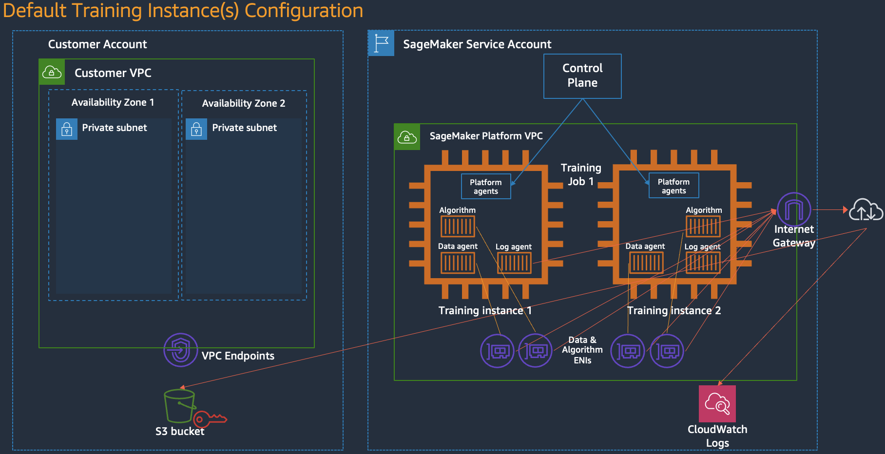
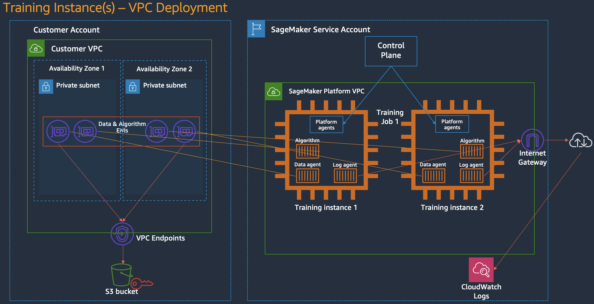
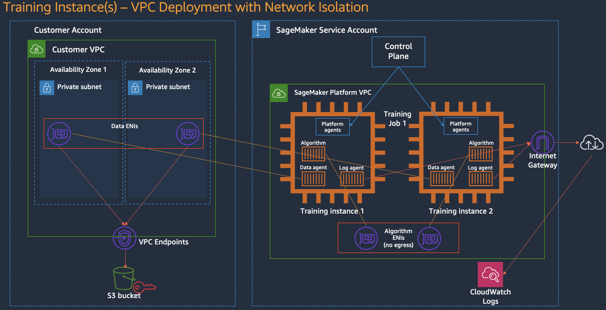
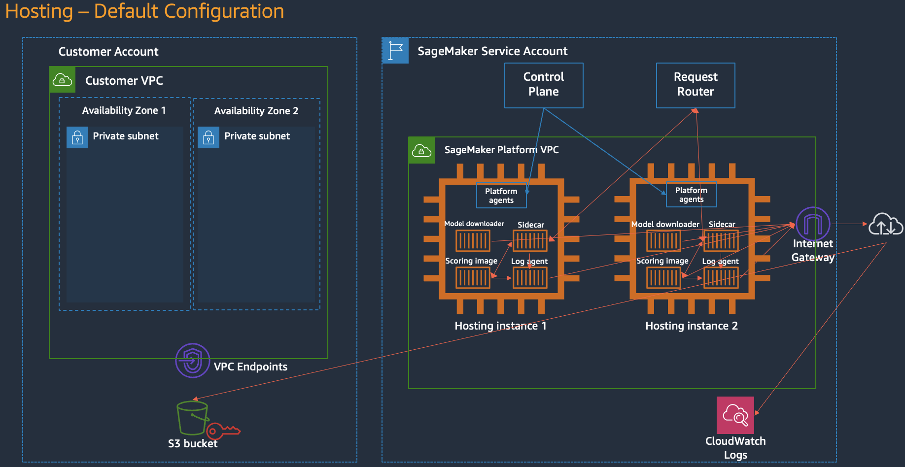
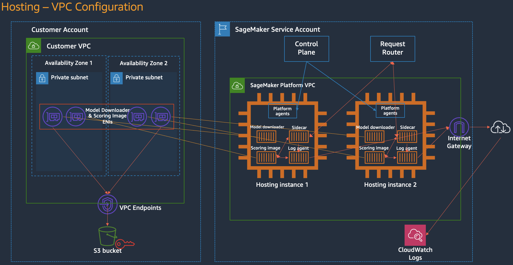
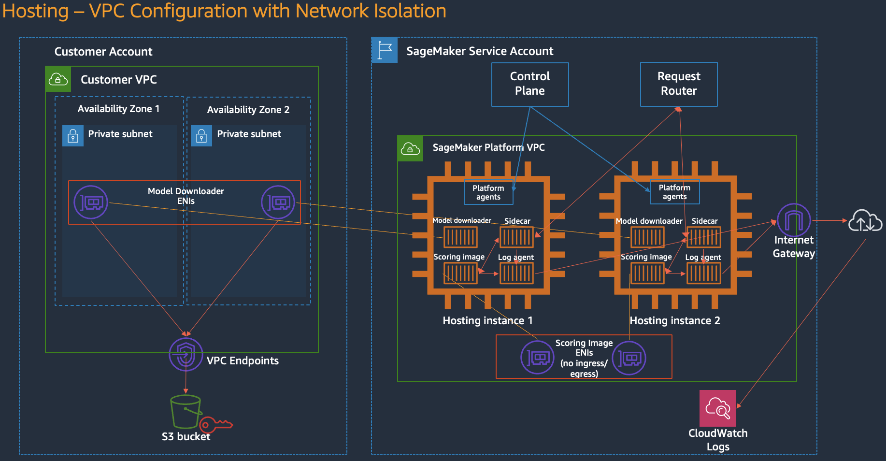

# 03. [Advanced] SageMaker AI 보안과 네트워크

!!! info "Scope"
    SageMaker AI Training Job과 Hosting Endpoint의 control plane, 데이터 이동, VPC 연결과 network isolation을 구분하고 보안 요구사항에 맞는 구성을 선택하는 기준을 설명합니다.

## 공통 개념

Training Job과 Hosting Endpoint는 모두 다음 세 가지 네트워크 구성을 사용할 수 있습니다.

### 30초 요약

ENI(Elastic Network Interface)는 통신을 수행하는 프로그램이 아니라 **Training Job이나 Endpoint를 네트워크에 연결하는 가상 네트워크 카드**입니다.

```text
사용자 컨테이너 또는 SageMaker agent
                |
               ENI
                |
    Subnet의 route table과 보안 규칙
                |
     VPC Endpoint, NAT 또는 외부 경로
```

세 구성의 차이는 ENI가 어느 네트워크에 만들어지고, 사용자 컨테이너의 트래픽을 어디까지 허용하는지입니다.

| 구성 | ENI 위치와 통신 경로 | 사용자 컨테이너의 외부 통신 |
|---|---|---|
| **기본 구성** | SageMaker AI 관리 VPC를 통해 AWS 서비스와 외부 리소스에 연결 | 가능 |
| **VPC 연결** | 고객 subnet에 ENI를 만들고 VPC Endpoint와 내부 리소스에 연결 | 고객 VPC의 route table과 NAT 구성에 따라 결정 |
| **VPC 연결과 network isolation** | SageMaker AI의 데이터 및 요청 전달 경로는 유지하고 사용자 컨테이너의 네트워크 차단 | 불가능 |

조금 더 정확히 풀면 다음과 같습니다.

1. **기본 구성:** SageMaker AI 관리 VPC에서 실행됩니다. 사용자 컨테이너는 기본적으로 외부 패키지, 모델과 API에 접근할 수 있습니다.
2. **VPC 연결:** SageMaker AI가 고객 subnet에 ENI를 생성합니다. 사용자 컨테이너는 이 ENI를 통해 VPC Endpoint와 내부 리소스에 접근합니다.
3. **VPC 연결과 network isolation:** 학습 데이터, 모델 아티팩트, 로그와 추론 요청을 전달하는 SageMaker AI 관리 경로는 유지됩니다. Algorithm이나 Scoring image는 인터넷, VPC 리소스와 AWS API를 직접 호출할 수 없습니다.

Control plane은 데이터와 추론 요청 경로와 별개입니다. Training Job과 Endpoint를 생성하고 상태를 관리하지만 학습 데이터나 모델 가중치가 control plane API를 통과하지는 않습니다.

### 네 가지 네트워크 경로

SageMaker AI의 네트워크를 이해하려면 모든 통신을 한 경로로 보면 안 됩니다.

| 경로 | 무엇이 이동하는가 | 주요 보안 제어 |
|---|---|---|
| 개발환경과 SageMaker AI API | 작업과 Endpoint 생성, 중지와 조회 요청 | IAM, TLS(Transport Layer Security), AWS PrivateLink, CloudTrail |
| S3와 관리형 리소스 | 학습 데이터, 체크포인트와 모델 아티팩트 | 실행 역할, S3 정책, VPC Endpoint, KMS |
| 사용자 컨테이너의 외부 통신 | 패키지, 모델과 외부 API 요청 | VPC 라우팅, 보안 그룹, NAT, network isolation |
| 분산 학습 인스턴스 사이 | gradient와 학습 프레임워크 통신 | 보안 그룹, inter-container traffic encryption |

`VpcConfig`, network isolation과 AWS PrivateLink는 서로 다른 경로를 제어합니다. 하나를 설정했다고 다른 경로까지 자동으로 보호되는 것은 아닙니다.

### Control plane을 거치면 데이터도 전달되는가

!!! note "흔한 오해: control plane이 학습 데이터를 처리한다"
    `CreateTrainingJob` 같은 control plane API에는 작업 이름, 컨테이너 이미지, S3 위치, 실행 역할, 인스턴스 유형과 네트워크 설정이 전달됩니다. 학습 데이터와 모델 가중치 자체를 API 요청 본문으로 보내는 구조가 아닙니다.

Control plane은 Training Job을 생성하고 상태를 관리합니다. 실제 학습 데이터는 S3에서 Training Job으로 이동하며, 완성된 모델 아티팩트는 다시 S3에 저장됩니다.

AWS는 control plane과 학습 인스턴스 사이의 명령 및 상태 통신을 고객 데이터가 아닌 통신으로 구분합니다. SageMaker AI API 요청과 외부 네트워크 구간은 TLS로 암호화됩니다. TLS는 네트워크로 전송되는 내용을 암호화해 도청과 변조를 방지하는 통신 보안 프로토콜입니다.

Control plane 사용 자체가 보안 문제는 아닙니다. 대신 다음 항목을 관리해야 합니다.

- **인증과 권한:** 누가 Training Job을 만들고 어떤 실행 역할을 전달할 수 있는지 IAM으로 제한합니다.
- **API 접속 경로:** 기본 서비스 엔드포인트 대신 AWS PrivateLink를 사용하면 VPC 안에서 SageMaker AI API를 호출할 수 있습니다.
- **감사 기록:** control plane API 호출은 CloudTrail 관리 이벤트에 기록됩니다.
- **요청 메타데이터:** 작업 이름, 태그와 하이퍼파라미터 같은 API 요청 값에 비밀값을 넣지 않습니다.

`VpcConfig`는 학습 또는 추론 컨테이너의 네트워크를 설정합니다. 개발환경에서 control plane API를 호출하는 경로까지 private으로 만들려면 별도의 SageMaker AI API interface VPC endpoint가 필요합니다.

### 기본 네트워크 용어

| 용어 | 쉽게 설명하면 |
|---|---|
| **VPC** | AWS 계정 안에 만드는 전용 가상 네트워크 |
| **Subnet** | VPC를 리전과 가용 영역 기준으로 나눈 네트워크 구역 |
| **ENI** | VPC 안의 리소스에 연결하는 가상 네트워크 카드 |
| **Security Group** | ENI를 통과할 수 있는 inbound와 outbound 통신 규칙 |
| **VPC Endpoint** | 인터넷이나 NAT를 거치지 않고 S3 같은 AWS 서비스에 연결하는 전용 입구 |
| **NAT Gateway** | Private subnet의 리소스가 외부 인터넷으로 요청을 보낼 때 사용하는 출구 |

#### ENI란

물리 서버에 랜 카드를 꽂아 네트워크에 연결하는 것처럼, AWS 리소스는 ENI를 통해 VPC에 연결됩니다.

ENI에는 private IP와 security group이 연결됩니다. 어떤 subnet에 ENI가 생성되는지에 따라 해당 리소스가 사용할 수 있는 route table과 VPC Endpoint도 결정됩니다.

!!! note "ENI가 있다고 자동으로 private 통신이 되는 것은 아닙니다"
    ENI는 네트워크에 연결하는 인터페이스입니다. 실제 통신 가능 범위는 subnet의 route table, security group, NAT Gateway와 VPC Endpoint 구성이 결정합니다.

SageMaker AI Training Job은 역할에 따라 ENI를 나눠 사용합니다.

| ENI | 누가 사용하는가 | 용도 |
|---|---|---|
| **Data ENI** | SageMaker AI의 data agent | S3에서 학습 데이터를 받고 모델 아티팩트를 저장 |
| **Algorithm ENI** | 사용자의 학습 컨테이너 | VPC 리소스, 패키지 저장소와 외부 서비스 호출 |

두 ENI를 분리하면 데이터 전달 경로는 유지하면서 사용자 학습 코드의 외부 통신만 차단할 수 있습니다. 세 번째 그림의 network isolation이 이 구조를 사용합니다.

세 그림에서 보라색 네트워크 카드 아이콘이 ENI입니다. 그림은 Data ENI와 Algorithm ENI의 역할을 설명하기 위한 개념도이며, 실제 ENI 개수는 고정된 계약이 아닙니다. subnet 크기를 정할 때는 ENI 그림의 개수보다 필요한 private IP 수를 기준으로 계산해야 합니다.

EFA를 사용하지 않는 Training Job은 인스턴스당 private IP를 최소 2개 준비해야 합니다. EFA를 사용한다면 인스턴스당 최소 5개가 필요합니다.

## Training Job 네트워크

Training Job은 S3에서 데이터를 받아 학습하고 결과를 다시 S3에 저장한 뒤 종료됩니다. 먼저 Training Job의 세 가지 구성을 살펴봅니다.

### 주요 구성요소

세 그림에는 Training Job 안의 역할이 나뉘어 표시됩니다.

| 구성요소 | 역할 |
|---|---|
| **Control Plane** | Training Job 생성, 중지와 상태 관리 |
| **Platform agent** | control plane의 명령을 받아 학습 인스턴스 수명 관리 |
| **Data agent** | S3 입력 다운로드와 결과 업로드 |
| **Log agent** | stdout, stderr와 지표를 CloudWatch로 전달 |
| **Algorithm** | 사용자가 제공한 학습 코드와 컨테이너 |
| **Data ENI** | 데이터 이동에 사용하는 네트워크 인터페이스 |
| **Algorithm ENI** | 학습 컨테이너의 네트워크 통신에 사용하는 인터페이스 |

`Algorithm`과 SageMaker AI가 관리하는 agent는 역할이 다릅니다. network isolation은 사용자 학습 컨테이너의 통신을 차단해도 SageMaker AI가 데이터와 로그를 처리하는 관리 경로는 유지합니다.

### 세 그림의 ENI 위치 비교

세 그림은 한 Training Job의 ENI가 실행 중에 이동하는 과정을 보여 주지 않습니다. 서로 다른 네트워크 설정으로 새 Training Job을 만들었을 때의 구성을 각각 보여 줍니다.

| 구성 | Customer VPC | SageMaker Platform VPC |
|---|---|---|
| 기본 구성 | Training용 ENI 없음 | Data ENI와 Algorithm ENI |
| VPC 연결 | Data ENI와 Algorithm ENI | SageMaker AI 관리 구성요소 |
| VPC 연결과 Network Isolation | Data ENI만 있음 | 외부 통신이 차단된 Algorithm ENI |

보라색 ENI 아이콘이 왼쪽과 오른쪽 중 어디에 있는지만 보면 됩니다.

1. **기본 구성:** Data ENI와 Algorithm ENI가 모두 오른쪽 SageMaker Service Account에 있습니다. Customer VPC는 사용하지 않습니다.
2. **VPC 연결:** Data ENI와 Algorithm ENI가 모두 왼쪽 Customer VPC에 있습니다. 데이터 전송과 학습 코드의 네트워크가 모두 Customer VPC를 사용합니다.
3. **VPC 연결과 Network Isolation:** Data ENI만 왼쪽 Customer VPC에 있고 Algorithm ENI는 오른쪽에 `no egress`로 표시됩니다. 데이터는 Customer VPC를 통해 전달하지만 학습 코드는 Customer VPC나 인터넷에 연결하지 않습니다.

세 번째 구성에서 ENI 위치가 갈리는 이유는 역할이 다르기 때문입니다. Data agent는 S3 입력과 결과 파일을 전달해야 하지만, Algorithm은 전달받은 파일만 사용하고 외부 네트워크에는 접근하지 않아야 합니다.

즉, Network Isolation은 Training instance 전체를 네트워크에서 끊는 기능이 아니라 **사용자가 제공한 Algorithm 컨테이너를 격리하는 기능**입니다. Training instance 전체를 차단하면 SageMaker AI도 학습 데이터 전달, 결과 업로드와 로그 수집을 수행할 수 없습니다. 그래서 SageMaker AI가 관리하는 Data agent, Log agent와 Platform agent의 경로는 유지하고 사용자 코드의 경로만 차단합니다.

### 기본 구성



`VpcConfig`를 지정하지 않으면 Training Job은 SageMaker AI가 관리하는 VPC에서 실행됩니다.

- 데이터와 모델 아티팩트는 S3의 공개 서비스 엔드포인트를 사용합니다.
- 로그는 CloudWatch의 공개 서비스 엔드포인트로 전달됩니다.
- 학습 컨테이너는 기본적으로 인터넷의 외부 리소스에 접근할 수 있습니다.
- 고객 VPC의 데이터베이스나 내부 서비스에는 직접 연결할 수 없습니다.

여기서 **공개 서비스 엔드포인트**는 S3 버킷이나 Training Job이 누구에게나 공개된다는 뜻이 아닙니다. 접근 권한은 실행 역할과 S3 정책으로 제한되며 전송 구간은 TLS로 암호화됩니다. 다만 네트워크 경로를 고객 VPC와 VPC Endpoint 안으로 제한한 구성은 아닙니다.

이 구성은 외부 패키지와 모델을 내려받기 편하지만 학습 코드가 외부로 통신할 수 있다는 점을 고려해야 합니다.

### VPC 연결



!!! warning "그림의 두 subnet은 인스턴스별 배치를 뜻하지 않습니다"
    그림은 두 Training 인스턴스가 서로 다른 subnet에 놓인 것처럼 보이지만, 실제로는 한 Training Job의 모든 인스턴스가 하나의 subnet과 Availability Zone에 함께 배치됩니다. `VpcConfig.Subnets`는 SageMaker AI가 선택할 수 있는 후보 목록입니다.

Training Job에 `VpcConfig`의 subnet과 security group을 지정하면 SageMaker AI가 고객 VPC에 ENI를 생성합니다. Training instance 자체가 고객 subnet으로 이동하는 것은 아닙니다. 인스턴스는 SageMaker AI 관리 환경에서 실행되고, 고객 subnet에 만든 ENI를 통해 고객 VPC와 연결됩니다.

- 학습 컨테이너가 RDS, EFS나 사내망처럼 VPC 안의 리소스에 접근할 수 있습니다.
- S3 Gateway Endpoint를 사용하면 학습 데이터와 모델 아티팩트를 인터넷 경로 없이 S3와 주고받을 수 있습니다.
- 보안 그룹, 네트워크 ACL과 VPC Flow Logs를 기존 네트워크 운영 방식에 맞게 적용할 수 있습니다.
- 분산 학습이라면 같은 작업의 인스턴스끼리 통신할 수 있도록 보안 그룹 규칙이 필요합니다.

VPC 연결만으로 인터넷 통신이 항상 차단되는 것은 아닙니다. 학습 컨테이너의 외부 통신 가능 여부는 subnet의 route table, NAT Gateway, 보안 그룹과 VPC Endpoint 구성에 따라 결정됩니다.

| VPC 구성 | 학습 컨테이너의 외부 통신 |
|---|---|
| Private subnet과 NAT Gateway | 허용된 인터넷 목적지에 접근 가능 |
| Private subnet, NAT 없음 | 일반 인터넷 접근 불가 |
| S3 Endpoint만 구성 | S3는 private 경로로 접근하지만 다른 외부 서비스에는 접근 불가 |

VPC 연결은 **통신 경로를 고객이 관리하는 방식**입니다. 학습 컨테이너의 모든 네트워크 호출을 서비스 수준에서 차단하는 기능은 아닙니다.

#### Subnet 목록과 실제 배치

`VpcConfig`에는 subnet을 1개부터 16개까지 지정할 수 있습니다. 이 목록은 인스턴스를 subnet별로 나누는 설정이 아니라 Training Job 전체를 실행할 위치의 후보입니다.

예를 들어 다음과 같이 subnet 두 개와 학습 인스턴스 두 대를 요청했다고 가정합니다.

```text
후보 subnet
├── subnet-a: Availability Zone A
└── subnet-b: Availability Zone B

Training Job
├── training instance 1
└── training instance 2
```

SageMaker AI가 `subnet-a`를 해당 Job의 실행 위치로 정했다면 결과는 다음과 같습니다.

```text
subnet-a: Job의 Data ENI와 Algorithm ENI 생성
          training instance 1과 2가 같은 Availability Zone A에서 실행

subnet-b: 이 Job에서는 사용하지 않음
```

`training instance 1`을 `subnet-a`, `training instance 2`를 `subnet-b`에 하나씩 나누는 방식이 아닙니다.

| 지정한 subnet 수 | 의미 |
|---|---|
| 1개 | Job을 실행할 수 있는 위치가 한 곳뿐 |
| 2개 | Job 전체를 실행할 위치 후보가 두 곳 |
| 4개 | Job 전체를 실행할 위치 후보가 네 곳 |

여러 AZ의 subnet을 제공하면 SageMaker AI가 사용할 수 있는 용량 후보가 늘어납니다. 특정 인스턴스 유형이 한 AZ에 없거나 용량이 부족하더라도 다른 AZ의 subnet을 선택할 수 있어 Job 시작 가능성이 높아집니다.

반대로 subnet을 하나만 지정해도 API 요청은 유효합니다. 다만 해당 AZ에서 요청한 인스턴스 유형을 사용할 수 없거나 용량과 private IP가 부족하면 다른 subnet으로 전환할 수 없습니다.

예를 들어 EFA를 사용하지 않는 2인스턴스 Training Job이라면 선택될 subnet에 최소 4개의 사용 가능한 private IP가 필요합니다. subnet을 네 개 지정했다고 각 subnet에 IP를 하나씩 준비하는 방식이 아닙니다.

### VPC 연결과 Network Isolation



두 번째 VPC 연결 그림과 비교하면 빨간 ENI 영역의 이름이 `Data & Algorithm ENIs`에서 `Data ENIs`로 바뀝니다. Customer VPC에는 Data ENI만 남고, Algorithm ENI는 SageMaker Platform VPC 안에서 `no egress` 상태로 표시됩니다.

바뀐 내용은 하나입니다. Data agent의 파일 전달 경로는 유지하되, Algorithm의 Customer VPC 연결을 제거한 것입니다.

Data agent는 학습 데이터와 모델 아티팩트를 계속 전달합니다. Algorithm은 전달된 로컬 파일만 사용해 학습하며 AWS 자격증명도 받지 않습니다. 여러 인스턴스를 사용하는 분산 학습에서는 같은 Training Job의 학습 컨테이너 사이 통신만 허용됩니다.

그림의 `Algorithm ENIs (no egress)`는 Customer VPC에 연결된 ENI가 아닙니다. Algorithm이 SageMaker AI 관리 영역 안에서 같은 Job의 학습 컨테이너하고만 통신할 수 있고 외부로는 나갈 수 없다는 뜻입니다. 오른쪽 Internet Gateway는 platform agent와 log agent 같은 SageMaker AI 관리 경로에 사용되며 Algorithm이 이용할 수 없습니다.

Network isolation은 VPC에서 NAT를 제거하는 것보다 강한 제어입니다. Route table이 나중에 바뀌더라도 학습 컨테이너의 외부 통신은 허용되지 않습니다.

## Hosting Endpoint 네트워크

Hosting Endpoint는 요청을 계속 받아야 하므로 Training Job과 실행 방식과 트래픽 진입점이 다릅니다. IAM, ENI, VPC Endpoint와 control plane 개념은 같으므로 이 절에서는 Hosting에서 달라지는 부분만 설명합니다.

### Training Job과의 차이

| 구분 | Training Job | Hosting Endpoint |
|---|---|---|
| 실행 방식 | 학습이 끝나면 종료 | 요청을 받기 위해 계속 실행 |
| 사용자 컨테이너 | Algorithm | Scoring image |
| S3 처리 | Data agent가 학습 데이터와 결과 전달 | Model downloader가 모델 아티팩트 다운로드 |
| 요청 진입점 | `CreateTrainingJob`으로 작업 시작 | Request Router가 `InvokeEndpoint` 요청 전달 |
| AZ 배치 | 한 Job의 모든 인스턴스가 하나의 subnet과 AZ 사용 | 2개 이상 인스턴스면 기본적으로 최소 2개 AZ에 배치 |
| VPC subnet 요구 | 1개부터 지정 가능 | 서로 다른 AZ의 subnet을 최소 2개 지정 |

Hosting에서 가장 중요한 차이는 **Request Router**입니다. 클라이언트는 모델 컨테이너의 ENI나 private IP를 직접 호출하지 않습니다.

```text
Client
  |
SageMaker Runtime InvokeEndpoint
  |
Request Router
  |
Sidecar
  |
Scoring image
```

`CreateModel.VpcConfig`는 Scoring image가 고객 VPC 리소스에 접근하는 경로를 설정합니다. 클라이언트의 `InvokeEndpoint` 요청을 private 경로로 만들려면 SageMaker Runtime용 interface VPC endpoint를 별도로 구성해야 합니다.

### 기본 구성



Training 기본 구성과 비교하면 다음 요소가 추가됩니다.

- **Request Router:** 들어온 추론 요청을 사용 가능한 Hosting instance로 전달합니다.
- **Sidecar:** SageMaker AI 요청 형식과 Scoring image 사이의 통신을 중계합니다.
- **Model downloader:** Endpoint 시작 시 S3에서 모델 아티팩트를 내려받습니다.
- **Scoring image:** 실제 모델 서버와 추론 코드가 실행됩니다.

기본 구성에서는 Model downloader와 Scoring image가 SageMaker AI 관리 VPC의 네트워크를 사용합니다. Scoring image는 기본적으로 외부 서비스에 접근할 수 있습니다.

### VPC 연결



`CreateModel.VpcConfig`에 subnet과 security group을 지정하면 SageMaker AI가 Model downloader와 Scoring image용 ENI를 고객 VPC에 생성합니다.

- Model downloader가 S3 VPC Endpoint를 통해 모델 아티팩트를 받을 수 있습니다.
- Scoring image가 RDS, ElastiCache, EFS나 사내 API 같은 VPC 리소스에 접근할 수 있습니다.
- Scoring image가 외부 서비스에 접근해야 한다면 NAT와 route table을 별도로 구성해야 합니다.
- 클라이언트 요청은 여전히 Request Router를 통해 전달됩니다.

!!! note "Model VPC 연결과 private Endpoint 호출은 다른 설정입니다"
    `CreateModel.VpcConfig`는 모델 컨테이너의 네트워크를 고객 VPC에 연결합니다. 애플리케이션에서 `InvokeEndpoint`를 public SageMaker Runtime 엔드포인트를 거치지 않고 호출하려면 SageMaker Runtime interface VPC endpoint를 추가해야 합니다.

Training과 달리 Hosting은 서로 다른 AZ의 subnet을 최소 두 개 요구합니다. Endpoint에 인스턴스가 두 개 이상이면 SageMaker AI는 기본적으로 최소 두 AZ에 인스턴스를 분산해 가용성을 높입니다.

인스턴스 수가 하나라면 subnet을 두 개 지정해도 Hosting instance가 두 개 생기지는 않습니다. 두 subnet은 배치와 복구에 사용할 수 있는 AZ 후보이며, 실제 인스턴스 수는 EndpointConfig의 `InitialInstanceCount`가 결정합니다.

### VPC 연결과 Network Isolation



Network isolation을 활성화하면 Scoring image는 인터넷, 고객 VPC와 AWS API를 직접 호출할 수 없습니다.

- Model downloader는 고객 VPC의 ENI와 S3 VPC Endpoint를 통해 모델 아티팩트를 받을 수 있습니다.
- Request Router와 Sidecar의 관리 경로는 유지되므로 Endpoint는 추론 요청을 계속 처리할 수 있습니다.
- Scoring image가 RDS나 외부 API를 호출하는 모델이라면 network isolation을 사용할 수 없습니다.
- 모델 파일, 토크나이저와 추론에 필요한 패키지는 이미지 또는 모델 아티팩트에 미리 포함해야 합니다.

그림의 `Scoring Image ENIs (no ingress/egress)`는 Scoring image가 일반 네트워크 연결을 열 수 없다는 뜻입니다. 클라이언트 요청은 해당 ENI로 직접 들어오는 것이 아니라 Request Router와 Sidecar의 SageMaker AI 관리 경로로 전달됩니다.

## Network Isolation을 사용하기 전에 준비할 것

Network Isolation에서는 학습이나 추론 중 필요한 파일을 외부에서 내려받을 수 없습니다.

컨테이너는 시작할 때 이미 네트워크 없이 실행할 수 있는 상태여야 합니다. 다만 학습 데이터와 모델 아티팩트까지 모두 컨테이너 이미지에 넣어야 하는 것은 아닙니다. SageMaker AI의 Data agent와 Model downloader는 S3 입력과 모델 파일을 컨테이너 외부의 관리 경로로 전달할 수 있습니다.

| 실행 중 동작 | Network Isolation |
|---|---|
| `pip install transformers`로 PyPI에서 다운로드 | 실패 |
| CodeArtifact나 사설 패키지 서버에서 다운로드 | 실패 |
| 컨테이너 이미지에 설치된 패키지 사용 | 가능 |
| S3 입력 채널로 전달한 wheel을 로컬 경로에서 설치 | 가능 |
| Hugging Face Hub에서 모델 다운로드 | 실패 |
| SageMaker AI가 S3에서 전달한 학습 데이터나 모델 사용 | 가능 |

Network Isolation을 활성화하면 컨테이너는 인터넷뿐 아니라 고객 VPC의 VPC Endpoint, CodeArtifact와 내부 패키지 서버에도 접근할 수 없습니다. `pip install` 자체가 금지되는 것은 아니지만, 설치할 wheel이나 소스가 컨테이너 이미지 또는 SageMaker AI가 미리 전달한 로컬 경로에 있어야 합니다.

| 현재 학습 코드가 하는 일 | 격리 환경에서의 준비 |
|---|---|
| `requirements.txt`로 패키지 설치 | 필요한 패키지를 컨테이너 이미지에 포함 |
| Hugging Face Hub에서 모델 다운로드 | 모델을 S3 입력 채널이나 이미지에 포함 |
| 외부 데이터셋 다운로드 | 학습 전에 S3로 복사 |
| 학습 코드에서 AWS API 호출 | 입력과 출력 채널 또는 SageMaker AI 관리 기능으로 대체 |
| 학습 컨테이너에서 MLflow 서버 호출 | 격리된 작업에서는 직접 기록하지 않고 외부 수집 경로 설계 |
| Scoring image에서 데이터베이스나 외부 API 호출 | 호출 의존성 제거 또는 network isolation을 사용하지 않는 VPC 구성 선택 |

이 저장소의 현재 학습 경로는 `requirements.txt`를 설치하고 Hugging Face 모델을 런타임에 내려받으므로 network isolation과 바로 호환되지 않습니다. 격리를 사용하려면 패키지와 모델을 미리 준비한 커스텀 학습 이미지 또는 S3 입력 구조로 바꿔야 합니다.

인터넷이 없는 VPC만 사용하는 경우에는 CodeArtifact, 사설 패키지 저장소와 VPC Endpoint를 구성하는 방법도 있습니다. 반면 network isolation을 활성화하면 학습 컨테이너 자체의 네트워크 호출이 모두 차단되므로 필요한 파일을 작업 시작 전에 준비해야 합니다.

## 구성 선택

| 상황 | 권장 시작점 |
|---|---|
| 공개 데이터와 검증된 코드로 빠르게 실험 | 기본 구성 |
| 사설 데이터베이스나 EFS 접근 필요 | VPC 연결 |
| S3와 AWS 서비스만 private 경로로 사용 | VPC 연결과 필요한 VPC Endpoint |
| 신뢰할 수 없는 학습 코드나 강한 반출 방지 필요 | VPC 연결과 network isolation |
| 개발환경의 API 호출도 private 경로로 제한 | SageMaker AI API interface VPC endpoint 추가 |
| 애플리케이션의 추론 호출도 private 경로로 제한 | SageMaker Runtime interface VPC endpoint 추가 |

운영 환경에서는 먼저 데이터와 모델의 민감도, 외부 패키지 의존성, 필요한 VPC 리소스와 감사 요구사항을 정한 뒤 구성을 선택해야 합니다.

## 관련 문서

- [SageMaker AI 기초](01_sagemaker_basics.md): 실행 역할, Training Job과 Endpoint
- [SageMaker AI와 Studio 이해하기](02_sagemaker_ai_vs_studio.md): 개발환경과 관리형 리소스 구분
- [Training Job의 VPC 연결](https://docs.aws.amazon.com/sagemaker/latest/dg/train-vpc.html)
- [Hosted Endpoint의 VPC 연결](https://docs.aws.amazon.com/sagemaker/latest/dg/host-vpc.html)
- [Training과 Inference Container의 Network Isolation](https://docs.aws.amazon.com/sagemaker/latest/dg/mkt-algo-model-internet-free.html)
- [Real-time Endpoint와 AWS PrivateLink](https://docs.aws.amazon.com/sagemaker/latest/dg/realtime-endpoints-privatelink.html)
- [SageMaker AI VPC Endpoint와 Network Isolation](https://docs.aws.amazon.com/sagemaker/latest/dg/interface-vpc-endpoint.html)
- [전송 중 암호화](https://docs.aws.amazon.com/sagemaker/latest/dg/encryption-in-transit.html)
- [분산 학습 통신 암호화](https://docs.aws.amazon.com/sagemaker/latest/dg/train-encrypt.html)
- [SageMaker AI API의 CloudTrail 기록](https://docs.aws.amazon.com/sagemaker/latest/dg/logging-using-cloudtrail.html)
- [AWS Security Blog: 7 ways to improve security of your machine learning workflows](https://aws.amazon.com/blogs/security/7-ways-to-improve-security-of-your-machine-learning-workflows/)
- [AWS Machine Learning Blog: Securing all SageMaker API calls with AWS PrivateLink](https://aws.amazon.com/blogs/machine-learning/securing-all-amazon-sagemaker-api-calls-with-aws-privatelink/)
