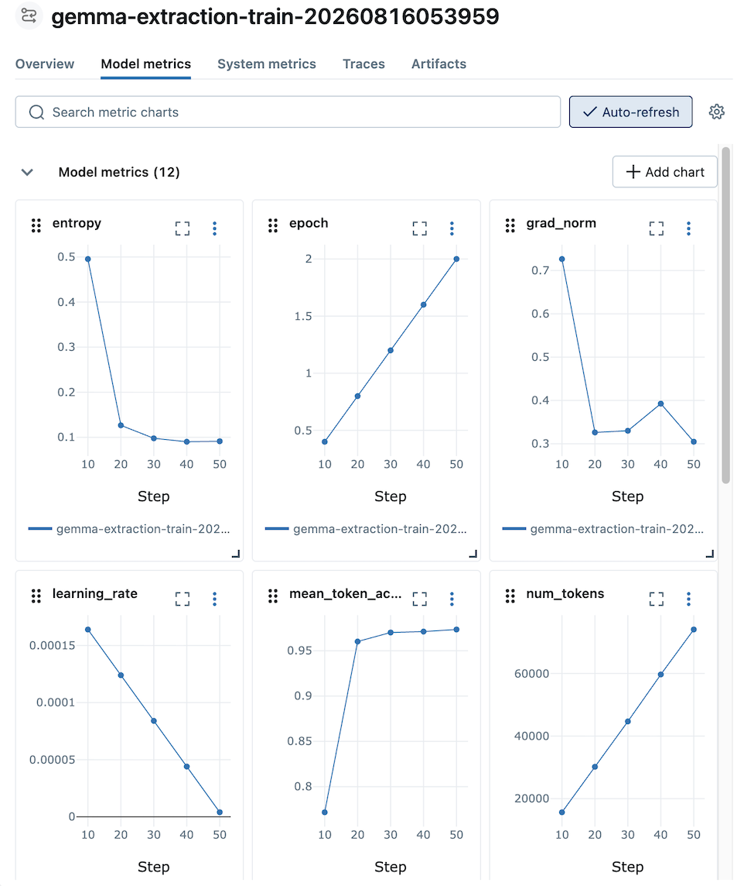

# SageMaker Managed MLflow로 파인튜닝 실험 비교

!!! info "Scope"
    SageMaker Managed MLflow를 중심으로 파인튜닝 실험의 설정, 학습 지표와 평가 결과를 기록하고 비교하는 방법을 다룹니다.

파인튜닝을 한두 번 실행할 때는 터미널 로그와 결과 파일만으로도 충분하지만, 데이터셋, 기반 모델, LoRA 설정, 학습률, 에포크를 바꾸며 여러 번 실행하면 어떤 설정이 현재 점수를 만들었는지 추적하기 어려워집니다. MLflow는 각 실행의 설정, 지표, 결과 위치와 상태를 하나의 `run`으로 묶어 저장하고 비교할 수 있게 합니다.

## 활용 시점

MLflow는 다음과 같은 경우에 특히 유용합니다.

- 같은 코스를 여러 설정으로 반복 실행하고 점수를 비교할 때
- 데이터 조건, 기반 모델, LoRA 설정과 평가 결과의 관계를 확인할 때
- 팀원이 실행한 실험을 같은 화면에서 검색하고 비교할 때
- 배포된 엔드포인트가 어떤 학습 작업과 모델 아티팩트에서 만들어졌는지 추적할 때
- 학습 손실과 SageMaker 시스템 지표를 함께 보고 실패나 성능 저하 원인을 찾을 때

반대로 튜토리얼을 한 번 실행하거나 마지막 결과만 확인하면 되는 경우에는 MLflow가 필수는 아닙니다. 이때는 `USE_MLFLOW=0`으로 두면 MLflow 서버 조회, 로컬 데이터베이스 생성, run 기록을 모두 건너뜁니다.

## MLflow가 필요한 이유

MLflow가 없으면 실험 정보가 여러 위치에 나뉩니다. 파이프라인 상태 파일에는 최근 실행 상태가 남고, 학습 로그는 CloudWatch에 있으며, 평가 결과는 로컬 파일이나 S3에 저장되고, 모델은 별도 S3 경로에 생성됩니다. 실행 횟수가 늘어날수록 이 정보들을 다시 연결하는 작업이 어려워집니다.

MLflow를 사용하면 한 번의 파이프라인 실행을 하나의 상위 run으로 기록하고, 설정과 결과를 같은 단위로 조회할 수 있습니다. SageMaker 관리형 학습 작업에서 기록한 지표는 하위 run으로 연결되므로 파이프라인 전체 결과와 실제 학습 과정을 함께 볼 수 있습니다.

MLflow가 기록하는 핵심 정보는 다음과 같습니다.

| 구분 | 예시 | 용도 |
|---|---|---|
| 파라미터 | 코스, 모델 ID, 인스턴스 유형, LoRA 설정, 에포크 | 어떤 설정으로 실행했는지 확인 |
| 지표 | 평가 점수, 손실, 처리량, 시스템 지표 | 실행 결과와 학습 상태 비교 |
| 태그 | 코스, 실행 단계, 리전, 단계별 상태 | run 검색과 실행 흐름 추적 |
| 아티팩트 | `eval_scores.json` | 평가 결과 상세 확인 |
| 단계 결과 | SageMaker 작업 이름, 모델 S3 URI, 엔드포인트 이름 | 실제 AWS 리소스로 이동 |

모델 파일 자체는 MLflow에 중복 업로드하지 않습니다. SageMaker가 생성한 모델의 S3 URI만 기록하므로 기존 모델 저장 흐름과 비용 구조를 유지할 수 있습니다.

## SageMaker Managed MLflow와 오픈소스 MLflow의 차이점

MLflow 자체는 오픈소스 실험 추적 도구입니다. `mlflow.start_run()`, `mlflow.log_param()`, `mlflow.log_metric()` 같은 클라이언트 API와 MLflow UI는 직접 구축한 서버와 SageMaker 관리형 환경에서 동일하게 사용할 수 있습니다.

차이는 MLflow 기능보다 서버 운영 방식에 있습니다. 오픈소스 MLflow를 직접 운영하면 서버, 메타데이터 저장소, 아티팩트 저장소, 인증, 네트워크와 업그레이드를 사용자가 구성해야 합니다. SageMaker Managed MLflow를 사용하면 AWS가 MLflow 서버를 관리하고 IAM 기반 인증과 AWS 서비스 연동을 제공합니다.

| 항목 | 오픈소스 MLflow 직접 운영 | SageMaker Managed MLflow |
|---|---|---|
| MLflow API와 UI | 표준 MLflow 사용 | 표준 MLflow 사용 |
| 서버 운영 | 사용자가 설치, 배포, 확장, 백업 | AWS가 관리 |
| 메타데이터 저장소 | SQLite, PostgreSQL 등 직접 구성 | 관리형 저장소 사용 |
| 아티팩트 저장소 | 로컬 파일 또는 객체 저장소 직접 구성 | 지정한 S3 버킷 사용 |
| 인증과 접근 제어 | 직접 구성 | IAM과 AWS SigV4 사용 |
| Tracking URI | `sqlite:///...`, `http://...` 등 | MLflow App 또는 Tracking Server ARN |
| AWS 연동 | 필요한 기능을 직접 구현 | SageMaker 작업과 AWS 콘솔 연동 |
| 제어 범위 | 구성과 버전을 세밀하게 제어 가능 | 지원 범위 안에서 운영 부담 감소 |

SageMaker Managed MLflow에서는 `sagemaker-mlflow` 플러그인이 ARN 형식의 Tracking URI를 처리하고 요청에 AWS SigV4 서명을 추가합니다. 따라서 학습 코드의 MLflow API는 유지하면서 서버 주소와 인증 방식만 AWS 환경에 맞게 바뀝니다.

직접 운영하는 MLflow가 더 적합한 경우도 있습니다. AWS 외부 환경과 동일한 서버를 공유해야 하거나, 서버 플러그인과 데이터베이스를 세밀하게 제어해야 하거나, AWS가 지원하지 않는 MLflow 버전과 배포 구성이 필요하면 자체 서버가 더 적합할 수 있습니다.

## SageMaker MLflow App과 Tracking Server 비교

SageMaker에는 MLflow를 제공하는 두 관리형 리소스가 있습니다. 최신 방식은 MLflow App이며, 기존 방식은 MLflow Tracking Server입니다. AWS는 새로운 워크플로에는 MLflow App 사용을 권장합니다.

| 항목 | MLflow App | MLflow Tracking Server |
|---|---|---|
| 권장 용도 | 새로 구성하는 워크플로 | 기존 Tracking Server 유지와 호환 |
| 리소스 형태 | 독립형 MLflow App | 별도 크기와 버전을 지정하는 관리형 Tracking Server |
| 운영 방식 | AWS가 지원 버전과 서비스 구성을 관리 | 크기, 버전, 시작과 중지를 사용자가 관리 |
| 공유와 연동 | 교차 계정 공유와 최신 AWS 연동 지원 | 기존 SageMaker 연동 중심 |
| Tracking URI | MLflow App ARN | Tracking Server ARN |

이 저장소는 두 ARN을 모두 Tracking URI로 사용할 수 있지만, 새 환경을 구성할 때는 MLflow App을 기본으로 설명합니다. 기존 Tracking Server를 운영 중이라면 해당 ARN을 `MLFLOW_TRACKING_URI`에 지정해 그대로 사용할 수 있습니다.

지원 리전, MLflow 버전, 비용과 서비스 제한은 변경될 수 있으므로 환경을 만들기 전에 AWS 공식 문서를 확인해야 합니다. 특히 MLflow App과 아티팩트 S3 버킷은 같은 리전에 있어야 합니다.

## 실험 기록 구조

MLflow 기록은 `pipelines/` 아래의 엔드투엔드 파이프라인에 적용됩니다. 코스 노트북을 셀 단위로 실행하는 과정은 자동으로 기록하지 않으며, 루트의 `mlflow_setup.ipynb`는 관리형 MLflow 환경을 준비하는 설정 노트북입니다.

관리형 MLflow에서는 파이프라인과 SageMaker 학습 작업이 `mlflow`와 `sagemaker-mlflow`를 통해 같은 MLflow App에 기록합니다. App은 실험 메타데이터와 UI를 제공하고, 평가 결과 같은 아티팩트는 사용자 계정의 S3 버킷에 저장합니다.


파이프라인을 실행하면 전체 실행을 나타내는 상위 run이 만들어집니다. 상위 run에는 파이프라인 설정, 단계별 상태, 평가 결과, 모델 S3 URI와 엔드포인트 정보가 기록됩니다. SageMaker 학습 컨테이너는 별도의 하위 run을 만들고 학습 파라미터, 손실, 처리량과 시스템 지표를 기록합니다. 하위 run에는 상위 run ID가 태그로 남으므로 두 기록을 함께 조회할 수 있습니다.

실험 이름은 코스 키를 사용하고, run 이름은 코스 키와 실행 시각을 조합해 자동으로 만듭니다. 사용자가 `MLFLOW_EXPERIMENT_NAME`을 별도로 설정할 필요는 없습니다.

로컬 SQLite 모드에서는 파이프라인 프로세스가 만드는 상위 run만 기록됩니다. SageMaker 학습 컨테이너는 로컬 데이터베이스에 접근할 수 없으므로 학습 하위 run과 스텝별 지표까지 함께 보려면 MLflow App이나 Tracking Server를 사용해야 합니다.

## 실행 모드 선택

이 저장소는 비활성화, 로컬 SQLite, SageMaker 관리형 MLflow의 세 가지 사용 방식을 지원합니다.

| 목적 | 설정 | 동작 |
|---|---|---|
| MLflow를 사용하지 않음 | `USE_MLFLOW=0` | MLflow 초기화와 기록을 모두 건너뜀 |
| 로컬에서 기능 확인 | `USE_MLFLOW=1`과 `MLFLOW_TRACKING_URI=local` | `.mlflow/mlflow.db`에 기록 |
| 팀 단위 실험 추적 | `USE_MLFLOW=1`이고 App을 자동 탐색 | App ARN을 Tracking URI로 사용 |
| 대상을 명시적으로 고정 | `USE_MLFLOW=1`과 `MLFLOW_TRACKING_URI=...` | 지정한 URI나 ARN 사용 |

설정 우선순위는 다음과 같습니다.

1. `USE_MLFLOW=0`이면 다른 설정과 관계없이 MLflow를 사용하지 않습니다.
2. `USE_MLFLOW=1`이고 `MLFLOW_TRACKING_URI`가 설정되어 있으면 `local`, 표준 MLflow URI 또는 SageMaker MLflow ARN을 그대로 사용합니다.
3. URI가 없으면 `MLFLOW_APP_NAME`으로 같은 리전의 MLflow App을 찾습니다.
4. App을 찾지 못하면 로컬 SQLite로 전환합니다.

셸에 이미 설정된 환경변수는 `.env`보다 우선합니다. `.env`를 수정했는데 동작이 바뀌지 않으면 `env | grep MLFLOW`로 현재 셸 값을 확인하고, 필요하면 `unset USE_MLFLOW MLFLOW_TRACKING_URI MLFLOW_APP_NAME`을 실행한 뒤 다시 시도하십시오.

## 빠른 시작

### MLflow 비활성화

`.env`에서 다음 값을 설정합니다.

```bash
USE_MLFLOW=0
```

이 상태에서는 MLflow 서버 조회, 로컬 SQLite 생성, run 생성과 학습 컨테이너의 MLflow 환경변수 전달을 모두 건너뜁니다. MLflow 기록 실패가 아니라 의도적인 비활성화이며, 나머지 파이프라인은 동일하게 실행됩니다.

### 로컬 SQLite 사용

관리형 환경을 만들기 전에 로컬 기록 흐름을 확인하려면 다음과 같이 실행합니다.

```bash
export USE_MLFLOW=1
export MLFLOW_TRACKING_URI=local
```

파이프라인을 실행하면 AWS에서 App을 조회하지 않고 `.mlflow/mlflow.db`에 기록합니다. UI는 저장소 루트에서 다음 명령으로 실행합니다.

```bash
mlflow ui \
  --backend-store-uri sqlite:///$(pwd)/.mlflow/mlflow.db \
  --host 127.0.0.1 \
  --port 5000
```

원격 EC2에서 실행 중이라면 로컬 컴퓨터에서 SSH 포트 포워딩을 열고 `http://127.0.0.1:5000`에 접속합니다.

```bash
ssh -L 5000:127.0.0.1:5000 <user>@<ec2-host>
```

MLflow UI를 `0.0.0.0`에 바인딩해 인터넷에 직접 노출하지 마십시오. 로컬 확인에는 SSH 포트 포워딩이나 사내 네트워크 접근 방식을 사용해야 합니다.

### SageMaker Managed MLflow 사용

관리형 환경에서는 다음과 같이 설정합니다.

```bash
USE_MLFLOW=1
MLFLOW_APP_NAME=gemma-e2e
MLFLOW_TRACKING_URI=
```

`MLFLOW_TRACKING_URI`를 비워 두면 `MLFLOW_APP_NAME`으로 App을 자동 탐색합니다. 자동 탐색 대신 특정 App이나 기존 Tracking Server를 고정하려면 ARN을 직접 지정합니다.

```bash
MLFLOW_TRACKING_URI=arn:aws:sagemaker:<region>:<account-id>:mlflow-app/app-XXXXXXXX
```

App ARN의 마지막 값은 사용자가 정한 App 이름이 아니라 AWS가 생성한 ID입니다. ARN을 직접 조립하지 말고 `mlflow_setup.ipynb`나 SageMaker 콘솔에서 조회한 값을 사용하십시오.

## SageMaker Managed MLflow 사용 순서

SageMaker Managed MLflow 사용은 최초 설정과 반복 실행으로 나뉩니다. MLflow App 준비와 연결 설정은 처음 한 번 수행하고, 이후 파이프라인을 실행할 때마다 상위 run, 학습 하위 run과 평가 결과가 순서대로 기록됩니다.


### 1. MLflow App 준비

먼저 사용할 리전에서 MLflow App이 지원되는지 확인합니다. MLflow App과 아티팩트 S3 버킷은 같은 리전에 있어야 하며, 이 저장소의 자동 탐색은 현재 `AWS_REGION`에서 App을 찾습니다.

저장소 루트의 `mlflow_setup.ipynb`를 실행하면 설정을 확인하고, 필요한 경우 MLflow App을 생성하며, 사용할 ARN과 UI 접속 명령을 출력합니다. 기본 App 이름은 `gemma-e2e`이며, 다른 이름을 사용하려면 `.env`의 `MLFLOW_APP_NAME`을 수정합니다.

### 2. 연결 설정

앞 절의 `USE_MLFLOW`, `MLFLOW_APP_NAME`, `MLFLOW_TRACKING_URI` 값을 `.env` 또는 현재 셸에 설정합니다. Tracking URI를 비워 두면 App 이름으로 자동 탐색하고, ARN을 지정하면 해당 App이나 기존 Tracking Server를 사용합니다. 권한은 호출 주체, 학습 실행 역할, MLflow App 실행 역할로 나누어 확인해야 합니다.

| 역할 | 필요한 권한 | 이 저장소의 예시 |
|---|---|---|
| 파이프라인 실행 사용자 또는 역할 | App 조회, 생성, UI 접속 URL 생성, MLflow API 호출 | `iam/mlflow-full-policy.json` |
| SageMaker 학습 실행 역할 | MLflow API 호출과 대상 App 또는 Tracking Server 접근 | `iam/mlflow-training-role-policy.json` |
| MLflow App 실행 역할 | 아티팩트 S3 버킷 읽기와 쓰기 | 환경에 맞는 S3 정책 |

### 3. 상위 실행 시작

평소와 같은 명령으로 파이프라인을 실행합니다.

```bash
python pipelines/run_extraction.py --stages all
```

파이프라인이 시작되면 상위 run이 생성되고 설정과 단계 상태가 기록됩니다. 학습과 평가가 끝나면 같은 run에 SageMaker 작업 이름, 모델 S3 URI, 엔드포인트 이름과 평가 결과가 추가됩니다.

### 4. 학습 지표 기록

SageMaker 학습 컨테이너는 별도의 하위 run을 만들고 Trainer가 수집한 지표를 기록합니다. `Model metrics` 탭에서는 `entropy`, `epoch`, `grad_norm`, `learning_rate`, `mean_token_accuracy`, `num_tokens` 같은 지표를 스텝별로 확인할 수 있습니다. GPU, CPU와 메모리 사용량은 `System metrics` 탭에서 확인합니다.

[{ width="720" }](images/mlflow-training-log.png)

상위 run은 생성됐지만 학습 하위 run이 없다면 학습 실행 역할의 MLflow 권한과 학습 작업에 전달된 Tracking URI를 먼저 확인합니다.

### 5. 평가 결과 기록

평가 단계가 끝나면 코스별 평가 점수가 상위 run의 지표로 기록되고, 상세 결과는 `eval_scores.json` 아티팩트로 저장됩니다. 학습까지만 실행한 경우에는 평가 지표와 아티팩트가 아직 나타나지 않습니다.

### 6. UI에서 비교

MLflow App UI는 AWS가 발급한 사전 서명 URL로 접속합니다. URL은 접속할 때 새로 발급하고, `mlflow_setup.ipynb`가 출력한 AWS CLI 명령이나 SageMaker 콘솔에서 App을 엽니다. 파이프라인 로그에는 실험 이름과 run ID도 출력됩니다.

UI에서는 같은 코스와 평가 조건의 run을 먼저 모은 뒤 평가 점수, 학습 설정과 학습 지표를 비교합니다.

## Run 비교 방법

처음에는 모든 지표를 한꺼번에 보기보다 다음 순서로 비교하는 것이 효율적입니다.

1. 같은 코스와 같은 평가 데이터로 실행한 run만 필터링합니다.
2. 평가 점수를 기준으로 후보 run을 정렬합니다.
3. 상위 run의 기반 모델, 데이터 버전, LoRA 설정, 학습률과 에포크를 비교합니다.
4. 점수가 비슷하면 학습 시간, 인스턴스 유형, 처리량과 시스템 지표를 비교합니다.
5. 선택한 run의 모델 S3 URI와 SageMaker 작업 이름을 확인해 배포 또는 재실행 대상으로 사용합니다.

평가 데이터와 평가 코드가 달라지면 점수를 직접 비교하기 어렵습니다. 현재 파이프라인은 샘플 수와 주요 데이터 설정을 기록하지만 데이터셋 버전과 Git 커밋을 자동으로 기록하지는 않으므로, 엄격한 재현성이 필요하면 해당 값을 태그나 파라미터로 추가해야 합니다.

## 동작 원칙

MLflow는 파이프라인의 부가 기능이므로 일반적인 기록 실패는 경고를 남기고 파이프라인 실행을 계속합니다. 일시적인 서버 오류나 권한 문제 때문에 학습과 배포까지 중단하지 않기 위한 동작입니다.

다만 Tracking URI 형식이 명백히 잘못된 경우에는 실행 초기에 오류를 발생시킵니다. 잘못된 대상을 사용한 채 파이프라인이 끝까지 실행되는 것보다 설정 문제를 즉시 확인하는 편이 안전하기 때문입니다.

`USE_MLFLOW=0`에서는 no-op run 핸들을 사용합니다. 호출부는 같은 흐름을 유지하지만 실제 MLflow 클라이언트 초기화와 네트워크 요청은 수행하지 않습니다.

## 문제 해결

### App을 찾지 못하고 로컬 SQLite를 사용한다

현재 AWS 리전과 `MLFLOW_APP_NAME`을 확인합니다. App이 다른 리전에 있거나 이름이 다르면 자동 탐색에 실패합니다. 특정 App을 반드시 사용해야 한다면 `MLFLOW_TRACKING_URI`에 ARN을 직접 지정하십시오.

### `.env`에서 활성화했는데 run이 생기지 않는다

현재 셸에 `USE_MLFLOW=0`이 남아 있는지 확인합니다.

```bash
env | grep MLFLOW
```

셸 환경변수가 `.env`보다 우선하므로 값을 제거하거나 올바르게 다시 설정해야 합니다.

### 상위 run은 있지만 학습 하위 run이 없다

로컬 SQLite와 SageMaker 관리형 학습을 함께 사용하면 원격 컨테이너가 로컬 데이터베이스에 접근할 수 없습니다. 관리형 MLflow를 사용 중이라면 SageMaker 학습 실행 역할에 MLflow API 호출 권한이 있는지, 학습 작업에 `MLFLOW_TRACKING_URI`, `MLFLOW_EXPERIMENT_NAME`, `MLFLOW_PARENT_RUN_ID`가 전달되었는지 확인합니다.

### 관리형 UI에 접속할 수 없다

사전 서명 URL은 짧은 시간 동안 한 번만 사용할 수 있습니다. 기존 URL을 재사용하지 말고 새 URL을 발급하십시오. URL 발급 권한과 App 상태도 함께 확인해야 합니다.

### MLflow 클라이언트와 서버 버전이 맞지 않는다

SageMaker Managed MLflow는 지원하는 클라이언트 버전 범위가 있습니다. App 또는 Tracking Server의 지원 버전과 프로젝트의 `mlflow`, `sagemaker-mlflow` 버전을 맞추십시오. 버전을 임의로 올리기 전에 AWS 공식 호환성 문서를 확인해야 합니다.

## 이 프로젝트에서 사용하지 않는 기능

이 저장소는 실험 추적에 필요한 기능만 사용합니다.

- MLflow Model Registry에 모델을 등록하지 않습니다.
- 모델 바이너리를 MLflow 아티팩트로 중복 업로드하지 않습니다.
- MLflow Projects로 파이프라인을 실행하지 않습니다.
- MLflow Deployments로 SageMaker 엔드포인트를 배포하지 않습니다.
- 프롬프트 관리와 평가 기능을 파이프라인의 필수 요소로 사용하지 않습니다.

모델 등록, 승인과 승격 절차가 필요하면 기존 SageMaker Model Registry 또는 별도 MLflow Model Registry 도입을 검토할 수 있습니다. 현재 문서의 범위는 어떤 설정이 어떤 결과를 만들었는지 추적하고 비교하는 데 한정합니다.

## 정리

한 번 실행하고 끝나는 작업이라면 `USE_MLFLOW=0`으로 두는 것이 가장 단순합니다. 여러 설정을 반복 비교하려면 로컬 SQLite로 기록 구조를 먼저 확인할 수 있습니다. 팀 단위 실험, SageMaker 관리형 학습 지표와 장기 기록이 필요하면 MLflow App을 사용하고, 기존 Tracking Server가 있다면 ARN을 직접 지정해 계속 사용할 수 있습니다.

핵심은 MLflow를 별도 학습 시스템으로 보는 것이 아니라, 기존 파이프라인 실행에 설정과 결과의 연결 정보를 추가하는 추적 계층으로 사용하는 것입니다.

## 공식 문서

- [MLflow Tracking](https://mlflow.org/docs/latest/ml/tracking/)
- [MLflow Tracking Server](https://mlflow.org/docs/latest/ml/tracking/server/)
- [Amazon SageMaker Managed MLflow 개요](https://docs.aws.amazon.com/sagemaker/latest/dg/mlflow.html)
- [SageMaker MLflow App 설정](https://docs.aws.amazon.com/sagemaker/latest/dg/mlflow-app-setup.html)
- [MLflow App 생성](https://docs.aws.amazon.com/sagemaker/latest/dg/mlflow-app-create-app-cli.html)
- [MLflow App IAM 권한](https://docs.aws.amazon.com/sagemaker/latest/dg/mlflow-app-setup-prerequisites-iam.html)
- [MLflow App UI 접속 API](https://docs.aws.amazon.com/sagemaker/latest/APIReference/API_CreatePresignedMlflowAppUrl.html)
- [SageMaker MLflow 플러그인](https://github.com/aws/sagemaker-mlflow)
