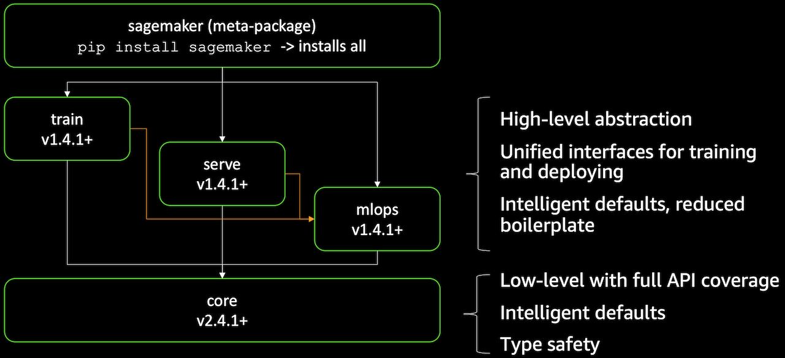
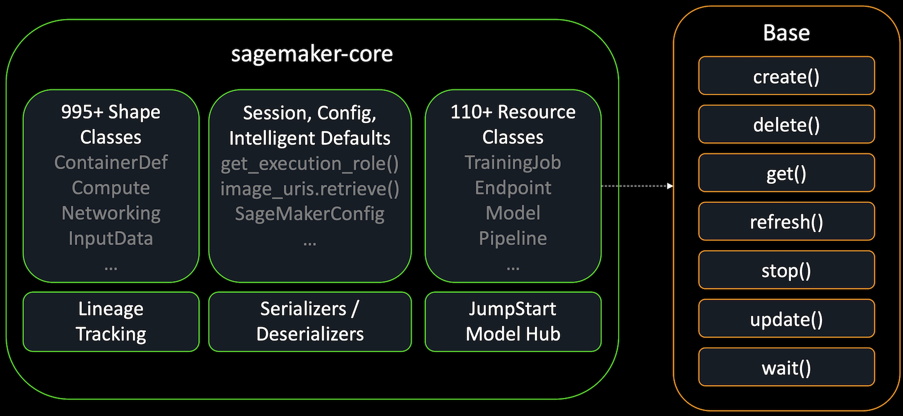

# SageMaker Python SDK V3 — V2에서 무엇이 바뀌었나

!!! info "Scope"
    **V2에 익숙한 분**(`HuggingFace` estimator · `estimator.fit()` · `predictor.predict()`로 SageMaker를 써 오신 분)과, 이 kit의 노트북을 읽다가 **`ModelTrainer`·`sagemaker.core.resources` 같은 낯선 import가 왜 나오는지** 궁금하신 분이 대상입니다. 선행 조건은 없습니다.
    다루는 것: V2 → V3 심볼 매핑, 두 레이어(`sagemaker.core` vs `sagemaker.train`/`sagemaker.serve`) 구조, 학습·배포·호출·정리 4가지 대표 용법, V2 코드를 옮길 때 걸리는 함정.
    다루지 않는 것: 학습 하이퍼파라미터·LoRA 설계([파인튜닝](../03_finetuning.md)), endpoint 구조와 서빙 엔진([SageMaker 추론](../04_sagemaker_inference.md)·[서빙 컨테이너](../05_serving_containers.md)), Processing/Pipelines/Feature Store 마이그레이션(이 kit이 쓰지 않습니다).

이 문서의 동작은 모두 **SDK 3.16.0 설치본에서 실측**한 것이고, 이름·의도는 [공식 마이그레이션 가이드](https://github.com/aws/sagemaker-python-sdk/blob/master/migration.md)와 [V3 문서](https://sagemaker.readthedocs.io/en/stable/)를 기준으로 적었습니다. 둘이 어긋나는 지점은 그 자리에서 따로 표시했습니다.

!!! warning "빠르게 바뀌는 값"
    3.x는 릴리스 주기가 짧아(3.0 GA 이후 8개월간 27개 버전) **import 경로가 3.x 안에서도 이동**합니다. 실제로 `sagemaker.train.configs`는 이미 `sagemaker.core.training.configs`로 옮겨졌고 지금은 shim만 남아 `DeprecationWarning`을 냅니다.
    이 문서의 심볼은 3.16.0 기준이며, `pyproject.toml`이 고정하는 것은 `sagemaker>=3.16.0` floor이므로 설치본은 더 높은 버전일 수 있습니다. 코드를 손볼 때는 [SDK 저장소](https://github.com/aws/sagemaker-python-sdk)의 현행 API를 함께 보세요.

---

## 한눈에 보는 변화

V3는 V2의 확장이 아니라 **호환되지 않는 재설계**입니다. AWS는 이를 문서에 그대로 적어 뒀습니다 — "Older interfaces such as Estimator, Model, Predictor and all their subclasses will not be supported in V3"([README](https://github.com/aws/sagemaker-python-sdk/blob/master/README.rst)). 아래 표의 V3 칸은 전부 3.16.0에서 import를 확인한 심볼입니다.

| 하는 일 | V2 | V3 | 비고 |
|---|---|---|---|
| 학습 잡 제출 | `sagemaker.huggingface.HuggingFace(...)`·`Estimator(...)` + `.fit()` | `sagemaker.train.model_trainer.ModelTrainer(...)` + `.train()` | 프레임워크별 estimator 전부가 한 클래스로. `fit` → `train` 개명 |
| 학습 코드 지정 | `entry_point=`·`source_dir=` 평면 인자 | `SourceCode(entry_script=, source_dir=, requirements=)` | `sagemaker.core.training.configs` |
| 학습 설정(인스턴스/볼륨/시간) | `instance_type=`·`volume_size=`·`max_run=` | `Compute(instance_type=, instance_count=, volume_size_in_gb=)` · `StoppingCondition(max_runtime_in_seconds=)` | 평면 kwargs가 config 객체로 재편 |
| 입력 채널 | `sagemaker.inputs.TrainingInput` | `InputData(channel_name=, data_source=)` | `train(input_data_config=[...])`에 리스트로 |
| 세션 | `sagemaker.Session()`·`sagemaker.session.Session` | `sagemaker.core.helper.session_helper.Session` | `sagemaker.Session`은 `AttributeError` |
| 실행 role | `sagemaker.get_execution_role()` | `sagemaker.core.helper.session_helper.get_execution_role()` | 최상위 헬퍼가 아니라 core 경유 |
| 이미지 URI 조회 | `sagemaker.image_uris.retrieve` | `sagemaker.core.image_uris.retrieve` | 함수 시그니처는 사실상 동일, 모듈만 이동 |
| 배포 | `Model(...)`·`HuggingFaceModel(...)` + `.deploy()` | `sagemaker.serve.ModelBuilder(...)` + `.build()` → `.deploy()` | `build()`가 Model 리소스, `deploy()`가 Endpoint 리소스 |
| 추론 호출 | `Predictor.predict(data)` | boto3 `sagemaker-runtime.invoke_endpoint(...)` (SDK 쪽 대응은 `Endpoint.invoke`) | `Predictor`는 제거. 이 kit은 boto3 직접 — **V2/V3 동일** |
| 학습 아티팩트 경로 | `estimator.model_data` | `job.model_artifacts.s3_model_artifacts` | 응답 shape을 그대로 노출 |
| 리소스 조회·삭제 | `sm.describe_*` / `predictor.delete_endpoint()` | `sagemaker.core.resources.TrainingJob.get/get_all/refresh/wait`·`Endpoint.get/wait_for_status/delete` | 리소스 객체가 조회·대기·삭제를 다 가짐 |
| 버전 확인 | `sagemaker.__version__` | `importlib.metadata.version("sagemaker")` | `__version__` 속성이 사라졌습니다 |

!!! abstract "쉽게 말하면"
    V2는 "프레임워크마다 클래스가 하나씩"이었고(`HuggingFace`, `PyTorch`, `TensorFlow`…), V3는 "**클래스는 하나, 컨테이너 이미지로 프레임워크를 고른다**"입니다. 학습은 `ModelTrainer`, 배포는 `ModelBuilder` 둘뿐이고, 나머지 차이는 전부 이미지 URI와 config 객체로 표현됩니다.
    그리고 평면 kwargs가 사라진 자리를 `Compute`·`SourceCode`·`StoppingCondition`·`InputData` 같은 작은 설정 객체가 채웁니다. 이 객체들의 필드 이름은 `CreateTrainingJob` API 필드와 거의 1:1입니다.

V2는 죽지 않았지만 **시한이 공개돼 있습니다**. [Version Lifecycle](https://sagemaker.readthedocs.io/en/stable/lifecycle.html)에 따르면 V2는 maintenance mode(2026-07-06 ~ 2027-07-05) 구간에서 "critical bug fixes and security updates only"만 받고, 2027-07-06부터 End-of-Support입니다. 지금 V2에 남고 싶으면 `pip install "sagemaker<3"`로 고정해야 하며(고정하지 않으면 3.x가 설치됩니다), AWS의 권고는 "We recommend all users migrate to V3"입니다.

---

## 메타패키지와 두 개의 레이어

[](../images/sdkv3_monolithic_to_modular.png)

*`pip install sagemaker` 하나가 전부를 끌어오지만, 안에서는 서브패키지가 **각자 버전을 갖습니다**(train/serve/mlops는 v1.4.1+, core는 v2.4.1+). 위층은 고수준 추상화와 기본값, 아래층은 API 전량 커버리지와 타입 안전성을 담당합니다.*

`sagemaker`는 **메타패키지**입니다. 그래서 `sagemaker` 3.16.0을 설치해도 실제로 동작하는 것은 독립적으로 버전이 붙은 서브패키지들이고, 3.x 안에서 import 경로가 옮겨 다니는 이유도 이것입니다 — 우산 버전이 아니라 서브패키지 버전이 올라가기 때문입니다.

V3의 import 경로가 처음에 임의로 보이는 이유는 **레이어가 둘**이기 때문입니다. 설치본의 `sagemaker/` 아래에는 정확히 여섯 개의 서브패키지만 있습니다 — `ai_registry`, `core`, `lineage`, `mlops`, `serve`, `train`. 이 중 이 kit이 쓰는 것은 `core`·`train`·`serve` 셋입니다.

| 레이어 | 무엇인가 | 대표 심볼 | 성격 |
|---|---|---|---|
| `sagemaker.core` | SageMaker API에서 **생성된** 저수준 리소스 레이어 | `resources.TrainingJob`·`resources.Endpoint`·`image_uris.retrieve`·`helper.session_helper.Session` | API 필드와 1:1. 넓지만 편의 기능 없음 |
| `sagemaker.train` / `sagemaker.serve` | 손으로 쓴 **편의 레이어** | `ModelTrainer`·`SFTTrainer`·`ModelBuilder` | 좁지만 기본값·검증·업로드까지 대신함 |

[](../images/sdkv3_core.png)

*오른쪽 `Base` 열이 V2와의 가장 큰 차이입니다 — 모든 리소스가 `create()`·`delete()`·`get()`·`refresh()`·`stop()`·`update()`·`wait()`를 같은 이름으로 갖습니다. 리소스마다 전부 있는 것은 아닙니다(Endpoint에는 `stop()`이 필요 없습니다).*

문서상 core는 **resource 클래스 110개 이상, shape 클래스 995개 이상**을 갖습니다. 서비스 API에서 생성했기 때문에 SageMaker가 지원하는 리소스에는 대응 Python 클래스가 있고, `train`·`serve`·`mlops`에 없는 기능은 core에 있습니다(Feature Store가 그런 예입니다).

core는 공용 기반도 함께 갖습니다 — 세션 관리, IAM role 자동 탐지, DLC 이미지 URI 조회, JumpStart 모델 허브, lineage 추적, serializer/deserializer, 그리고 SageMaker 설정 파일을 읽는 intelligent defaults입니다.

**polling이 1급이 됐습니다.** V2에서 `describe_*`를 루프로 돌리던 자리가 `wait()`·`refresh()`입니다.

`sagemaker.core`가 "생성된" 레이어라는 건 저장소에서 확인할 수 있습니다. `core/tools/`에 `codegen.py`·`resources_codegen.py`·`shapes_codegen.py`가 있고 이들이 botocore service model(`service-2.json`)을 읽어 `resources.py`와 `shapes/shapes.py`를 뽑습니다([api_coverage.json](https://github.com/aws/sagemaker-python-sdk/blob/master/sagemaker-core/src/sagemaker/core/tools/api_coverage.json)은 391 supported / 21 unsupported API로 집계). 실제로 `sagemaker.core.resources`에는 API 리소스 이름을 그대로 딴 pydantic 클래스가 85개, `sagemaker.core.shapes.shapes`에 요청·응답 shape 클래스가 822개 들어 있습니다. 공식 문서는 이를 "generated"라는 단어보다 "full parity with SageMaker APIs" / "map directly to AWS APIs"로 표현합니다([sagemaker.core 문서](https://sagemaker.readthedocs.io/en/stable/sagemaker_core/index.html)).

두 레이어는 **같은 객체 모델**입니다. `ModelTrainer.train()`은 내부에서 요청 dict를 만들어 `TrainingJob.create(...)`를 호출합니다(`sagemaker/train/model_trainer.py`). 그래서 "편의 레이어로 제출하고 core 레이어로 관찰한다"가 자연스러운 사용법이고, 이 kit의 노트북이 정확히 그렇게 합니다.

**언제 어느 쪽을 잡는가.**

- 새로 만들 때(학습 제출·모델 배포) → 편의 레이어. 기본값·코드 업로드·이미지 검증을 대신해 줍니다.
- 이미 있는 것을 볼 때(상태 조회·로그 대기·재접속·삭제) → `sagemaker.core.resources`. `TrainingJob.get(name)` 한 줄로 다른 세션에서 만든 잡에도 붙습니다.
- 편의 래퍼가 없는 리소스 → core만 있습니다. Processing은 `resources.ProcessingJob`, 하이퍼파라미터 튜닝은 `resources.HyperParameterTuningJob`, batch transform은 `resources.TransformJob`이 각각 V2의 `Processor`·`HyperparameterTuner`·`Transformer` 자리를 대신합니다.

!!! warning "sagemaker.train.configs vs sagemaker.core.training.configs"
    같은 클래스를 두 경로에서 가져올 수 있는데, **`sagemaker.train.configs`는 shim**입니다. import하면 "has been moved to sagemaker.core.training.configs … This shim will be removed in a future version" `DeprecationWarning`이 뜹니다(re-export된 클래스 객체 자체는 동일합니다).
    성가신 점은 SDK 자신의 마이그레이션 안내가 `from sagemaker.train.configs import InputData`, 즉 **deprecated 경로**를 알려준다는 것입니다. 이 kit은 경고가 나지 않는 `sagemaker.core.training.configs`를 씁니다. 제거 목표 버전은 어디에도 공지돼 있지 않습니다.

---

## 대표 용법은 두 페이지로 나눠 두었습니다

용법이 길어 별도 페이지로 두었습니다. 이 페이지는 **무엇이 바뀌었나**에 집중합니다.

| 페이지 | 다루는 것 |
|---|---|
| [SDK V3 학습](training.md) | `ModelTrainer` + `SourceCode`/`Compute`/`InputData`/`StoppingCondition` |
| [SDK V3 배포](serving.md) | `ModelBuilder`의 `build()`/`deploy()`, 추론 호출, 리소스 조회·정리 |

## V2 코드를 옮길 때 걸리는 것들

### 최상위 namespace가 비었습니다

`import sagemaker`는 성공하는데 아무것도 없습니다. `sagemaker/__init__.py`는 104 바이트짜리 `pkgutil` namespace stub이고, `dir(sagemaker)`의 public 심볼은 **0개**입니다. 그래서 `sagemaker.Session()`은 `ModuleNotFoundError`가 아니라 `AttributeError: module 'sagemaker' has no attribute 'Session'`으로 실패합니다. 같은 이유로 `sagemaker.__version__`도 사라졌으니 버전은 `importlib.metadata.version("sagemaker")`로 읽으세요(`sagemaker.core._version`은 3.16.0 설치본에서 없는 `VERSION` 파일을 열려다 `FileNotFoundError`가 나므로 쓰지 마세요).

### 프레임워크 estimator는 제거됐습니다 — 그리고 에러 메시지가 import 순서에 따라 다릅니다

`sagemaker.huggingface`·`sagemaker.pytorch`·`sagemaker.tensorflow`·`sagemaker.sklearn`·`sagemaker.xgboost` 모듈 자체가 없습니다. 이름이 바뀐 것도, 경고를 내며 계속 동작하는 것도 아니라 **`ModuleNotFoundError`** 입니다. `sagemaker.estimator`·`sagemaker.model`·`sagemaker.predictor`·`sagemaker.session`·`sagemaker.inputs`·`sagemaker.image_uris`도 마찬가지입니다.

비직관적인 부분이 하나 있습니다. SDK에는 정확한 V3 대체 심볼을 알려주는 `_RemovedV2ModuleFinder` meta-path hook이 들어 있는데, 이 hook을 등록하는 것은 `sagemaker/core/__init__.py`입니다. 즉 **`sagemaker.core`가 아직 import되지 않았으면 안내가 나오지 않습니다.**

```python
# sagemaker.core를 아직 안 건드린 인터프리터
from sagemaker.estimator import Estimator
# -> ModuleNotFoundError: No module named 'sagemaker.estimator'   (안내 없음)

import sagemaker.core          # 또는 sagemaker.serve / ModelTrainer import
from sagemaker.estimator import Estimator
# -> ModuleNotFoundError: `sagemaker.estimator` was removed in the
#    SageMaker Python SDK v3. Use `ModelTrainer`.
#    (from sagemaker.train import ModelTrainer)
```

`import sagemaker`만으로도, `import sagemaker.train`만으로도 hook은 등록되지 않습니다. 그래서 "무슨 모듈이 없다"는 맨 메시지만 보고 오래 헤매기 쉽습니다 — 그럴 때는 `import sagemaker.core`를 먼저 넣고 다시 실행해 안내 문구를 받아 보세요.

MXNet·Chainer·`RLEstimator`·Training Compiler는 **대체 없이 삭제**됐습니다([migration.md](https://github.com/aws/sagemaker-python-sdk/blob/master/migration.md)에서 REMOVED로 표시). 반대로 `@remote` 데코레이터·Feature Store·lineage 추적은 유지됩니다.

### stopping_condition을 생략하면 1시간이 들어갑니다

가장 비싸게 물리는 함정입니다. `sagemaker/train/defaults.py`의 `DEFAULT_MAX_RUNTIME_IN_SECONDS = 3600`이 `ModelTrainer` 생성 시점(`model_post_init`)에 조용히 주입되고, 그대로 `TrainingJob.create`로 넘어갑니다. 잡 로그에 `StoppingCondition not provided. Using default` 한 줄이 남는 것이 유일한 신호입니다(V2의 `max_run` 기본값과 같은지는 V2를 설치하지 않아 확인하지 않았습니다 — 어느 쪽이든 3600은 LLM 파인튜닝에 짧습니다).

이 kit이 실제로 여기 걸렸습니다 — 학습은 100% 끝났는데 어댑터 머지 중에 잡이 잘려 배포 불가능한 아티팩트가 남았습니다. 증상·타임라인·대응은 [MaxRuntimeExceeded — 학습 뒤 머지에서 잘리는 함정](../03_finetuning.md#maxruntimeexceeded--학습-뒤-머지에서-잘리는-함정)이 전부 갖고 있으니 그쪽을 보세요.

같은 파일에 조용한 기본값이 더 있습니다. `DEFAULT_INSTANCE_TYPE = "ml.m5.xlarge"` — **CPU 인스턴스**입니다. `compute=`를 빼먹은 GPU 학습은 에러 없이 CPU에서 돌기 시작합니다(`DEFAULT_INSTANCE_COUNT=1`, `DEFAULT_VOLUME_SIZE=30`도 같은 방식). 결론은 하나입니다 — `compute`와 `stopping_condition`은 항상 명시하세요.

### ModelTrainer 생성자가 네트워크를 씁니다

`ModelTrainer(...)`는 순수한 객체 생성이 아닙니다. `role`을 넘기면 `model_post_init` 안에서 **`iam:SimulatePrincipalPolicy`를 실제로 호출**해 권한을 검사합니다. 그래서 플레이스홀더 ARN이나 다른 계정의 ARN을 넣으면 `train()`이 아니라 **생성자에서** botocore `InvalidInputException: Invalid Policy Source Arn`이 납니다. V2 estimator는 생성 시점에 조용했으므로, "아직 아무것도 제출하지 않았는데 왜 IAM 에러가 나지?"라는 혼란이 여기서 옵니다. `role`은 `config.resolve_sagemaker_role(sess)`처럼 실제 해석된 ARN을 쓰세요.

### image_uris 경로는 하나뿐입니다

`common/dlc.py`는 이렇게 씁니다.

```python
try:
    from sagemaker.core.image_uris import retrieve   # v3
except ModuleNotFoundError:
    from sagemaker.image_uris import retrieve        # v2 폴백
```

3.16.0에서는 `except` 절이 **절대 성공할 수 없는 죽은 코드**입니다(`sagemaker.image_uris` 모듈이 없으므로). 무해하지만 — try 쪽이 항상 이깁니다 — "V2에서도 돌 것"이라는 기대는 하지 마세요. V2/V3 양쪽을 진짜로 지원하려면 `importlib.metadata.version("sagemaker")`로 분기해야 합니다. 참고로 `sagemaker.core.image_uris.retrieve`는 `@override_pipeline_parameter_var` 데코레이터로 감싸져 있어서 `inspect.getsourcefile(retrieve)`가 엉뚱하게 `core/workflow/utilities.py`를 가리킵니다(`retrieve.__wrapped__`가 진짜 파일입니다).

??? info "더 읽을 거리 — 공식 migration.md의 코드 예제를 그대로 믿지 마세요"
    [migration.md](https://github.com/aws/sagemaker-python-sdk/blob/master/migration.md)의 **매핑 표는 정확하지만 코드 스니펫은 셋 이상 어긋납니다**(3.16.0 기준). 가장 신뢰할 순서는 ① 설치본에서 직접 `import`/`inspect.signature` 확인 → ② [docs/training](https://sagemaker.readthedocs.io/en/stable/training/index.html)·[docs/inference](https://sagemaker.readthedocs.io/en/stable/inference/index.html)의 "Migration from V2" 표(정확한 dotted path가 여기 있습니다) → ③ migration.md 산문입니다.

    - `from sagemaker.serve.configs import InferenceSpec` + `InferenceSpec(image_uri=..., model_data_url=...)` — 실제 `InferenceSpec`은 `sagemaker.serve.spec.inference_spec`의 **추상 base class**(추상 `load()`/`invoke()`)이고 그런 생성자 인자가 없습니다. `serve/configs.py`에는 `Network`·`Compute`만 있습니다.
    - Processing 예제의 `sagemaker.mlops.processing.DataProcessor`·`sagemaker.mlops.configs` — 두 경로 모두 존재하지 않습니다. 같은 문서의 매핑 표는 올바르게 `ProcessingJob`을 가리킵니다.
    - 분산 학습 예제의 `from sagemaker.train.distributed import Distributed` — `distributed.py`에는 `SMP`·`DistributedConfig`·`Torchrun`·`MPI`가 있고 `Distributed`라는 클래스는 없습니다.

    또한 AWS **Developer Guide(docs.aws.amazon.com)는 "V3"라는 단어를 쓰지 않습니다.** 코드 예제만 조용히 `ModelTrainer`/`ModelBuilder`로 바뀌었고, 버전 경계·마이그레이션·V2 지원 종료 일정은 GitHub 저장소와 readthedocs에만 있습니다. "AWS 서비스 문서에 V3라고 써 있다"는 인용은 만들 수 없으니 lifecycle 페이지와 저장소를 인용하세요.

---

## 이 kit이 V3를 쓰는 방식

이 kit은 `sagemaker>=3.16.0`을 요구하고 V2 호환 경로를 유지하지 않습니다. 실제로 쓰는 V3 API는 다음이 전부입니다.

| 자리 | 심볼 | 파일 |
|---|---|---|
| 세션·role | `core.helper.session_helper.Session`·`get_execution_role` | `00_setup`·`02_train_sft_sagemaker`, `common/config.py` |
| 이미지 URI | `core.image_uris.retrieve` | `common/dlc.py`(env 우선, retrieve는 폴백) |
| 학습 제출 | `train.model_trainer.ModelTrainer` + `SourceCode`/`Compute`/`InputData`/`StoppingCondition` | `02_train_sft_sagemaker`·`02a_train_grpo_sagemaker` |
| 잡 재접속·아티팩트 | `core.resources.TrainingJob` | `02_train_sft_sagemaker` |
| 배포 | `serve.ModelBuilder` + `serve.mode.function_pointers.Mode` | `03_deploy_endpoint` |
| endpoint 상태 대기 | `core.resources.Endpoint` | `03_deploy_endpoint` |
| endpoint 호출 | (SDK 아님) boto3 `sagemaker-runtime` | `common/aws_utils.py` |
| 삭제·정리 | (SDK 아님) boto3 `sagemaker` client | `99_cleanup` |

세부는 [파인튜닝](../03_finetuning.md)과 [SageMaker 추론](../04_sagemaker_inference.md)에 있고, 이미지 해석 우선순위는 [서빙 컨테이너](../05_serving_containers.md#이미지-해석-우선순위--commondlcpy)에 있습니다.

**왜 프레임워크 estimator 대신 커스텀 `train.py`인가.** 선택의 여지가 없습니다 — V3에 `HuggingFace` estimator가 없습니다. 그리고 AWS가 문서화한 후속 경로가 정확히 이 형태입니다: `image_uris.retrieve(framework="pytorch", image_scope="training")`로 DLC를 고르고 `ModelTrainer(training_image=..., source_code=SourceCode(...))`에 내 스크립트를 얹는 것. AWS Developer Guide의 [Hugging Face 페이지](https://docs.aws.amazon.com/sagemaker/latest/dg/hugging-face.html)도 이제 estimator를 언급하지 않고 "Hugging Face SageMaker AI ModelTrainer"로 안내합니다. 즉 이 kit의 "PyTorch DLC + 내 `train.py`"는 우회로가 아니라 **문서화된 정규 경로**입니다. 부수 효과로 컨테이너 안에서 `requirements.txt`로 최신 `transformers`/`trl`을 맞출 수 있어, 프레임워크 버전이 SDK 릴리스에 묶이지 않습니다([JumpStart vs 자체 train.py](../03_finetuning.md#jumpstart-vs-자체-trainpy)).

---

## 자주 나오는 오개념

??? question "오개념 — “V3로 올리면 기존 V2 코드가 그대로 돕니까?”"
    아닙니다. V3는 **backward compatible이 아닙니다**. 3.16.0 설치본에서 대표적인 V2 진입점 여덟 개를 전부 시도해 봤고 하나도 살아 있지 않았습니다 — 일곱 개는 `ModuleNotFoundError`, `sagemaker.Session()`은 `AttributeError`입니다.
    "`DeprecationWarning`이 뜨지만 일단 돈다"는 완충 구간은 **없습니다**. `pip install -U sagemaker`로 3.x가 들어오면 V2 노트북은 첫 import 셀에서 멈춥니다. 준비가 안 됐으면 `pip install "sagemaker<3"`으로 고정하세요(V2 End-of-Support는 2027-07-06입니다).

??? question "오개념 — “SDK를 V3로 바꾸면 endpoint 호출 코드도 바꿔야 하나요?”"
    호출을 boto3로 하고 있다면 **한 줄도 바꿀 필요가 없습니다**. endpoint 호출은 `sagemaker-runtime` 서비스의 `InvokeEndpoint` API이고, SageMaker Python SDK의 메이저 버전과 무관합니다. 이 kit의 `common/aws_utils.py`는 처음부터 boto3 클라이언트를 직접 쓰기 때문에 V3 전환의 영향을 받지 않았습니다.
    바꿔야 하는 것은 `sagemaker.predictor.Predictor`와 serializer/deserializer에 **의존하던 코드**뿐입니다. 그 자리는 boto3 직접 호출이나 `core.resources.Endpoint.invoke()`로 대체합니다.

??? question "오개념 — “ModelTrainer·ModelBuilder는 V3에서 새로 나온 클래스다”"
    둘 다 V2 후반부터 이미 있었습니다(`sagemaker.modules.train.model_trainer`, `sagemaker.serve.builder.model_builder`에 V2 API 문서 페이지가 지금도 살아 있습니다). V3가 한 일은 **이 둘을 유일한 지원 인터페이스로 승격**하고, 경로를 `sagemaker.train`/`sagemaker.serve`로 옮기고, 대안(estimator·Model·Predictor)을 삭제한 것입니다. 그래서 늦은 2.x 코드베이스에서 오는 분은 클래스 이름은 이미 알고 있고 **import 경로와 config 객체만** 새로 익히면 됩니다.

??? question "오개념 — “sagemaker-core 버전이 2.x면 V2인가요?”"
    아닙니다. V3는 `sagemaker-core`/`sagemaker-train`/`sagemaker-serve`/`sagemaker-mlops`로 쪼개진 모듈 구조이고 **각 하위 패키지는 독립적으로 버전이 매겨집니다**. `sagemaker` 3.16.0 설치본이 `sagemaker-core` 2.x를 끌고 오는 것이 정상입니다. 확인할 것은 우산 패키지 하나뿐입니다 — `importlib.metadata.version("sagemaker")`가 3으로 시작하면 V3입니다.

---

## 이어서 볼 문서

- [01 SageMaker 기초](../01_sagemaker_basics.md#training-job--잡이-끝나면-사라지는-계산) — `ModelTrainer`가 감싸는 `CreateTrainingJob`의 실체와 경로 계약
- [03 파인튜닝](../03_finetuning.md#maxruntimeexceeded--학습-뒤-머지에서-잘리는-함정) — `stopping_condition` 함정 전체 진단 기록과 학습 경로 선택
- [04 SageMaker 추론](../04_sagemaker_inference.md#endpoint-3층-구조와-호출) — endpoint 3층 구조, 호출 스키마, cleanup 순서
- [05 서빙 컨테이너](../05_serving_containers.md#sdk-v3-배포-모드와-로컬-검증) — `ModelBuilder`의 `Mode` 3단계와 로컬 검증
- [실행 runbook](../RUN_E2E.md#단계별-실행과-데이터-핸드오프) — 단계별 실행 순서와 비용 가드
- [공식 마이그레이션 가이드](https://github.com/aws/sagemaker-python-sdk/blob/master/migration.md) · [Version Lifecycle](https://sagemaker.readthedocs.io/en/stable/lifecycle.html) — V2 지원 종료 일정과 매핑 표
