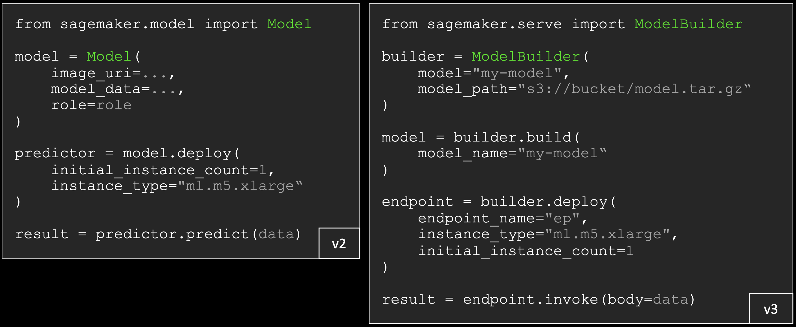

# SDK V3 배포: ModelBuilder와 endpoint

!!! info "Scope"
    V3에서 **모델을 endpoint에 올리고 호출하는 방법**을 다룹니다.
    V2와의 전체 차이는 [SDK V3 개요](index.md), 학습 Job 제출은 [SDK V3 학습](training.md),
    서빙 엔진(vLLM/SGLang/LMI) 선택은 [서빙 컨테이너](../05_serving_containers.md)에 있습니다.

## ModelBuilder로 배포

[](../images/sdkv3_inference.png)

*V3 코드에서 **없어진 두 인자**를 보세요: `role`과 `image_uri`가 사라졌습니다. 그리고 `model.deploy()` 한 번이 `build()` → `deploy()` 두 단계로 갈라졌고, 마지막이 `predictor.predict()`가 아니라 `endpoint.invoke()`입니다.*

`tracks/*/03_deploy_endpoint.ipynb`입니다. `ModelBuilder`는 **`build()` → `deploy()` 두 단계**이고, `deploy()`가 돌려주는 것은 `Predictor`가 아니라 `Endpoint` 리소스입니다.

=== "V3"

    ```python
    from sagemaker.serve import ModelBuilder
    from sagemaker.serve.mode.function_pointers import Mode

    mb = ModelBuilder(
        image_uri=serve_image,             # vLLM / SGLang / DJL LMI DLC
        s3_model_data_url=model_data,      # 학습 산출 S3 artifact
        env_vars=serve_env,                # 엔진별 env (common/dlc.serving_env)
        role_arn=role, sagemaker_session=sess,
        instance_type="ml.g6.2xlarge",
        mode=Mode.SAGEMAKER_ENDPOINT,      # LOCAL_CONTAINER로 로컬 검증 가능
    )
    mb.build()
    endpoint = mb.deploy(endpoint_name=endpoint_name, initial_instance_count=1,
                         instance_type="ml.g6.2xlarge", wait=False)
    ```

=== "V2 (참고)"

    ```python
    from sagemaker.model import Model      # V3에서 이 클래스는 없습니다

    model = Model(
        image_uri=serve_image,
        model_data=model_data,             # V3의 s3_model_data_url
        env=serve_env, role=role, sagemaker_session=sess,
    )
    predictor = model.deploy(              # Predictor를 돌려줬습니다
        endpoint_name=endpoint_name, initial_instance_count=1,
        instance_type="ml.g6.2xlarge", wait=False,
    )
    ```

!!! warning "s3_model_data_url과 model_path를 섞지 마세요"
    `ModelBuilder`에는 `model_path`도 있지만 그건 **로컬 경로**입니다. S3 URI는 `s3_model_data_url`에 넣어야 합니다([model_data 로드 경로](../04_sagemaker_inference.md#model_data-로드-경로)).
    그리고 `Mode`는 **두 개가 따로 있습니다**. `sagemaker.serve.mode.function_pointers.Mode`는 `IN_PROCESS`/`LOCAL_CONTAINER`/`SAGEMAKER_ENDPOINT`(int 값, 서빙용)이고, `sagemaker.train.model_trainer.Mode`는 `LOCAL_CONTAINER`/`SAGEMAKER_TRAINING_JOB`(str 값, 학습용)입니다. 이름이 같은 `LOCAL_CONTAINER` 멤버가 양쪽에 있는데 값이 달라 서로 대입할 수 없습니다.

## 사라진 role과 image_uri: intelligence layer

V3 코드가 짧아진 것은 인자를 생략해도 되게 만든 계층이 있기 때문입니다. `ModelBuilder`는 실행 role, 프레임워크, 컨테이너, 입출력 serializer, 모델 서버를 **자동으로 판별**하고, 모델과 부속 artifact를 배포 가능한 형태로 포장합니다.

| 없어진 인자 | 무엇이 대신하나 | 직접 주고 싶으면 |
|---|---|---|
| `role` | `get_execution_role()`이 SageMaker 세션 → 노트북 인스턴스 메타데이터 → Studio 환경 순으로 찾습니다 | `role_arn`을 명시 |
| `image_uri` | 모델 객체를 넘기면 클래스 계층을 보고 설치된 프레임워크 버전을 확인해 `image_uris.retrieve()`로 맞는 DLC를 찾습니다 | 커스텀 컨테이너면 `image_uri` 명시 |

**이 프로젝트는 뒤쪽 경우입니다.** vLLM/SGLang/LMI DLC를 이미지로 지정해 넘기므로 자동 탐지가 개입하지 않습니다([서빙 컨테이너](../05_serving_containers.md)에 그 이미지들과 고정 태그가 있습니다).

## build()와 deploy()가 갈라진 이유

V2의 `model.deploy()`는 모델 등록과 endpoint 생성을 한 번에 했습니다. V3는 나눕니다.

- `build()` → `sagemaker.core.resources.Model` **AWS 리소스**를 만듭니다.
- `deploy()` → 그 Model로 **Endpoint**를 만듭니다.

그래서 **한 번 build하고 여러 번 deploy**할 수 있고, endpoint를 띄우기 전에 Model 설정을 확인할 수 있습니다.

프레임워크별 모델 클래스도 정리됐습니다. V2에는 범용 `Model` 외에 `PyTorchModel`, `TensorFlowModel` 같은 것들이 따로 있었고 각자 생성자 시그니처와 기본 이미지, 각자의 특이점을 가졌습니다. V3의 `ModelBuilder` 하나가 PyTorch, TensorFlow, HuggingFace, Scikit-learn, XGBoost, JumpStart 모델과 커스텀 컨테이너를 모두 받습니다.

## 컨테이너와 모델 서버의 차이

V3는 이 둘을 분리해서 다룹니다. 이 프로젝트를 읽다 보면 "vLLM DLC"와 "vLLM 서버"가 섞여 보이는데, 층이 다릅니다.

| | 무엇인가 |
|---|---|
| **추론 컨테이너** | Docker 이미지. OS, Python, CUDA 드라이버, 프레임워크 라이브러리, 모델 서버 소프트웨어가 한 이미지에 구워져 있고, Amazon SageMaker AI가 ML 인스턴스에서 실제로 실행하는 것 |
| **모델 서버** | 그 컨테이너 **안에서 도는 HTTP 애플리케이션**. 포트를 열고 모델을 메모리에 올리고 요청을 받아 추론해 응답 |

같은 프레임워크라도 이미지에 따라 서버가 다릅니다. PyTorch DLC는 TorchServe를 싣고, 같은 PyTorch용 다른 이미지는 DJL Serving이나 Triton을 쓸 수 있습니다.

| 모델 서버 | 적합한 용도 | 대표 컨테이너 |
|---|---|---|
| TorchServe | PyTorch 모델, 범용 | PyTorch DLC |
| TGI (Text Generation Inference) | LLM 텍스트 생성 (HuggingFace) | HF TGI DLC |
| TEI (Text Embeddings Inference) | 임베딩, 유사도 모델 | HF TEI DLC |
| DJL Serving | 대형 모델 추론, 모델 병렬 | DJL DeepSpeed DLC |
| Triton | 멀티 프레임워크, 고처리량 | Triton DLC |
| TF Serving | TensorFlow/Keras 모델 | TensorFlow DLC |
| MMS (Multi-Model Server) | 경량, 다중 모델 호스팅 | MXNet/범용 DLC |
| SMD | 커스텀 orchestrator | SageMaker AI 관리형 DLC |

이 프로젝트는 이 표에 없는 조합을 씁니다: vLLM, SGLang을 **자체 OpenAI 호환 서버**로 띄우는 DLC입니다. 연속 배칭과 스트리밍이 필요해서인데, 그 근거는 [서빙 컨테이너](../05_serving_containers.md)에 있습니다.

## 배포 3모드: 테스트에서 production까지

`ModelBuilder`는 같은 코드로 세 곳에 배포합니다.

| 모드 | 쓸 때 | 한계 |
|---|---|---|
| **in-process** | 빠른 프로토타이핑, 추론 로직 디버깅, `InferenceSpec` 코드 테스트. Docker 불필요, 수 초에 시작 | 모델 서버도 컨테이너 격리도 없어 **실제 서빙 스택을 검증하지 못합니다.** JumpStart 모델은 불가 |
| **local container** | SageMaker AI에 올리기 전 **전체 서빙 스택** 검증. 실제 컨테이너 이미지, 모델 서버, 직렬화까지 확인 | 로컬 Docker 필요. GPU는 로컬 하드웨어 + nvidia-docker에 의존. 이미지를 당기고 컨테이너를 띄우므로 in-process보다 느림 |
| **SageMaker AI endpoint** | production과 부하 테스트. 전 추론 유형(real-time, serverless, async, batch), auto scaling, multi-model endpoint, A/B 테스트 | 인스턴스 시간당 과금 |

**이 프로젝트는 local container를 preflight로 씁니다.** 코스별 `02b_local_serve` 노트북이 그 단계이고, endpoint를 띄우기 전에 이미지, 엔진, checkpoint 조합이 실제로 뜨는지 확인합니다([서빙 컨테이너](../05_serving_containers.md)에 그 절차가 있습니다).

## 추론 호출

여기가 **V2와 V3가 같은 유일한 지점**입니다. endpoint 호출은 SageMaker Python SDK가 아니라 boto3 `sagemaker-runtime` 클라이언트의 일이고, 그 API는 SDK 메이저 버전과 무관합니다. 이 프로젝트의 `common/aws_utils.py`가 처음부터 boto3로 부르기 때문에 V3 전환에서 **호출 코드는 한 줄도 바뀌지 않았습니다**.

=== "V3, V2 공통 (이 프로젝트의 경로)"

    ```python
    import boto3, json

    client = boto3.client("sagemaker-runtime", region_name=region)
    resp = client.invoke_endpoint(
        EndpointName=endpoint_name,
        ContentType="application/json",
        Accept="application/json",
        Body=json.dumps({"messages": messages, "max_tokens": 512,
                         "temperature": 0.2}),
    )
    out = json.loads(resp["Body"].read().decode("utf-8"))
    ```

=== "V2 (참고)"

    ```python
    from sagemaker.predictor import Predictor      # V3에서 제거
    from sagemaker.serializers import JSONSerializer
    from sagemaker.deserializers import JSONDeserializer

    p = Predictor(endpoint_name, serializer=JSONSerializer(),
                  deserializer=JSONDeserializer())
    out = p.predict({"messages": messages})
    ```

V2의 serializer/deserializer 계층은 V3에서 제거됐습니다. `json.dumps`/`json.loads`를 직접 하라는 것이 [공식 안내](https://sagemaker.readthedocs.io/en/stable/inference/index.html)이고, boto3 경로는 원래 그렇게 하고 있었으므로 이 축의 마이그레이션 비용이 0이 됩니다. SDK 객체로 부르고 싶다면 `Endpoint.get(name).invoke(body=..., content_type=...)`(스트리밍은 `invoke_with_response_stream`)도 있지만, boto3 쪽이 의존성이 얇아 이 프로젝트는 그대로 둡니다. 호출 스키마 자체는 [invoke_endpoint 호출 스키마](../04_sagemaker_inference.md#invoke_endpoint-호출-스키마)를 보세요.

## 리소스 조회와 정리

노트북 세션이 끊겨 `trainer`/`mb` 객체를 잃어도, **이름만 알면 리소스 객체로 다시 붙습니다**. V2에서 `sm.describe_training_job` 응답 dict를 파싱하던 자리가 여기입니다.

=== "V3"

    ```python
    from sagemaker.core.resources import TrainingJob, Endpoint

    # 이름을 잊었으면 base_job_name으로 찾기 (get_all은 iterator, 최신순)
    jobs = list(TrainingJob.get_all(name_contains="gemma-extraction-train"))
    job = TrainingJob.get(jobs[0].get_name())
    job.refresh()
    print(job.training_job_status, job.secondary_status)
    # job.wait(logs=True)   # InProgress면 로그 스트리밍하며 대기
    model_data = job.model_artifacts.s3_model_artifacts

    ep = Endpoint.get(endpoint_name)
    ep.refresh()
    if ep.endpoint_status != "InService":
        ep.wait_for_status(target_status="InService")
    ep.delete()                # 과금 중단은 endpoint 삭제부터
    ```

=== "V2 (참고)"

    ```python
    import boto3
    from sagemaker.estimator import Estimator      # V3에서 제거
    from sagemaker.predictor import Predictor      # V3에서 제거

    sm = boto3.client("sagemaker")
    summaries = sm.list_training_jobs(
        NameContains="gemma-extraction-train")["TrainingJobSummaries"]
    name = summaries[0]["TrainingJobName"]
    est = Estimator.attach(name)                   # V3는 TrainingJob.get
    desc = sm.describe_training_job(TrainingJobName=name)
    model_data = desc["ModelArtifacts"]["S3ModelArtifacts"]
    Predictor(endpoint_name).delete_endpoint()
    ```

!!! tip "메서드가 어느 쪽에 붙어 있는지"
    `TrainingJob`은 클래스 메서드로 `create`/`get`/`get_all`, 인스턴스 메서드로 `wait`/`refresh`/`stop`/`update`/`delete`를 가집니다. `wait_for_status`는 **`TrainingJob`에는 없고 `Endpoint`에만** 있습니다(학습 Job은 `wait(logs=...)`로 기다립니다).
    다만 endpoint를 완전히 정리하려면 endpoint → endpoint-config → model 순서가 필요하고, `ModelBuilder`가 붙인 model 이름은 prefix로 찾기 어렵습니다. 이 프로젝트의 `99_cleanup`이 boto3로 그 순서를 처리합니다([cleanup이 실제로 지우는 것](../04_sagemaker_inference.md#cleanup이-실제로-지우는-것)).

---

## 이어서 볼 문서

- [SDK V3 개요](index.md): V2→V3 매핑표와 마이그레이션 함정
- [SDK V3 학습](training.md): `ModelTrainer`로 학습 Job 제출
- [SageMaker AI 추론](../04_sagemaker_inference.md): endpoint 구조와 추론 옵션
