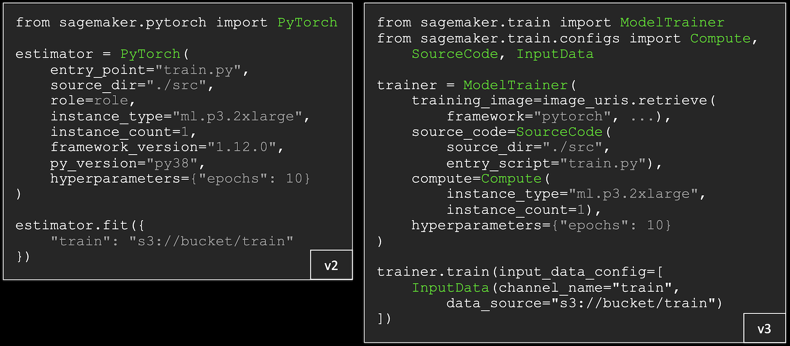
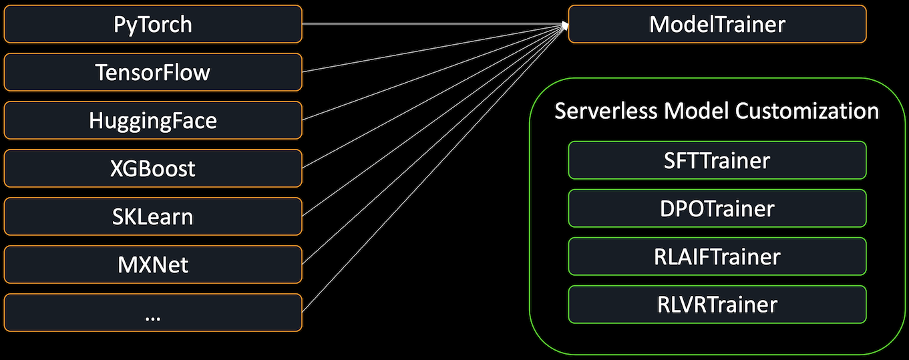
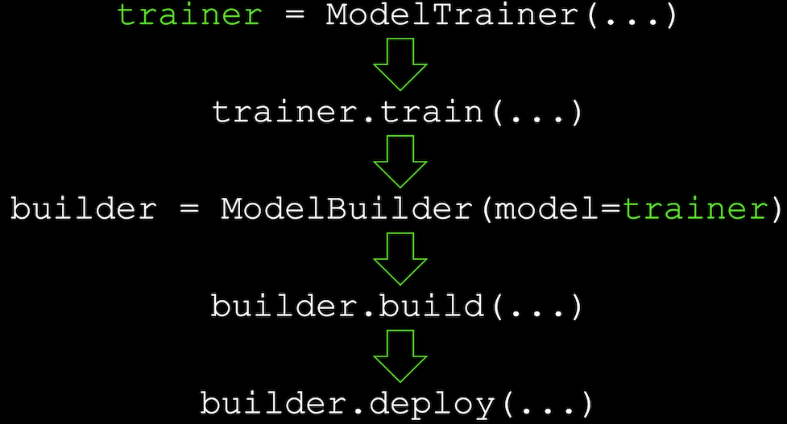

# SDK V3 학습 — ModelTrainer로 학습 잡 제출하기

!!! info "Scope"
    V3에서 **학습 잡을 제출하는 방법**만 다룹니다. V2와의 전체 차이와 마이그레이션 함정은 [SDK V3 개요](index.md), 배포는 [SDK V3 배포](serving.md)에 있습니다.
    LoRA 설계·하이퍼파라미터 같은 학습 내용 자체는 [파인튜닝](../03_finetuning.md)이 담당합니다.

## ModelTrainer로 학습 잡 제출

[](../images/sdkv3_training.png)

*왼쪽 V2는 `framework_version="1.12.0"`·`py_version="py38"`을 주면 SDK가 내부 lookup 표로 DLC 이미지를 찾아냅니다. 오른쪽 V3는 `training_image`를 직접 넘깁니다 — **SDK가 프레임워크를 알 필요가 없어졌습니다.** 나머지 인자는 `SourceCode`·`Compute`·`InputData` 세 config 객체로 흩어집니다.*

`tracks/*/02_train_sft_sagemaker.ipynb`에서 추린 형태입니다. 하이퍼파라미터 dict와 `role`·`sagemaker_session`은 V2와 같은 자리에 남고, **나머지가 전부 config 객체로 이동**합니다.

=== "V3"

    ```python
    import boto3
    from sagemaker.core.helper.session_helper import Session
    from sagemaker.core.image_uris import retrieve
    from sagemaker.train.model_trainer import ModelTrainer
    from sagemaker.core.training.configs import (
        SourceCode, Compute, InputData, StoppingCondition,
    )

    sess = Session(boto3.Session(region_name="us-east-1"))
    # 이 kit은 .env의 DLC_IMAGE_URI(완전 URI)를 그대로 씁니다. retrieve는 그 env가
    # 없을 때의 폴백입니다 — common/dlc.resolve_training_image()의 우선순위.
    image_uri = retrieve(framework="pytorch", region="us-east-1",
                         version="2.8.0", py_version="py312",
                         image_scope="training", instance_type="ml.g6.2xlarge")

    trainer = ModelTrainer(
        training_image=image_uri,
        source_code=SourceCode(source_dir="scripts", entry_script="train.py",
                               requirements="requirements.txt"),
        compute=Compute(instance_type="ml.g6.2xlarge", instance_count=1),
        hyperparameters={"model_id": "google/gemma-4-E4B-it", "epochs": 2,
                         "use_qlora": True, "merge_adapter": True},
        environment={"HF_TOKEN": "..."},
        role=role, sagemaker_session=sess,
        base_job_name="gemma-extraction-train",
        # 생략하면 SDK가 1시간을 넣습니다 — 아래 함정 절 참고
        stopping_condition=StoppingCondition(max_runtime_in_seconds=4 * 3600),
    )
    trainer.train(input_data_config=[InputData(channel_name="train",
                                               data_source=train_s3)],
                  wait=False, logs=False)
    print(trainer._latest_training_job.training_job_name)
    ```

=== "V2 (참고)"

    ```python
    import sagemaker
    from sagemaker.huggingface import HuggingFace       # V3에 없습니다
    from sagemaker.inputs import TrainingInput

    estimator = HuggingFace(
        entry_point="train.py", source_dir="scripts",
        instance_type="ml.g6.2xlarge", instance_count=1,
        transformers_version="4.36",        # 이미지를 버전 인자로 골랐습니다
        pytorch_version="2.1", py_version="py310",
        hyperparameters={"model_id": "...", "epochs": 2},
        environment={"HF_TOKEN": "..."},
        role=role, sagemaker_session=sagemaker.Session(),
        base_job_name="gemma-extraction-train",
        max_run=4 * 3600,                   # V3의 StoppingCondition
    )
    estimator.fit({"train": TrainingInput(train_s3)}, wait=False, logs=False)
    print(estimator.latest_training_job.name)
    ```

`ModelTrainer`에는 `hyperparameters`가 `--key value` CLI 인자로 직렬화돼 `train.py`에 들어갑니다. `--use_qlora True` 형태이므로 `argparse`에서 `action="store_true"`를 쓰면 깨집니다 — 이 kit의 `str2bool` 처리 이유는 [파인튜닝](../03_finetuning.md#trainpy--로컬-dry-run과-sagemaker-학습-잡)에 있습니다.

## ModelTrainer 하나로 합쳐진 estimator들

[](../images/sdkv3_trainer.png)

*왼쪽 estimator 7종(PyTorch·TensorFlow·HuggingFace·XGBoost·SKLearn·MXNet…)이 **`ModelTrainer` 하나로** 수렴합니다. 오른쪽 아래 초록 상자는 그것과 **별개**입니다 — estimator가 특화 trainer로 바뀐 것이 아니라, 성격이 다른 도구가 옆에 추가된 것입니다.*

둘의 역할이 다릅니다.

| | `ModelTrainer` | 특화 trainer |
|---|---|---|
| 하는 말 | "내 학습 코드와 컨테이너가 있으니 SageMaker 인프라에서 돌려라" | "foundation model을 이 기법으로 파인튜닝하고 싶고, 인프라는 신경 쓰고 싶지 않다" |
| 성격 | 범용 compute orchestrator | 정해진 모델·기법·파라미터만 받는 고수준 워크플로 |
| 내가 주는 것 | 이미지·스크립트·하이퍼파라미터 | 모델과 데이터 |

이 kit은 **`ModelTrainer` 쪽**입니다. TRL `SFTTrainer`와 PEFT를 직접 조합하고 최신 Gemma를 바로 쓰기 위해 `train.py`를 들고 가기 때문입니다([파인튜닝](../03_finetuning.md#왜-커스텀-trainpy-경로인가)에 그 선택 근거가 있습니다).

특화 trainer는 `sagemaker.train`에서 바로 import됩니다(3.16.0 확인).

```python
from sagemaker.train import SFTTrainer, DPOTrainer, RLAIFTrainer, RLVRTrainer
```

!!! info "이 kit은 아래 기능을 쓰지 않습니다"
    특화 trainer·평가·AI Registry·Batch queue는 **심볼이 존재하는지만 확인**했고, 실제로 학습을 돌려 보지는 않았습니다. 이 kit의 검증된 경로는 `ModelTrainer` + 자체 `train.py`입니다.
    아래는 "V3에 이런 것이 생겼다"는 지도이니, 쓰실 때는 [SDK 저장소](https://github.com/aws/sagemaker-python-sdk)의 현행 시그니처를 확인하세요.

## 평가가 SDK 안으로 들어왔습니다

V2에서 파인튜닝 결과를 표준 벤치마크로 재려면 그 인프라를 직접 만들어야 했습니다 — 데이터셋을 찾고, 평가 루프를 쓰고, 메트릭을 계산하고, 결과를 기록하는 것 전부입니다. V3는 evaluator 3종을 제공합니다.

| evaluator | 무엇을 하나 |
|---|---|
| `BenchMarkEvaluator` | 표준 벤치마크 11종을 기본 제공 |
| `LLMAsJudgeEvaluator` | Bedrock Evaluations 기반. foundation model을 judge로 골라 품질·안전성 채점 |
| `CustomScorerEvaluator` | 자체 채점 로직을 끼워 넣기 |

```python
from sagemaker.train import BenchMarkEvaluator, LLMAsJudgeEvaluator, CustomScorerEvaluator
```

셋 다 결과를 **MLflow에 자동 기록**합니다. 이 kit은 대신 코스별 메트릭을 직접 계산합니다(`common/eval_utils.py`) — 추출은 arg_f1, 분류는 macro-F1처럼 태스크에 맞춘 지표가 필요해서입니다.

## AI Registry — 데이터셋과 evaluator에 버전을 붙입니다

S3 경로를 주고받으며 "모두 같은 버전을 쓰고 있겠지" 하고 믿는 대신, 데이터셋과 evaluator를 **버전이 붙은 hub content로 등록**합니다.

AI Registry Evaluator는 실행 주체가 아니라 **저장·메타데이터 엔티티**입니다 — SageMaker Hub 안의 버전 레코드이고, 그 안에 평가 로직 참조(reward 프롬프트 문자열 또는 Lambda ARN)를 담습니다. 그래서 reward 프롬프트를 한 번 등록해 두고, `LLMAsJudgeEvaluator`나 `RLAIFTrainer`를 설정할 때 그 ARN으로 가리키는 식으로 씁니다.

설치본에서는 `sagemaker.ai_registry` 서브패키지가 이 영역을 담당합니다.

## AWS Batch 큐에 학습 잡을 넣기

잡이 많아 스케줄링이 필요할 때, `ModelTrainer`를 SageMaker에 바로 던지지 않고 **AWS Batch 큐에 제출**할 수 있습니다. 우선순위 큐잉·fair-share 스케줄링·재시도를 Batch가 맡습니다.

`ModelTrainer`는 **똑같이 만들고**, `.train()`을 부르는 대신 큐에 넘깁니다.

```python
from sagemaker.train.aws_batch.training_queue import TrainingQueue
# TrainingQueue: submit / map / get_job / list_jobs / list_jobs_by_share
```

## 학습에서 배포로 넘어가는 지점

[](../images/sdkv3_pipeline.png)

*`ModelBuilder(model=trainer)` — **trainer 객체를 그대로 넘깁니다.** S3 경로를 손으로 옮겨 적을 필요가 없고, 이 자리가 학습과 서빙을 잇는 이음매입니다.*

이후 단계는 [SDK V3 배포](serving.md)에서 다룹니다.

## 이어서 볼 문서

- [SDK V3 개요](index.md) — V2→V3 매핑표와 마이그레이션 함정
- [SDK V3 배포](serving.md) — `ModelBuilder`로 학습 결과를 endpoint에 올리기
- [파인튜닝](../03_finetuning.md) — 이 kit이 학습 스크립트를 직접 쓰는 이유
